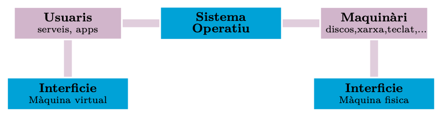
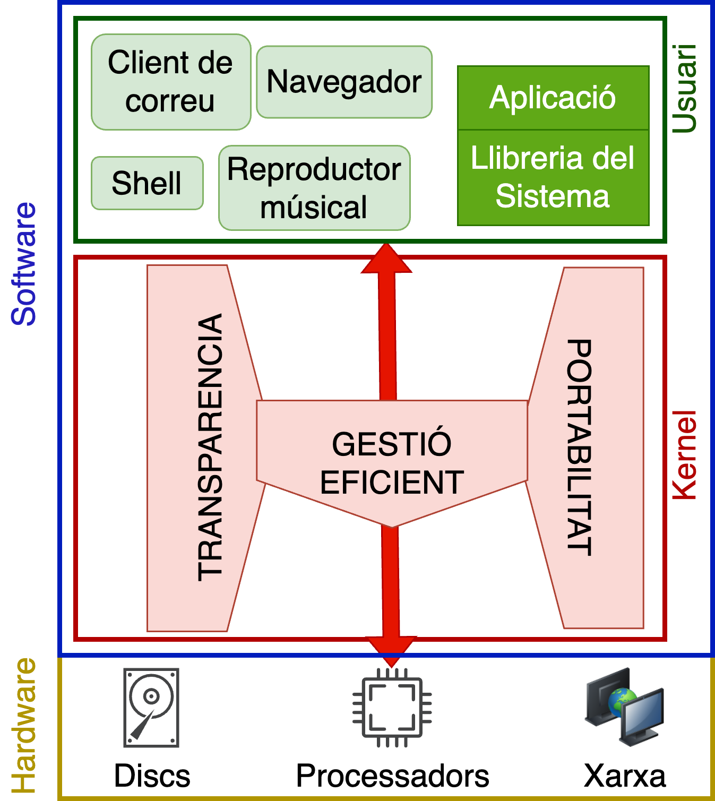
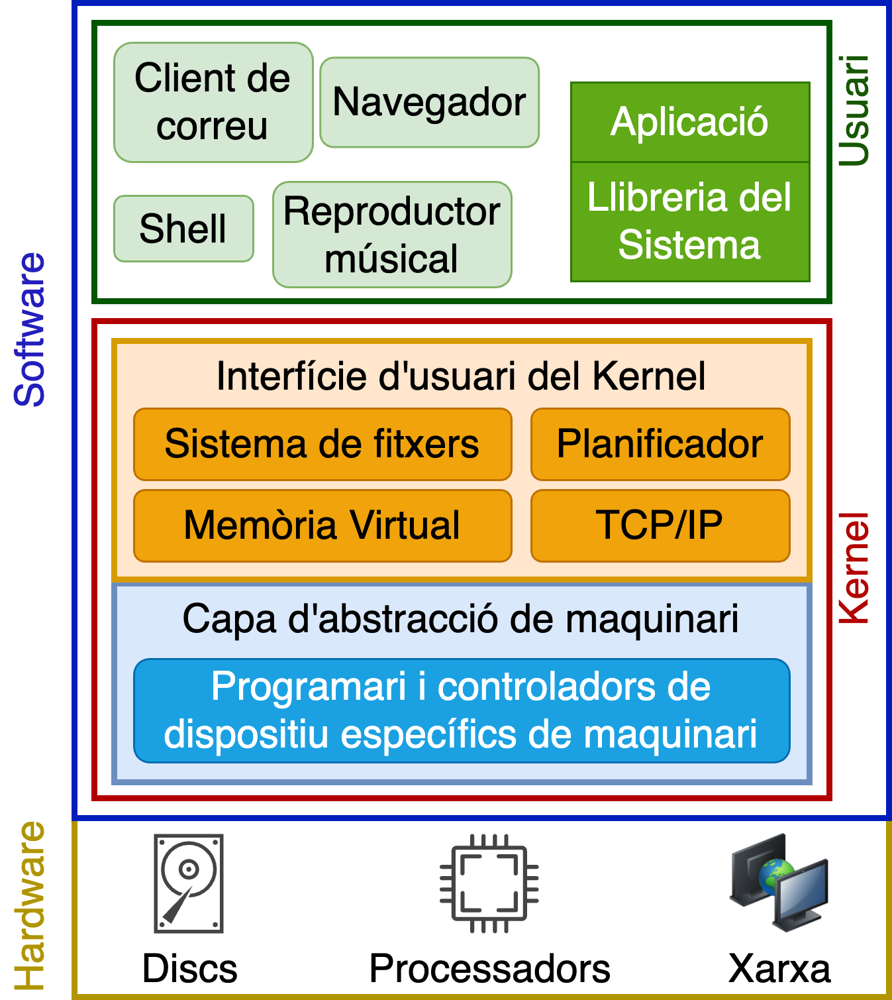
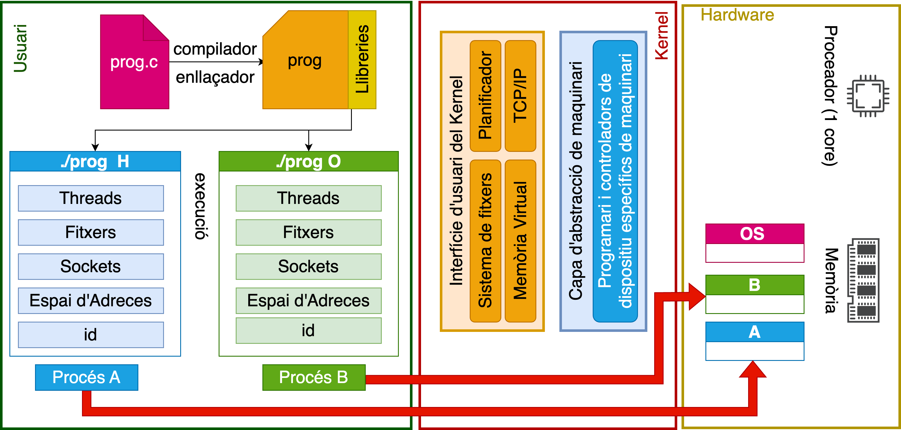
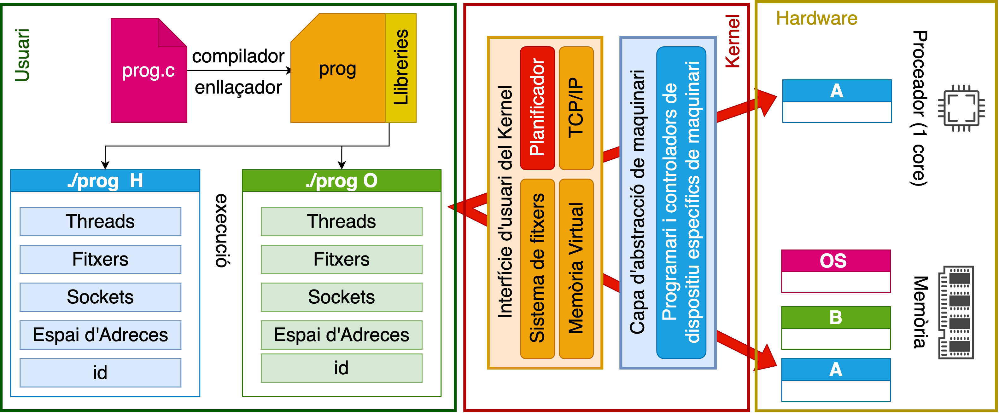
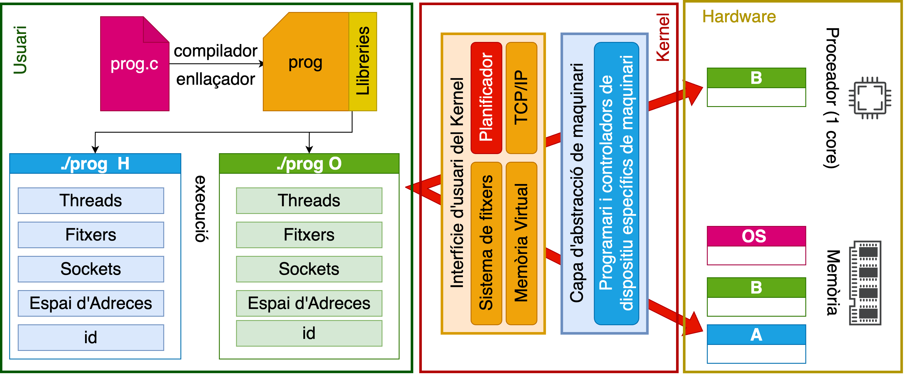
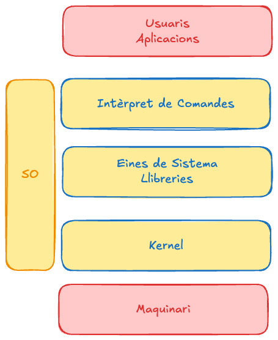

# Introducció

## Un món de sistemes informàtics 

::::: columns
::: {.column width="40%"}

:::{.reflexio title="Què tenen en comú?"}

Cotxe, rellotge, portàtil, rentadora, nevera, televisió... tots són **sistemes informàtics**.

:::

::: {.exemple .fragment}
Tot arreu es parla de **IoT, BigData, Cloud, AI, Blockchain**... 

:::

::: {.fragment .concepte}
El món esta interconnectat per xarxes i informació que es genera i es processa constantment.
:::

:::

::: {.column width="60%"}
{width="85%"}
:::
:::::

::: {.fragment style="text-align: center;"}
**Vivim envoltats de sistemes paral·lels i distribuïts.**
:::

## Complexitat del hardware

::: {.concepte}
Cada peça de hardware és diferent, per tant la complexitat per gestionar els recursos és molt elevada.
:::

:::{.fragment .exemple}
-   Arquitectures diferents de processadors i generacions (*x86, ARM, RISC-V, MIPS, PowerPC,...*).
-   Diferents tipus de memòries (*RAM DDR3, DDR4, DDR5, NAND,...*).
-   Diferents tipus de discs (*HDD, SSD, NVMe...*).
-   Diferents dispositius d'entrada/sortida i entorns de xarxa.
:::

::: {.fragment style="text-align: center;"}
**... entre moltes altres ...**
:::

## Què passa si un programa pot accedir a tota la RAM?

::: {.exercici}
Suposem que un programa pot llegir i escriure **qualsevol posició de la memòria RAM**.

Què podria passar?
:::

::: {.fragment .solucio}
- Podria **llegir dades d'altres processos**.
- Podria **modificar o destruir les seves dades**.
- Podria **modificar dades del propi sistema operatiu**.
:::

::: {.fragment .errorcomu}
**Sense protecció de memòria, els processos no estarien aïllats.**
:::

::: {.exercici .fragment}
Qui hauria d'impedir que un procés accedís a la memòria d'un altre?
:::

::: {.solucio .fragment}
El **sistema operatiu**, amb l'ajuda del **hardware**, proporciona mecanismes de protecció i aïllament de la memòria.
:::

## Un programa mal escrit pot fer fallar tot el sistema (I)


:::{.fragment .exercici title="Què passa si executo aquest programa?"}

```{.c code-line-numbers="false"}
int main() {
    while (1);
}
```

:::

:::{.solucio .fragment}
És un bucle infinit: el procés no acaba per si mateix. En un sistema amb preempció, el *scheduler* pot interrompre temporalment el procés i donar CPU a altres processos. El procés, però, continua consumint recursos mentre segueixi executant-se.
:::

:::{.fragment .repte}
Què passaria si no existís el *scheduler* o si no pogués interrompre el procés?
:::

## Un programa mal escrit pot fer fallar tot el sistema (II)

:::{.fragment .exercici title="Què passa si executo aquest programa?"}

```{.c code-line-numbers="false"}
int main() {
    while (1)
        fork();
}
```

:::

:::{.solucio .fragment}
Cada iteració crea nous processos. Aquests processos també continuen executant el bucle i poden crear nous processos, fent que el nombre de processos creixi molt ràpidament. Cosa que pot saturar el sistema i fer-lo inutilitzable. Aquest tipus de programa es coneix com a **fork bomb**.
:::

## Què és un sistema operatiu?


:::{.definicio}
Un **sistema operatiu (SO)** és el software que **gestiona els recursos del sistema**, **proporciona abstraccions del hardware** i **ofereix un entorn segur per executar programes**.
:::



## Què és un procés?

::: {.concepte}
Un **procés** és la màquina virtual que el sistema operatiu ofereix a un programa en execució: una instància activa amb els seus propis recursos.
:::

::: {.fragment .exemple}
Codi · Dades · Pila (*stack*) · *Heap* · Registres · Espai d'adreces · Estat gestionat pel SO (PID, prioritat, fitxers oberts...)
:::

::: {.fragment .reflexio title="Important"}
Dos processos que executen el **mateix programa** són, tot i així, dos processos **diferents**: cadascun amb el seu propi espai d'adreces i estat.
:::


## Separació de responsabilitats

El sistema operatiu utilitza dos nivells de privilegi del processador, mode kernel i mode usuari, per protegir l'estat crític del sistema  i per evitar que un procés alteri el funcionament d'altres processos o del propi sistema operatiu.

:::{.fragment .definicio title="Mode kernel"}
- El kernel s'executa amb privilegis que li permeten gestionar recursos protegits i configurar els mecanismes de protecció del hardware.
- Un error greu en codi del kernel pot comprometre l'estabilitat de tot el sistema.
:::

:::{.fragment .definicio title="Mode usuari"}
- El codi en mode usuari està sotmès a les restriccions de protecció imposades pel hardware.
- Un error en un procés d'usuari queda normalment aïllat de la resta del sistema.
:::


## Com accedeix una aplicació al hardware?

:::{.concepte}
Els programes en mode usuari no poden accedir directament als recursos del hardware. Demanen els serveis al sistema operatiu mitjançant una **crida de sistema**.
:::


::: {.fragment}
```{.c  code-line-numbers="false"}
printf("Hola\n");
```
:::

::: {.fragment style="text-align: center;"}
`printf()` $\Rightarrow$ **libc** $\Rightarrow$ `write()` $\Rightarrow$ **system call** $\Rightarrow$ **kernel** $\Rightarrow$ driver $\Rightarrow$ dispositiu
:::


:::{.fragment .resum}
El programa no accedeix directament al dispositiu de sortida, sinó que crida a la funció `printf()` de la **biblioteca estàndard de C** (*libc*). Aquesta funció, al seu torn, crida a la funció `write()` del sistema operatiu, que és una **crida de sistema** (*system call*). El sistema operatiu, en mode kernel, accedeix al dispositiu de sortida i escriu el missatge. *per simplificar, ignorem aquí el buffering intern de la llibreria `stdio`*.
:::


## Què vol el programador?

::::: columns
::: {.column width="50%"}
#### Una plataforma...

-   per executar aplicacions.
-   **transparent**, sense la complexitat del hardware.
-   **eficient**, que aprofiti bé els recursos.
-   **portable**, independent del hardware.
:::

::: {.column width="50%"}

:::
:::::


## Què ofereix el sistema operatiu? 

:::::: columns
:::: {.column width="50%"}
#### Serveis
-   Gestió d'usuaris i aplicacions.
-   Gestió de memòria.
-   Sistema de fitxers.
-   Planificació.
-   Xarxa.

::: fragment
#### Garanties
-   Seguretat.
-   Transparència.
-   Eficiència.
-   Portabilitat.
-   Estabilitat.
:::
::::

::: {.column width="50%"}

:::
::::::


## Anàlisi: què fa aquest programa? (I)

::::: columns
::: {.column width="45%"}
::: {.exercici title="Llegeix el codi"}
```{.c  code-line-numbers="false"}
#include <stdio.h>
#include <stdlib.h>

int main(int argc, char *argv[])
{
  while (1) {
    printf("%s\n", argv[1]);
  }
  return 0;
}
```
:::
:::

::: {.column width="55%"}
### `./prog H`

::: {.fragment .solucio}
H
H
...
:::

::: {.fragment .repte}
### `./prog H & ./prog O`

Què creieu que s'imprimirà?
:::
:::
:::::

## Anàlisi: què fa aquest programa? (II)

::: center
{width="80%"}
:::

::: {.fragment .concepte}
Cada execució del mateix programa genera un **procés diferent**, amb el seu propi identificador (PID) i espai de memòria.
:::

## Anàlisi: què fa aquest programa? (III)

::: center

:::

::: {.fragment .concepte}
El *scheduler* assigna el processador a un procés durant un temps determinat i el va intercanviant (canvi de context): cada procés creu tenir tots els recursos per a ell sol.
:::

## Anàlisi: què fa aquest programa? (IV)

::: center

:::

::: {.fragment .errorcomu}
Si un procés intenta accedir a una adreça que no té autoritzada, el hardware detecta la violació i el sistema operatiu pot finalitzar el procés. Habitualment, el procés rep un **senyal de violació de segmentació** (*segmentation fault*).
:::

## Anàlisi: què fa aquest programa? (V)

::: {.exercici}
Segons la prioritat dels processos **A** i **B**, un pot tenir més temps de CPU que l'altre.

### `./prog H & ./prog O`

Quins ordres de sortida són possibles?
:::

::: {.fragment .solucio}
::::: columns
::: {.column width="33%"}
H
H
H
...
:::
::: {.column width="33%"}
H
O
H
...
:::
::: {.column width="33%"}
O
O
H
...
:::
:::::
Qualsevol intercalació és possible: depèn del planificador.
:::


## Anàlisi: què fa aquest programa? (VI)

::: {.exercici}
### `./prog & ; ./prog O`

Fixeu-vos bé: el primer `./prog` s'executa **sense argument**.

Què passarà?
:::

## Anàlisi: què fa aquest programa? (VII)

::: {.solucio}
`./prog` sense argument: `argv[1]` és `NULL`. Passar `NULL` a `printf("%s", ...)` és **comportament indefinit** en C — la sortida depèn de la implementació de la llibreria.
:::

::: {.fragment .repte}
Comprovem-ho a la nostra màquina de referència. Quina és la sortida real?
:::


## Anàlisi: què fa aquest programa? (VIII)

::::: columns
::: {.column width="60%"}
::: {.exercici title="Llegeix el codi"}
```{.c  code-line-numbers="false"}
#include <stdio.h>
#include <stdlib.h>
#include <unistd.h>

int main(int argc, char *argv[])
{
  int *p = malloc(sizeof(int));
  printf("p: %p\n", p);
  int i = 1;
  while (1) {
    *p = i;
    printf("(%d) p: %d\n", getpid(), *p);
    i++;
  }
  free(p);
  return 0;
}
```
:::
:::

::: {.column width="40%"}
#### `./prog1`

::: {.fragment .solucio}
``` {.bash code-line-numbers="false"}
(611) p: 0x5570014a02a0
(611) p: 1
(611) p: 2
...
```
:::

::: {.fragment .repte}
#### `./prog1 & ./prog1`

Dues còpies del mateix programa. Tindran la mateixa adreça `p`?
:::
:::
:::::


## Anàlisi: què fa aquest programa? (IX)

#### `./prog1 & ./prog1`

::: {.solucio .fragment}
``` {.bash code-line-numbers="false"}
(611) p: 0x5570014a02a0
(612) p: 0x5570014a02a0
(611) p: 1
(612) p: 1
(611) p: 2
(612) p: 2
...
```
:::

::: {.fragment .reflexio title="Com pot ser?"}
Els dos processos mostren la **mateixa** adreça — però no interfereixen entre ells. Cada procés té el seu propi **espai d'adreces virtuals**. La MMU, mitjançant les estructures de traducció configurades pel sistema operatiu, tradueix les adreces virtuals a adreces físiques.
:::

## Un sistema operatiu fa tres coses

::::: columns
::: {.column width="33%"}
::: {.concepte title="Il·lusionista"}
**Abstrau** el maquinari: ofereix una interfície simple i amaga la complexitat tècnica.
:::
:::

::: {.column width="33%"}
::: {.fragment .concepte title="Àrbitre"}
**Aïlla i protegeix**: reparteix els recursos i evita que uns programes en perjudiquin d'altres.
:::
:::

::: {.column width="33%"}
::: {.fragment .concepte title="Pega"}
**Comparteix**: proporciona serveis comuns reutilitzables per a tot el sistema.
:::
:::
:::::

::: {.fragment .reflexio title="Per recordar"}
**SO = Il·lusionista + Àrbitre + Pega**
:::

## Com s'organitza el sistema operatiu?

::::::: columns
:::: {.column width="40%"}
::: center

:::
::::

:::: {.column width="60%"}
::: {.concepte title="Màquina virtual"}
És la *visió* que té l'**usuari** del sistema operatiu durant una sessió de treball.
:::

::: {.fragment .concepte title="Dualitat"}
El SO divideix el programari amb tots els privilegis (**kernel**) del programari amb accés limitat (**programes, llibreries, intèrpret de comandes**...).
:::
::::
:::::::

::: {.fragment .reflexio}
Aquesta dualitat és exactament la frontera **user space / kernel space** que vam veure abans.
:::

## Què és una màquina virtual?

::: {.concepte}
La **virtualització** presenta una visió abstracta dels recursos del sistema: diversos processos creuen que disposen sempre d'un conjunt exclusiu de recursos.
:::

::: {.fragment .exemple}
- **Simplicitat** → il·lusió de propietat de recursos.
- **Aïllament** → els errors es donen en un entorn virtual, no físic.
- **Protecció** → els processos no es poden fer mal entre ells.
- **Portabilitat** → es pot executar a totes les plataformes.
:::

## Què és la memòria virtual?

::: {.concepte}
Cada **procés** té la il·lusió de disposar d'accés exclusiu a tot l'espai d'adreces de memòria del processador.
:::

::: {.fragment .exemple}
La **MMU** (unitat de gestió de memòria) tradueix les adreces **virtuals** que utilitza el programa en adreces **físiques** reals.
:::

::: {.fragment .reflexio}
Ho hem vist ja amb `./prog1 & ./prog1`: dues adreces virtuals idèntiques, dues ubicacions físiques diferents.
:::

## Il·lusionista: una interfície simple

::: {.concepte}
Ofereix una interfície simple i fàcil d'utilitzar per als recursos físics, **ocultant la complexitat tècnica**.
:::

::: {.fragment .exemple title="Exemple"}
Per imprimir un document no cal conèixer la interfície de comunicació, els controladors ni els protocols de la impressora: n'hi ha prou amb una funció (**imprimir**).
:::

## Il·lusionista: recursos exclusius i "infinits"

::: {.concepte}
Permet que una aplicació tingui ús **exclusiu** d'un recurs quan cal, i alhora manté la il·lusió que els recursos són **il·limitats**.
:::

::: {.fragment .exemple}
Un programa de videoconferència pot usar la càmera i el micròfon amb la garantia que cap altre programa hi accedirà alhora.
:::

::: {.fragment .exemple}
Podeu tenir moltes aplicacions obertes a la vegada, encara que només una estigui en primer pla: cada procés creu ser propietari exclusiu dels recursos.
:::

## Àrbitre: repartiment de recursos

::: {.concepte}
Distribueix els recursos disponibles entre usuaris i aplicacions de manera **eficient i justa**.
:::

::: {.fragment .exemple}
En un sistema amb múltiples usuaris, el temps de processador s'ha de repartir equitativament entre tots els qui executen aplicacions.
:::

## Àrbitre: protecció

::: {.concepte}
Garanteix la **segregació** i la **protecció** d'usuaris i aplicacions entre ells.
:::

::: {.fragment .exemple}
Impedeix que una aplicació bloquegi o afecti el funcionament d'altres aplicacions.
:::


## Pega: serveis comuns

::: {.concepte}
Proporciona un conjunt de serveis compartits i reutilitzables per diverses parts del sistema.
:::

::: {.fragment .exemple}
- **Compartició**: simplifica, perquè sempre s'assumeixen les mateixes primitives bàsiques.
- **Reutilització**: evita reimplementar funcionalitats comunes i permet que els components evolucionin de forma independent.
:::

## El sistema de fitxers

::: {.reflexio title="Un exemple concret de pega"}
El **sistema de fitxers** proporciona una interfície estàndard per crear, llegir, escriure i eliminar fitxers de forma transparent (`read`, `write`, `open`, `close`...).
:::

::: {.fragment .exemple}
Sobre aquesta interfície es construeix la **libc**, amb funcions d'entrada/sortida d'alt nivell (`fopen`, `fread`, `fwrite`, `fclose`...).
:::

## Reptes en el disseny dels sistemes operatius

::::: columns
::: {.column width="50%"}
::: {.concepte title="Complexitat"}
- Programació **distribuïda**, concurrent i paral·lela.
- Diversitat de **contextos** (mòbil, IoT, servidors, centres de dades...).
- **Heterogeneïtat** de maquinari.
- **Portabilitat** i compatibilitat.
:::
:::

::: {.column width="50%"}
::: {.fragment .concepte title="Equilibris i garanties"}
- Funcionalitat **vs.** rendiment.
- Rendiment **vs.** consum energètic.
- **Fiabilitat** i **disponibilitat**.
- **Seguretat**.
- **Escalabilitat** i **mantenibilitat**.
:::
:::
:::::

::: {.fragment .reflexio}
Cap SO real optimitza tots aquests reptes alhora: cada disseny és un compromís diferent.
:::

## Conclusions

::: {.concepte}
- Els **sistemes operatius** són presents a tots els dispositius que fem servir.
- El disseny és **complex**: cal integrar maquinari molt divers.
:::

::: {.fragment .reflexio}
Un SO és **Il·lusionista + Àrbitre + Pega**:

- **Abstrau** el maquinari i ofereix la il·lusió d'una màquina virtual pròpia i "infinita".
- **Aïlla i protegeix** usuaris i aplicacions entre ells.
- **Comparteix** serveis comuns per facilitar la interacció programari–maquinari.
:::

# Auditoria d'un sistema operatiu

## Anàlisis de situacions
Per a cadascuna determina: (a) quin dels tres papers ha fallat (Il·lusionista / Àrbitre / Pega), (b) una frase justificant per quin mecanisme dels vistos avui.

:::{.exercici  .fragment title="Situació A"}
En un ordinador amb diversos usuaris connectats alhora, un usuari engega un programa i, a partir d'aquell moment, la resta d'usuaris no poden fer res: els seus programes queden congelats fins que l'usuari inicial acaba.
:::

:::{.exercici  .fragment title="Situació B"}
Un procés aconsegueix llegir, sense cap error ni avís, dades que pertanyen a la memòria d'un altre procés que s'executa al mateix ordinador.
:::

:::{.exercici  .fragment title="Situació C"}
Cada aplicació que es vol comunicar amb la impressora ha d'incloure el seu propi codi per parlar directament amb el controlador de la impressora, perquè el sistema no ofereix cap funció comuna per fer-ho.
:::

:::{.exercici  .fragment title="Situació D"}
Un procés intenta escriure en una zona de memòria que no li pertany. El sistema el finalitza immediatament amb un error.
:::

::: notes
A → Àrbitre (repartiment del temps de processador, no de la protecció de memòria). 
B → Àrbitre (aïllament d'espais d'adreces, mecanisme MMU). 
C → Pega (no hi ha servei comú reutilitzable). 
D → cap paper falla; és el sistema funcionant correctament.
:::

## Crea una situació

:::{.repte}
Creeu una situació on un sistema operatiu no compleixi el paper d'Ilusionista. Explica quin mecanisme ha fallat i per què.
:::

## Sistema operatiu sense separació de privilegis

:::{.repte}
Imagineu un sistema operatiu que no distingeix entre mode kernel i mode usuari: tot el codi s'executa amb els mateixos privilegis. Quin dels tres papers (Il·lusionista, Àrbitre o Pega) deixaria de poder-se garantir de manera fiable? Justifiqueu la resposta amb el mecanisme concret que fallaria.
:::

:::notes
Àrbitre és el que depèn més directament del mode kernel/usuari, perquè la protecció i l'aïllament (que un procés no pugui tocar la memòria d'un altre, ni el processador d'un altre) necessiten que el hardware impedeixi que codi d'usuari alteri les estructures de control (com les taules de traducció d'adreces) que garanteixen aquest aïllament. Sense aquesta distinció de privilegi, qualsevol procés podria desactivar la seva pròpia protecció.
:::