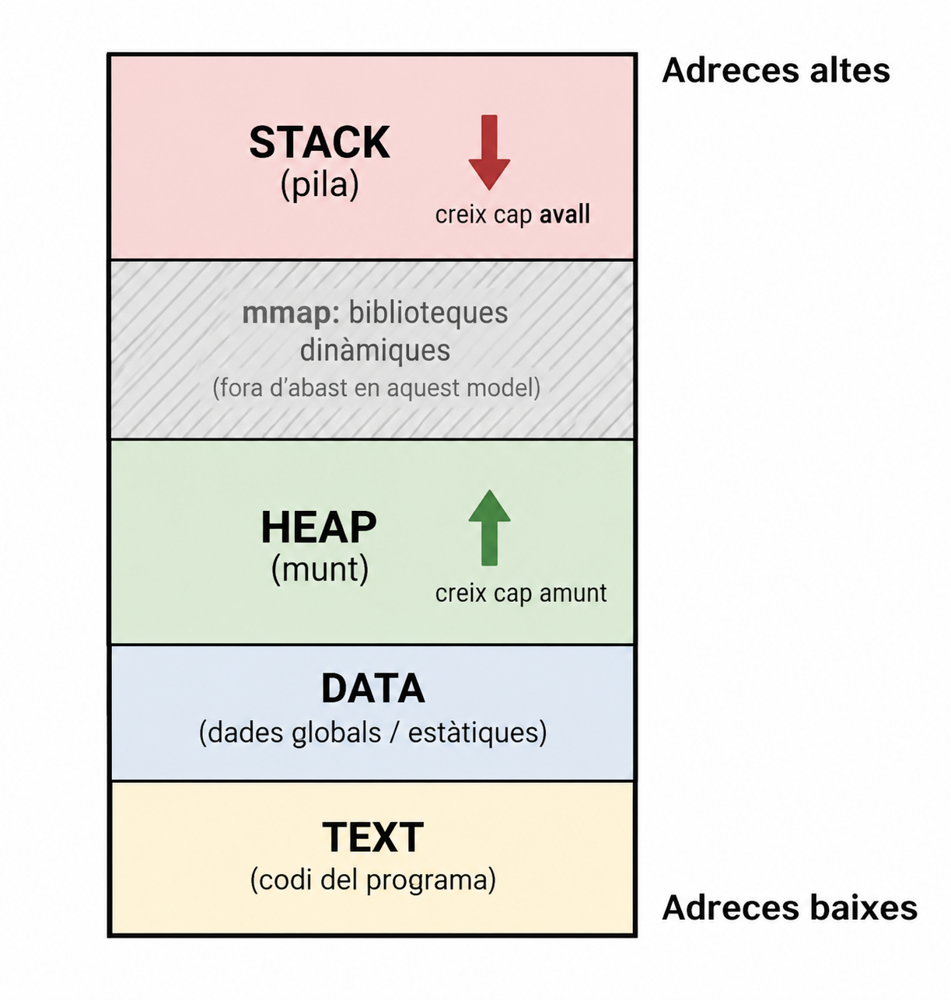
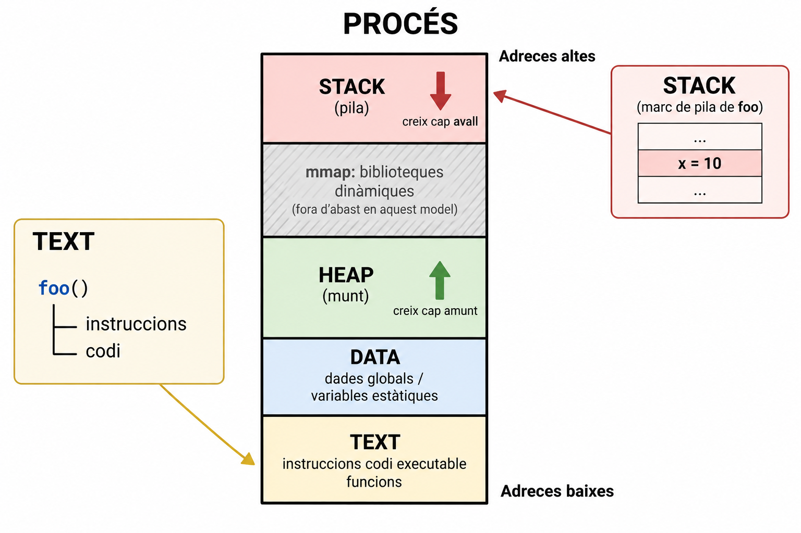
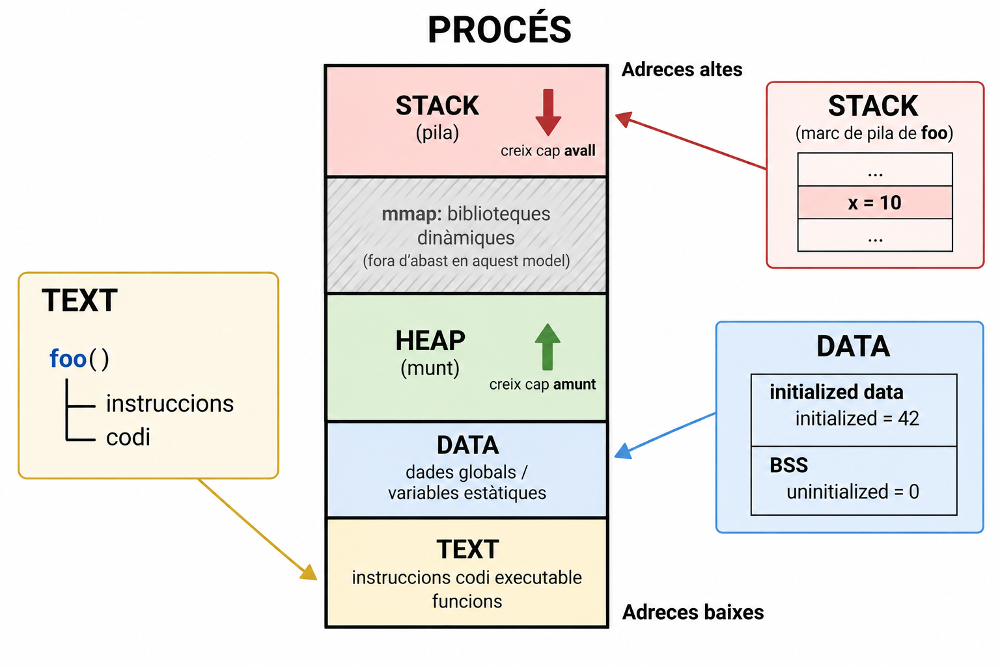
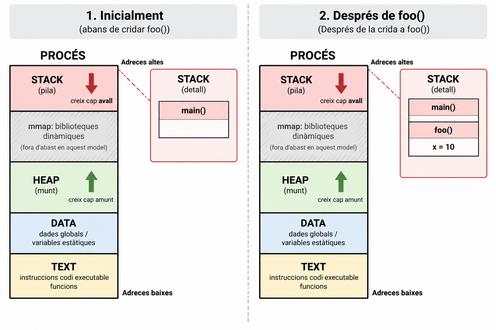
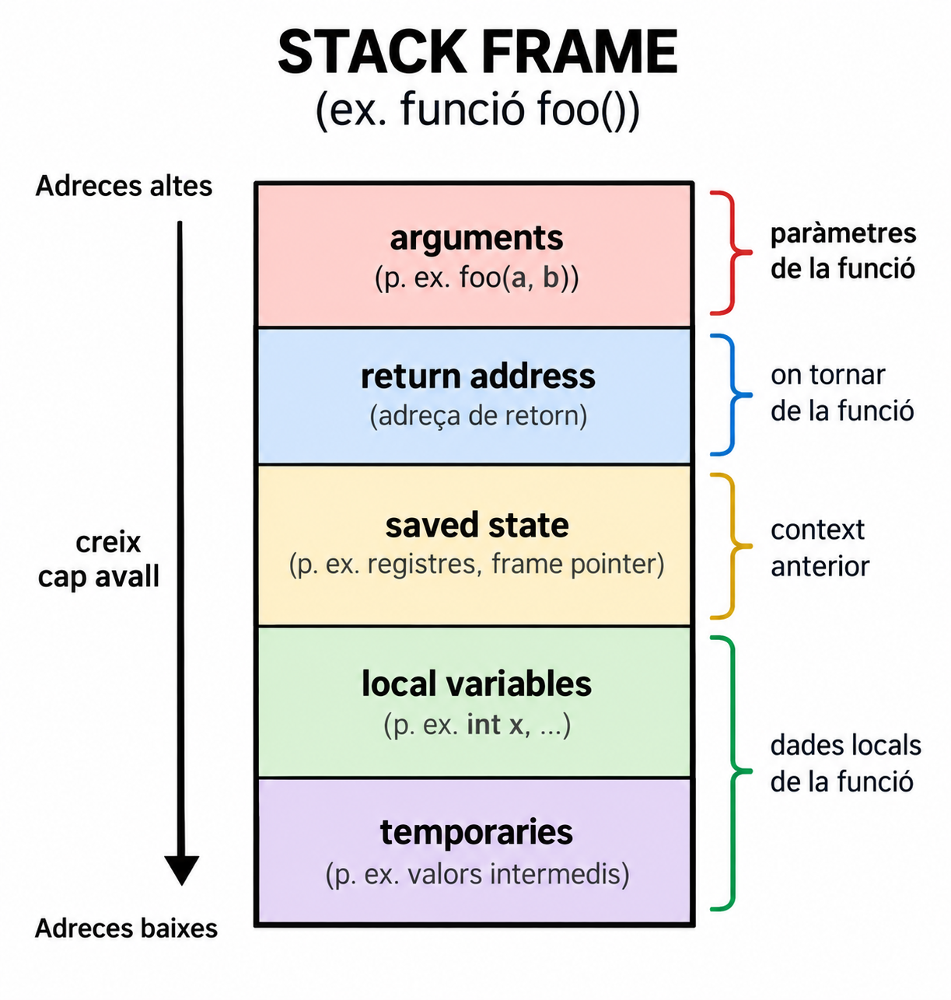
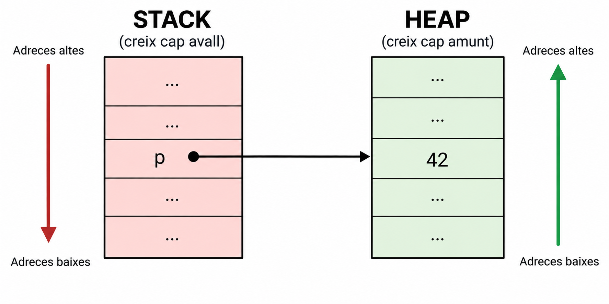
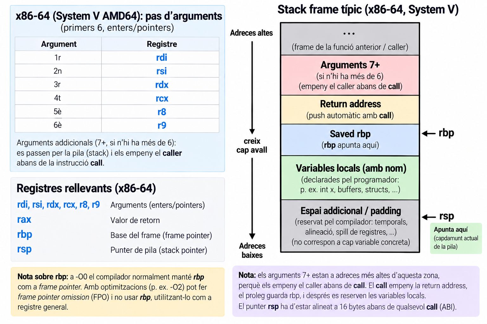
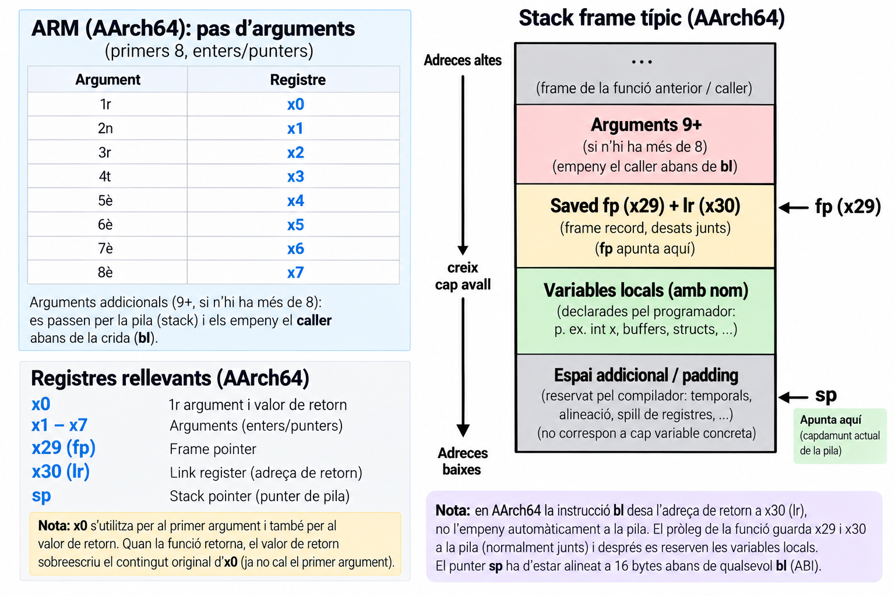

# Introducció

## Memòria d'un procés {.center}

::: {.r-fit-text}
Stack · Heap · Data · Text
:::

## Objectius d'aprenentatge

::: {.objectius}
- Descriure el model conceptual de l'espai d'adreces: **Text · Data · Heap · Stack**
- Classificar variables i funcions segons la regió de memòria on viuen
- Explicar què és un **stack frame** i el *lifetime* d'una variable automàtica
- Justificar per què calen reserves al **heap** per a dades que sobreviuen a la funció que les crea.
:::

## Prerequisits

::: {.prerequisits}
- Punters i l'operador `&` ([Pralab 01](../pralabs/01_c_mem.qmd), [Pralab 02](../pralabs/02_c_mem.qmd))
- Sintaxi bàsica de definició i crida de funcions en C
:::

# L'espai d'adreces

## El procés té un espai d'adreces

::: {.columns}
::: {.column width="30%"}

### Procés

{ width=100%}
:::
::: {.column width="70%"}

::: {.concepte}
Aquest és un **model conceptual**, no el mapa físic de la RAM. Les adreces
que fa servir el procés són adreces del seu **espai virtual**.
:::

::: {.bonapractica}
Aquest model omet a posta la regió `mmap` (biblioteques compartides), l'espai
de kernel i qualsevol detall d'**ASLR**. Les adreces reals no són fixes ni
predictibles entre execucions — hi tornarem quan calgui.
:::

:::
:::

::: {.notes}
Si algú pregunta per `mmap` o per per què les adreces canvien cada
execució, la resposta curta és "ASLR — ho veurem quan calgui" i seguir.
:::

# TEXT

## Què hi ha al TEXT?

- Instruccions 
- Codi executable
- Funcions

```{.c code-line-numbers="false" .fragment}
int suma(int a, int b)
{
    return a + b;
}
```

::: {.reflexio .fragment}
La funció `suma()` és una variable? 
:::

::: {.definicio .fragment}
**Text segment**: la zona de l'espai d'adreces on viuen les instruccions
executables del programa.
:::

::: {.notes}
Resposta: no, és codi executable → TEXT.
:::

## Codi ≠ dades

:::{.columns}
::: {.column width="50%"}

{ width=100%}

:::
:::{.column width="50%"}

```{.c code-line-numbers="false"}
void foo(void)
{
    int x = 10;
}
```

::: {.errorcomu .fragment}
**La funció està al stack.** $\Rightarrow$ Fals. El **codi** de `foo()` viu al *TEXT* i és la seva **activació** (la crida en curs) la que utilitza el *STACK*.
:::

:::
:::

::: {.notes}
Aquesta diapositiva és clau per trencar la confusió més freqüent d'avui.
La funció com a codi és estàtica i única al TEXT; cada crida crea una
activació nova al STACK.
:::

# DATA

## Variables globals

Aquestes variables viuen a la regió **DATA** de l'espai d'adreces.

```{.c code-line-numbers="false"}
int counter = 0;

int main(void)
{
    ...
}
```

::: {.concepte .fragment}
Variables **globals** i **static** tenen una vida que s'estén durant tota
l'execució del procés $\Rightarrow$ no depenen de cap crida de funció.
:::

## Initialized data i BSS

:::{.columns}
::: {.column width="50%"}

```{.c code-line-numbers="false"}
int initialized = 42;
int uninitialized;
int main(void)
{
    ...
}
```

::: {.concepte}
El model **DATA** que fem servir simplifica diverses seccions que
l'executable real diferencia (`.data`, `.bss`...). Ens permetrà parlar
d'ELF més endavant sense haver de corregir el model.
:::

:::
:::{.column width="50%"}

{ width=100%}
:::
:::


::: {.notes}
Diapositiva de rigor, no cal aprofundir. Prescindible si falta temps:
es pot resumir oralment en una frase i saltar a l'activitat.
:::

# Activitat 1

## On viu cada cosa? (I)

:::{.exercici title="Classifica variables i funcions"}

```{.c code-line-numbers="false"}
int global = 10;

static int total = 20;

void foo(void)
{
    int x = 30;
}
```

| Element | On? |
|---|---|
| `global` | ? |
| `total`  | ? |
| `foo()`  | ? |
| `x`      | ? |

:::


## On viu cada cosa? (II)

:::{.solucio title="Classifica variables i funcions"}

```{.c code-line-numbers="false"}
int global = 10;

static int total = 20;

void foo(void)
{
    int x = 30;
}
```

| Element | Regió |
|---|---|
| `global` | DATA |
| `total`  | DATA |
| `foo()`  | TEXT |
| `x`      | STACK |

:::


# STACK

## Què és el stack?

::: {.r-fit-text}
$\text{Stack} = \text{variables automàtiques} + \text{informació de les crides}$
:::


::: {.definicio}
**Stack**: regió de memòria utilitzada per gestionar les crides de funcions
i les dades automàtiques associades a aquestes crides.
:::

::: {.notes}
Evitar dir simplement "el stack és on viuen les variables locals" — és
imprecís. Millor: gestiona les crides *i* les variables automàtiques
associades. Berkeley CS61C descriu cada crida com la creació d'un
"stack frame".
:::

## Una crida crea una activació

:::{.columns}
::: {.column width="30%"}

```{.c code-line-numbers="false"}
void foo(void)
{
    int x = 10;
}

int main(void)
{
    foo();
}
```

::: {.concepte}
Cada crida de funció necessita **informació pròpia**, per això s'apila un
nou marc cada vegada.
:::

:::
:::{.column width="70%"}

{ width=100%}

:::
:::

## Stack frame

:::{.columns}
::: {.column width="30%"}

{ width=100%}

:::
::: {.column width="70%"}
::: {.concepte}
La disposició exacta d'un **stack frame** depèn de l'arquitectura i de la convenció de crida (*calling convention*).
:::

::: {.errorcomu}
Els *arguments* no sempre van a la pila. En **x86-64 (System V AMD64 ABI)**, els sis primers arguments enters es passen per **registres** (`rdi, rsi, rdx, rcx, r8, r9`), no s'apilen. *El detall complet el veurem a la propera sessió*.
:::


:::
:::

## Lifetime d'una variable automàtica

```{.c code-line-numbers="false"}
void foo(void)
{
    int x = 10;
}
```


::: {.r-fit-text}
`foo()` → crea frame → `x` existeix → `foo()` retorna → frame desapareix → `x` deixa d'existir
:::

::: {.concepte .fragment}
El *lifetime* d'una variable automàtica està lligat a l'**activació** de la
funció, no al programa sencer. Això serà essencial per entendre el heap.
:::

## Aquesta funció és segura?

```{.c code-line-numbers="false"}
int *create(void)
{
    int x = 42;

    return &x;
}
```

:::{.reflexio .fragment}
`create()` → `x = 42` → `return &x` → frame desapareix
:::

::: {.errorcomu .fragment}
Estem retornant una adreça que correspon a una variable automàtica que ja
**no té una activació activa**. El punter resultant és penjat (*dangling*).
:::

:::{.concepte .fragment}
L'adreça sobreviu, la variable no.
:::


# HEAP

## Memòria dinàmica

:::{.columns}
::: {.column width="50%"}

```{.c code-line-numbers="false"}
int *create(void)
{
    int *p = malloc(sizeof(int));

    *p = 42;

    return p;
}
```


:::
:::{.column width="40%"}

{ width=100%}

:::
:::

::: {.definicio}
**Heap**: regió per a objectes amb *lifetime* controlat manualment, o amb
una mida no coneguda en temps de compilació.
:::

::: {.concepte}
`p` és una variable local (al **STACK**). La memòria que apunta és una reserva
dinàmica (al **HEAP**) $\Rightarrow$ són dues coses diferents.
:::

## malloc() / free()

```{.c code-line-numbers="false"}
int *p = malloc(sizeof(int));

*p = 42;

/* use p */

free(p);
```

::: {.exemple}
`malloc()` reserva memòria al HEAP; `free()` la retorna com a disponible.
:::

::: {.bonapractica}
Tot `malloc()` hauria de tenir el seu `free()` corresponent. Encara no cal
saber com funciona per dins (`brk`, `sbrk`, *bins*, fragmentació) $\Rightarrow$ hi tornarem quan parlem dels *memory allocators*.
:::

# Síntesi

## Conclusions

:::{.columns}
::: {.column width="50%"}

::: {.resum}
1. En el model tradicional, el **STACK** creix cap a adreces més baixes i el **HEAP** cap a adreces més altes.
2. **TEXT** i **DATA** no creixen dinàmicament com el **STACK** o el **HEAP**. 
3. Les variables globals i static viuen a **DATA**; les automàtiques al **STACK**; les reserves dinàmiques al **HEAP**.
4. El *lifetime* d'una variable automàtica està lligat a l'activació de la funció; el *lifetime* d'una reserva dinàmica està controlat pel programador.
5. Un punter i allò que apunta poden viure en regions diferents.
:::

:::
::: {.column width="50%"}

{ width=100%}

:::
::: 

## Classifica variables i funcions (III)

```{.c code-line-numbers="false"}
int global = 10;

void foo(void)
{
    int x = 20;
    int *p = malloc(sizeof(int));

    *p = 30;
}
```

::: {.exercici}
Classifica: `foo()`, `global`, `x`, `p`, `*p`
:::

## Classifica variables i funcions (IV)

```{.c code-line-numbers="false"}
int global = 10;

void foo(void)
{
    int x = 20;
    int *p = malloc(sizeof(int));

    *p = 30;
}
```

::: {.solucio}
| Element | Regió |
|---|---|
| `foo()`  | TEXT |
| `global` | DATA |
| `x`      | STACK |
| `p`      | STACK |
| `*p`     | HEAP |
:::

# Annex · Material addicional

## Stack frame en detall: x86-64 vs ARM

:::: {.panel-tabset}

### x86-64 (System V AMD64 ABI)

:::{.columns}
::: {.column width="60%"}


{ width=90%}

:::
::: {.column width="40%"}

- `call` apila l'adreça de retorn; `ret` la desapila.
- Registres *callee-saved* (`rbx, rbp, r12-r15`) es guarden si es fan servir.

::: {.errorcomu}
"El retorn sempre s'apila automàticament." Cert en x86 (`call`/`ret`), fals
en ARM: `bl` només escriu `lr`; és la funció qui decideix si cal desar-lo.
:::


:::
:::

### ARM (AArch64)

:::{.columns}
::: {.column width="60%"}

{ width=90%}

:::
::: {.column width="40%"}
- No hi ha instrucció `call`/`ret` equivalent implícita: `bl` desa
  l'adreça de retorn al registre `lr` (x30); cal desar-lo explícitament
  a la pila si la funció fa una altra crida.
- 8 registres per a arguments enters, no 6.

::: {.errorcomu}
"El retorn sempre s'apila automàticament." Cert en x86 (`call`/`ret`), fals
en ARM: `bl` només escriu `lr`; és la funció qui decideix si cal desar-lo.
:::


:::
:::
::::

