# Introducció

## Crides de funció: CPU, registres i stack {.center}

::: {.r-fit-text}
Què passa realment quan fem `foo()`?
:::

## Objectius d'aprenentatge

::: {.objectius}
- Reconstruir el mecanisme complet d'una crida de funció, de principi a fi
- Distingir **RIP/RSP/RBP** i els seus equivalents **PC/SP/X29** en AArch64
- Explicar què és una **calling convention** i quin paper hi juga l'ABI
- Identificar quins registres ha de preservar una funció (*caller-saved* vs *callee-saved*)
- Observar aquests conceptes en execució real amb GDB
:::

## Prerequisits

::: {.prerequisits}
- Espai d'adreces d'un procés: TEXT, DATA, HEAP, STACK
- Concepte de *stack frame* i *lifetime* d'una variable automàtica
- Sintaxi bàsica de funcions en C
:::

## On ens vam quedar?


:::{.columns}
::: {.column width="50%"}

{ width=90%}

:::
::: {.column width="50%"}

```{.c code-line-numbers="false" }
int main(void)
{
    foo();
}
```

::: {.reflexio}
Però què fa la CPU quan executem aquesta crida?
:::

:::
:::


# El punter d'instrucció

## Un programa és una seqüència d'instruccions

::: {.columns}
::: {.column width="50%"}
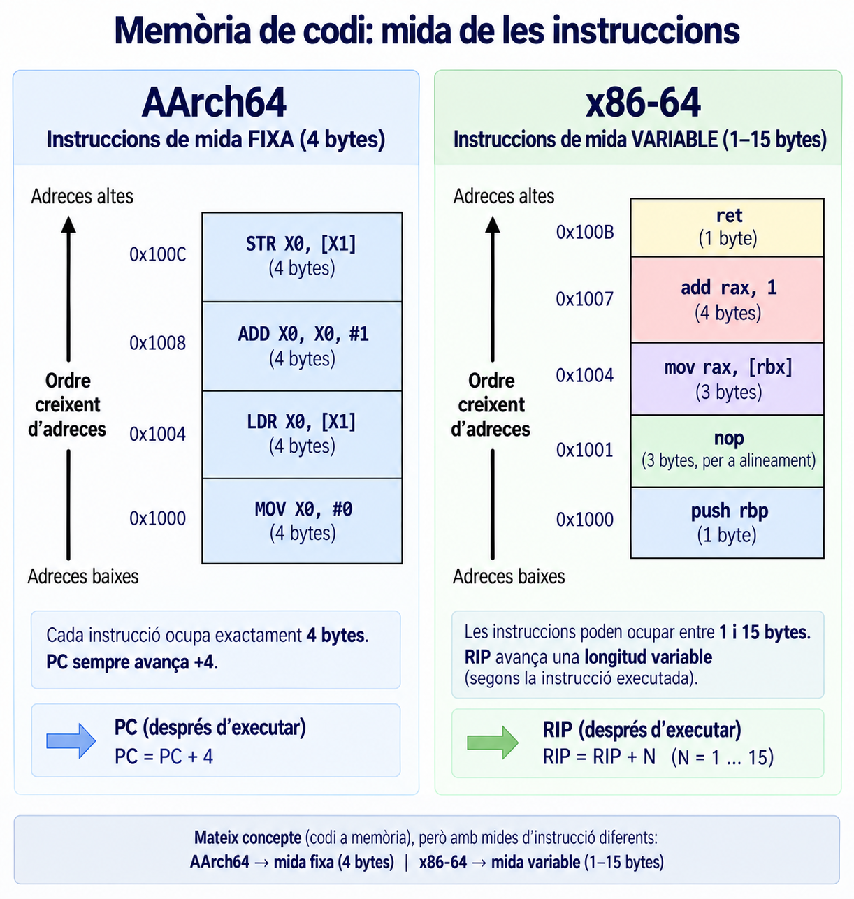{ width=90%}
:::
::: {.column width="50%"}

::: {.concepte}
La CPU executa instruccions una darrere l'altra **sequencialment**. 
:::

::: {.concepte .fragment}
Les instruccions poden ser de diferents tipus (aritmètiques, de salt, de càrrega,...) i la seva mida **no és sempre la mateixa**: en **x86-64** és **variable** (entre 1 i 15 bytes segons la instrucció); en **AArch64** és **fixa**, sempre 4 bytes.
:::

::: {.bonapractica .fragment}
Per això en AArch64 la instrucció següent sempre és `PC + 4`. En x86-64, `RIP + 4` **no funciona en general** — cal conèixer la longitud real de la instrucció actual per saber on comença la següent.
:::

::: {.reflexio .fragment}
Com sap la CPU quina instrucció ha d'executar?
:::

:::
:::

## RIP: Instruction Pointer

::: {.columns}
::: {.column width="50%"}
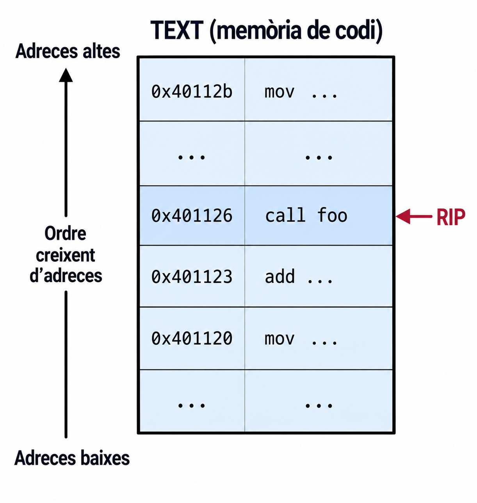{ width=90%}

:::
::: {.column width="50%"}

::: {.definicio}
- **x86-64**: `RIP`: *Instruction Pointer*. 
- **AArch64**: `PC`: *Program Counter*.
:::

::: {.concepte .fragment}
El nom canvia, però el concepte és el mateix: indicar on continua l'execució.
:::

:::
:::

# Return address i call/ret

## Ara fem `foo()`

::: {.columns}
::: {.column width="50%"}

```{.c code-line-numbers="false" }
{
    foo();
    printf("fi\n");
}
```

::: {.reflexio}
Quan `foo()` acaba, com sap la CPU on ha de tornar?
:::

:::
::: {.column width="50%"}

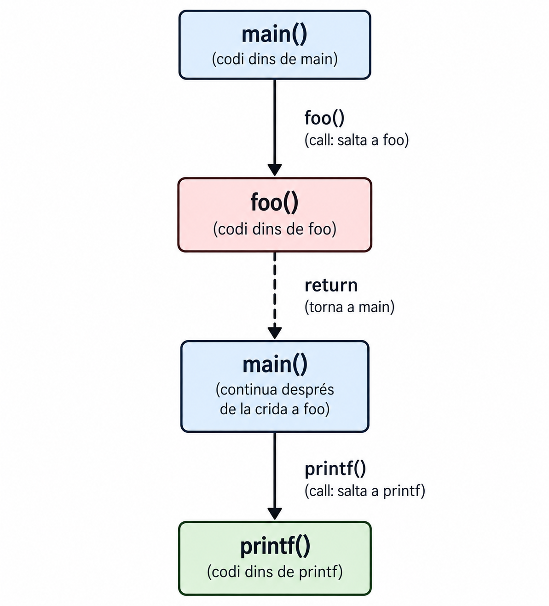{ width=80%}

:::
:::

## Return address

::: {.columns}
::: {.column width="65%"}

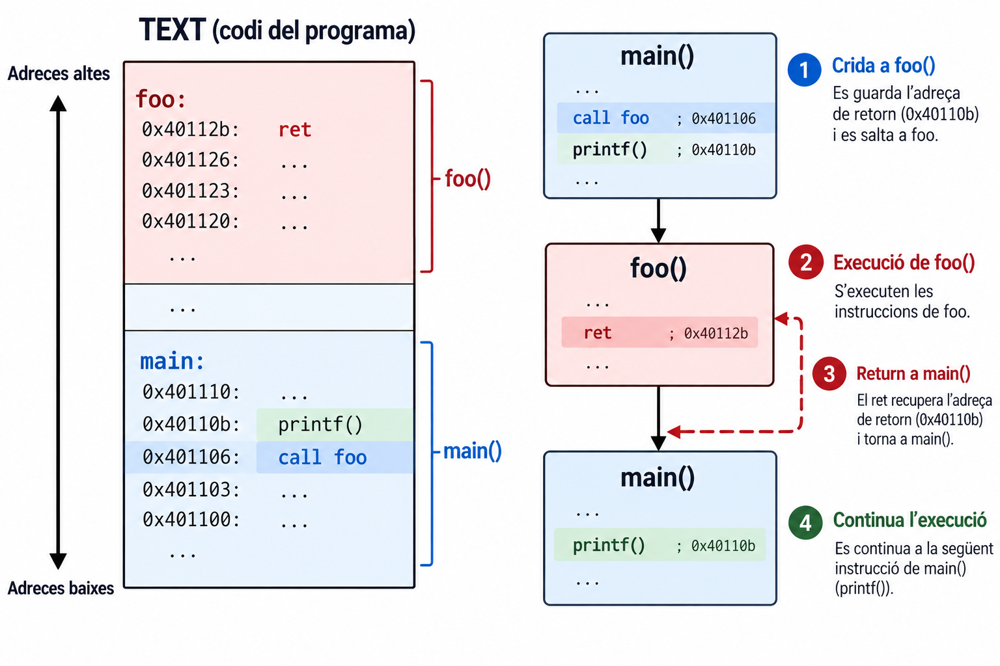{ width=80%}

:::
::: {.column width="35%"}
::: {.definicio}
**Return address**: la instrucció a la qual cal tornar un cop acabada la funció cridada.
:::

::: {.concepte}
Una crida de funció necessita conservar el punt al qual haurà de tornar.
:::

:::
:::

## call i ret (x86-64)


:::{style="text-align:center;"}
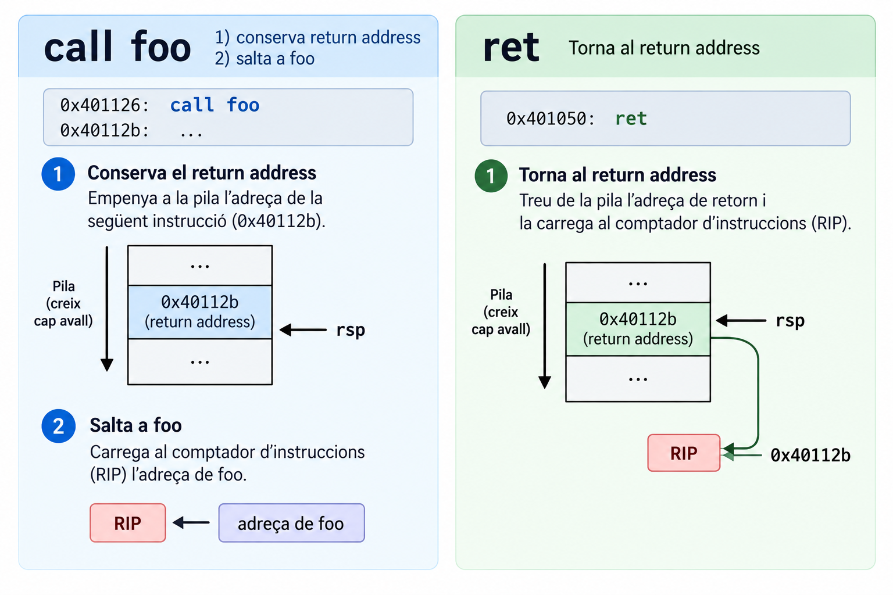{ width=70%}
:::

::: {.notes}
La implementació concreta depèn de l'arquitectura — això permetrà comparar-ho amb ARM a la propera slide.
:::

## BL i RET (AArch64)

::: {.columns}
::: {.column width="65%"}

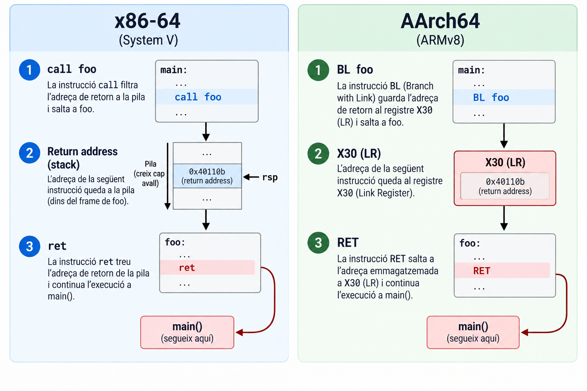

:::
::: {.column width="35%"}
::: {.definicio}
`BL foo` salta a `foo` **i** desa l'adreça de retorn a `X30` (*Link Register*).
:::

::: {.concepte}
El mecanisme conceptual és el mateix i és l'arquitectura qui decideix com es representa.
:::

::: {.bonapractica}
El mecanisme físic canvia (pila vs. registre), però **C no en sap res**: `foo()` és `foo()` en ambdues arquitectures. L'ABI i el maquinari decideixen com es representa la crida; el llenguatge només veu l'abstracció "crida una funció i torna". Aquesta separació entre abstracció i mecanisme és la mateixa raó per la qual el mateix codi C es pot compilar per a qualsevol de les dues.
:::

::: {.reflexio}
I si `foo()` mateixa crida `bar()`? `BL bar` torna a escriure `X30` — qui preserva llavors l'adreça de retorn original de `foo()`? *(hi tornarem amb caller-saved / callee-saved)*
:::

:::
:::

# El stack pointer

## Però... on està el stack?

La **STACK** és una regió de memòria que creix cap a adreces més baixes. Per tant, cal un registre que indiqui on és el *top* actual del stack.

::: {.definicio}
- **RSP** (*x86-64*):  *Stack Pointer*.
- **SP** (*AArch64*):  *Stack Pointer*.
:::

## RSP / SP

::::: {.columns}
::: {.column width="65%"}

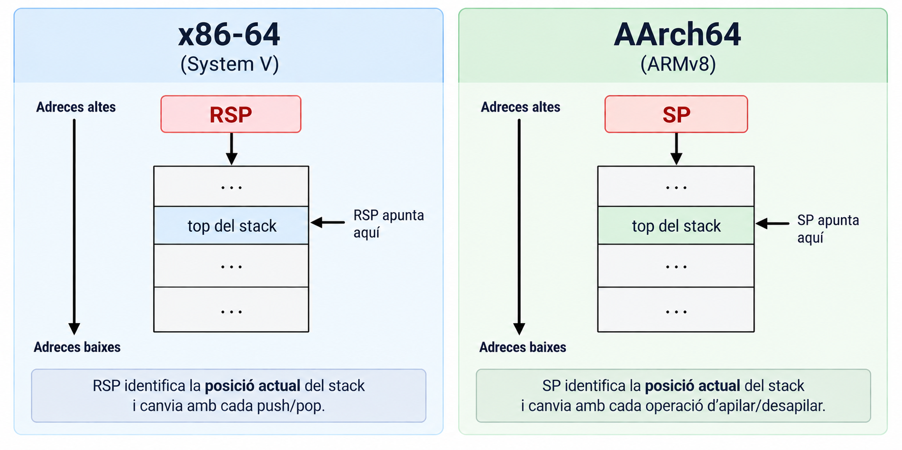

:::
::: {.column width="35%"}

::: {.concepte}
`RSP`/`SP` identifica la posició actual del stack: `push` i `pop` (x86-64) el modifiquen.
:::

::: {.bonapractica}
Per a AArch64 no parlem de `push`/`pop` com a instruccions literals — el model conceptual és el mateix, però la implementació és diferent.
:::

:::
:::


## Una funció necessita espai


::::: {.columns}
::: {.column width="35%"}

```{.c code-line-numbers="false" }
void foo(void)
{
    int x = 10;
    int y = 20;
}
```

::: {.reflexio}
Què passa amb `RSP` quan reservem i alliberem aquest espai?
:::

:::
::: {.column width="65%"}
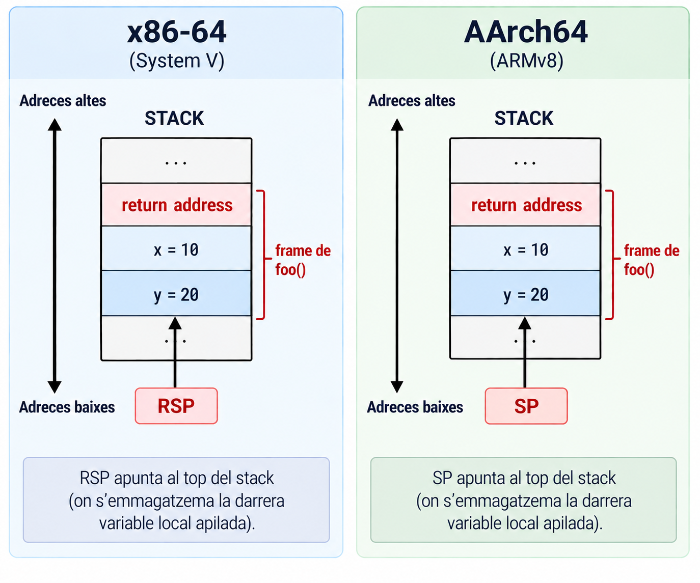{ width=90%}

:::
:::


## El stack frame — recordatori

::::: {.columns}
::: {.column width="50%"}


{ width=75%}

:::
::: {.column width="50%"}

::: {.definicio}
**Stack frame**: la part del stack associada a una activació d'una funció (Sessió 1).
:::


::: {.bonapractica}
No existeix un únic format universal de stack frame. Depèn de l'arquitectura, l'ABI/*calling convention*, el compilador i les opcions d'optimització.
:::

:::
:::

## El problema de RSP

::::: {.columns}
::: {.column width="25%"}

```{.c code-line-numbers="false" }
void foo(void)
{
    int x = 10;
    int y = 20;
    ...
}
```

::: {.reflexio}
`RSP` es mou constantment. Podem tenir un punt de referència **estable** per al frame?
:::


> x86_64 i set instruccions AT&T

:::
::: {.column width="75%"}

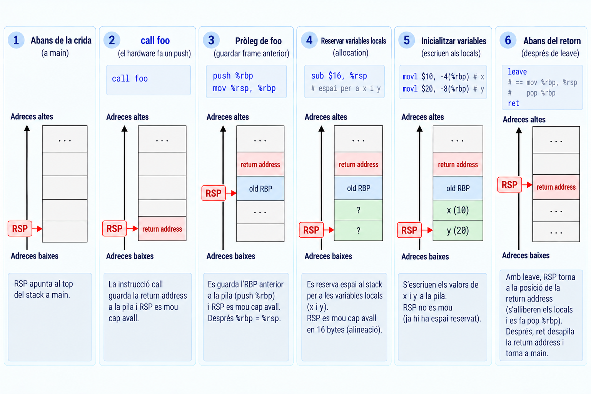


:::
:::


# El frame pointer

## RBP: Frame Pointer

::: {.definicio}
**RBP** — *Frame Pointer* (x86-64).
:::

:::{style="text-align:center;"}
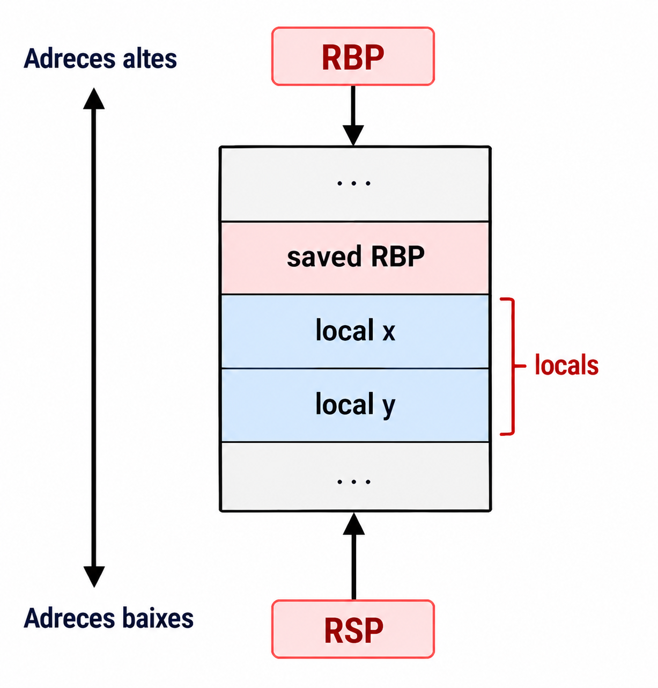{ width=25%}
:::

::: {.concepte}
`RSP` → posició actual del stack. `RBP` → referència estable al frame. `RSP` pot moure's; `RBP` es manté fix mentre dura l'activació.
:::

## AArch64: X29

::::: {.columns}
::: {.column width="50%"}
**x86-64**

- `RBP` → *frame pointer*
:::
::: {.column width="50%"}
**AArch64**

- `X29` → *frame pointer*
- `X30` → *link register*
:::
:::::

::: {.concepte}
El paper conceptual és el mateix però els registres tenen noms diferents.
:::

## Construint el frame (x86-64)


:::{style="text-align:center;"}
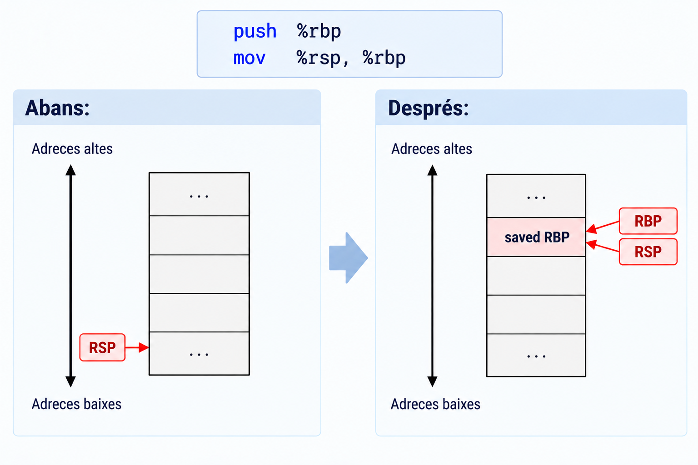{ width=55%}
:::

::: {.bonapractica}
Aquest és el patró clàssic. Els compiladors moderns poden ometre el frame pointer (*frame pointer omission*, típic amb `-O2`).
:::

## Destruint el frame

:::{style="text-align:center;"}
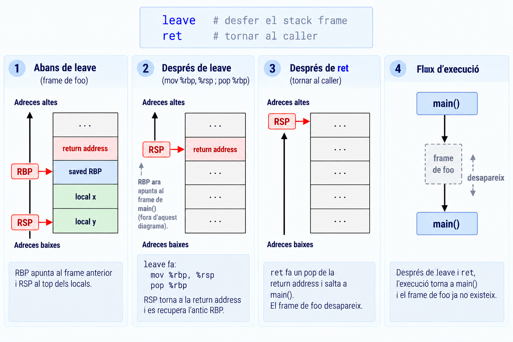{ width=70%}
:::

::: notes
Quan acaba l'activació de la funció, les variables automàtiques locals deixen de tenir *lifetime*. (No lligar-ho al frame físic desapareixent — el *lifetime* és un concepte del llenguatge, no de la implementació; amb optimització pot no haver-hi frame "clàssic" darrere.)
:::

# Arguments i ABI

## I els arguments?

```{.c code-line-numbers="false" }
int suma(int a, int b)
{
    return a + b;
}
```

::: {.reflexio}
Quan `main()` crida `suma(10, 20)`, on són `a` i `b`?
:::

::: {.errorcomu}
**"Al stack."** $\Rightarrow$ No necessàriament.
:::

## Calling convention

::: {.definicio}
**Calling convention**: com es passen els arguments, on es retorna el resultat, quins registres cal preservar, i com es relacionen *caller* i *callee*.
:::

::: {.concepte}
C defineix la funció. **L'ABI defineix com caller i callee es comuniquen.**
:::

## System V AMD64: pas d'arguments

::::: {.columns}
::: {.column width="70%"}

{ width=90%}

:::
::: {.column width="30%"}
::: {.exemple}
Arguments 1–6 (enters/punters) → `RDI, RSI, RDX, RCX, R8, R9`. Valor de retorn → `RAX`.
:::
:::
:::

## AArch64: pas d'arguments

::::: {.columns}
::: {.column width="70%"}
{ width=90%}

:::
::: {.column width="30%"}
::: {.exemple}
Arguments 1–8 (enters/punters) → `X0`–`X7`. Valor de retorn → `X0`.
:::

::: {.concepte}
La *calling convention* és específica de l'ABI: 6 registres en System V AMD64, 8 en AArch64.
:::

:::
:::

## I si no caben als registres?

::::: {.columns}
::: {.column width="70%"}

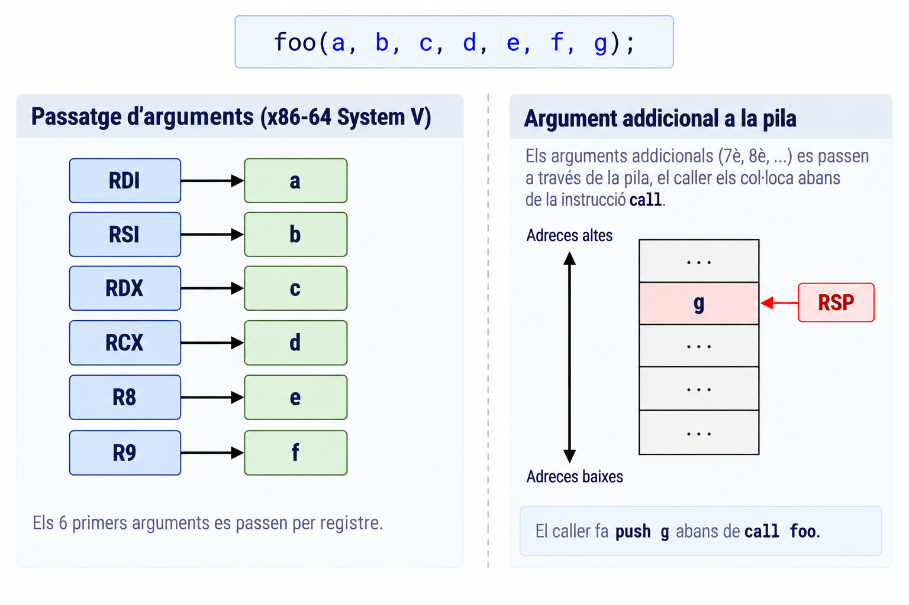

:::
::: {.column width="30%"}

::: {.bonapractica}
Model simplificat: el tractament real també depèn del tipus i de la classificació dels arguments (p. ex. enters vs. punt flotant) definida per l'ABI.
:::

:::
:::

:::notes
No es menciona l'alineament de 16 bytes de RSP abans de call (ja establert com a requisit a x86_64.png). Amb un únic argument extra de 8 bytes, un push sol deixaria RSP desalineat llevat que ja hi hagués padding previst. Com que aquest matís ja va quedar explícitament fora d'abast al .bonapractica d'aquesta mateixa diapositiva del guió ("model simplificat... depèn també del tipus i la classificació"), no cal afegir-ho aquí — només ho apunto per si en algun moment voleu ser exhaustius amb l'alineament en una diapositiva dedicada.
:::

## No tots els registres es tracten igual

::::: {.columns}
::: {.column width="50%"}
**Caller-saved**

- `RAX` 
- `RCX`
- `RDX`
- `RDI`
- `RSI`
- `R8`-`R11`
:::
::: {.column width="50%"}
**Callee-saved**

- `RBX`
- `RBP`
- `R12`–`R15`
:::
:::::

::: {.repte .fragment}
Si `foo()` modifica `RBX`, qui ha de garantir que el valor original es conserva?
:::

::: {.solucio .fragment}
`RBX` és *callee-saved*: és **`foo()`** qui ha de preservar-lo, no qui la crida. No cal memoritzar tota la llista, però sí saber distingir les dues categories.
:::

## AArch64: caller / callee saved

:::{style="text-align:center;"}
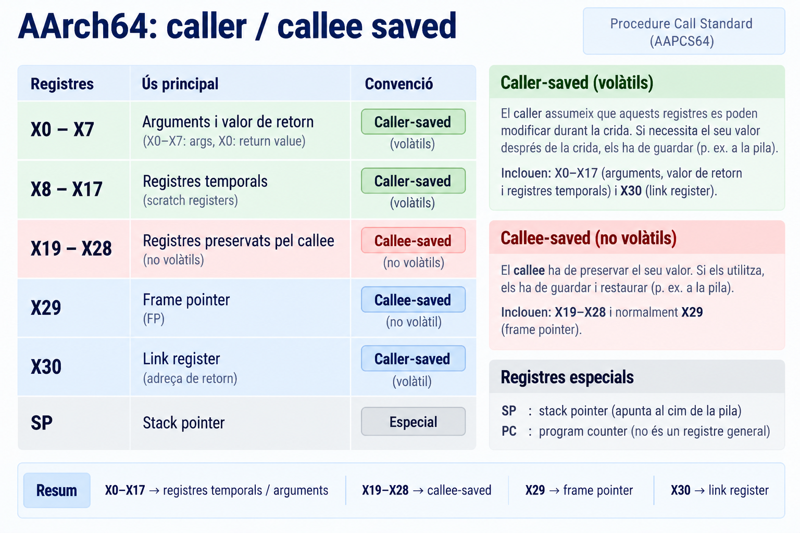{ width=70%}
:::


::: {.notes}
Prescindible si falta temps: es pot resumir oralment en una frase i saltar a la síntesi. Agrupar X8–X17 com a "registres temporals" homogenis amalgama X8 (que a l'AAPCS64 té un paper específic: indirect result location register, per retornar valors que no caben en registres) amb X9–X17, que sí són purament temporals. És una simplificació raonable i habitual a aquest nivell —i coherent amb el "no aprofundim més" que ja vau decidir per aquesta part—, però si algun dia voleu polir-ho més, X8 mereixeria una nota a part. No és un error, és una oportunitat de precisió si mai amplieu aquesta diapositiva.

Tancar aquí el fil obert a "BL i RET": X30 surt com a caller-saved precisament perquè qualsevol crida interna (`bar()` dins de `foo()`) el sobreescriu amb `BL` — si `foo()` el necessita després, l'ha de preservar ella mateixa.
:::

# Síntesi

## Posem-ho tot junt

:::{style="text-align:center;"}
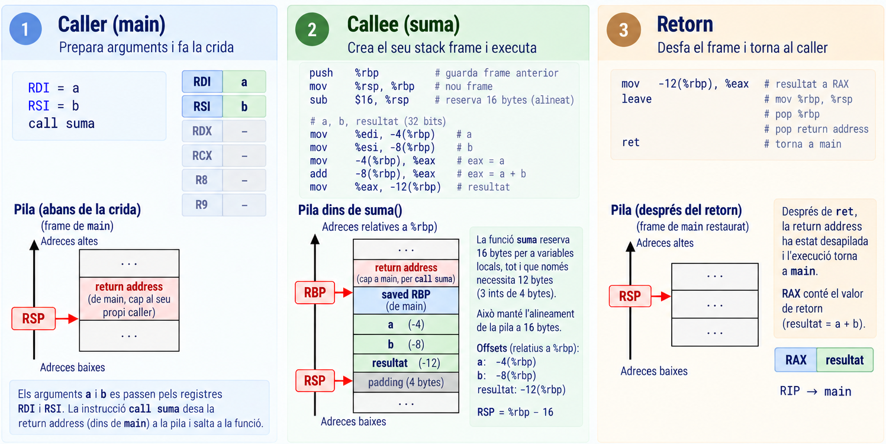{ width=60%}
:::

::: {.concepte}
`RIP`/`RSP`/`RBP` i els registres d'arguments (`RDI`...) i de retorn (`RAX`) són les peces que ja podem seguir en qualsevol crida.
:::

## Ho podem observar?

::: {.exercici}
Abans de mirar-ho, prediu:

- On creieu que estarà el valor `10`?
- I el `20`?
- Quan fem `call`, què espereu que canviï?
- Què passarà amb `RSP`?
:::

```
programa C → compilador → executable → GDB → registres + stack
```

::: {.notes}
Avui només l'utilitzarem per observar. Al proper Pralab l'utilitzarem de manera pràctica. No avancis cap resposta aquí — deixa les prediccions penjades fins després del vídeo.
:::

## GDB en directe

<div id="gdb-demo"></div>

<script>
AsciinemaPlayer.create(
  'cast/03_crides_funcions_cpu_registres_stack/gdb-demo.cast',
  document.getElementById('gdb-demo'),
  {
    autoPlay: false,
    loop: false,
    speed: 0.8,
    cols: 150,
    rows: 20
  }
);
</script>

::: {.reflexio}
Coincideix amb la vostra predicció? On és `RIP`? On és `RSP`? On és `RBP`? On són els arguments? Què hi ha al stack?
:::

::: {.notes}
No explicar la sintaxi de GDB en detall avui.
:::

## Del dibuix al programa real

::: {.concepte}
El model que hem construït (`RIP → codi`, `RSP → stack`, `RBP → frame`, `RDI/RSI → arguments`, `RAX → retorn`) no és només un dibuix: podem observar-ne parts en un programa real amb GDB.
:::

## x86-64 i AArch64 — síntesi final

| Concepte | x86-64 | AArch64 |
|---|---|---|
| Instruction pointer | RIP | PC |
| Stack pointer | RSP | SP |
| Frame pointer | RBP | X29 |
| Return/link | stack (via `call`) | X30 (via `BL`) |
| Arguments | RDI...R9 | X0...X7 |
| Return value | RAX | X0 |

::: {.resum}
1. Una funció en execució té una activació associada al stack.
2. La CPU utilitza registres per gestionar l'execució, el stack i els arguments.
3. `call`/`ret` i `BL`/`RET` implementen el mecanisme de crida segons l'arquitectura.
4. L'ABI defineix com caller i callee es comuniquen.
:::

::: {.notes}
Frase de tancament: "El model és el mateix; l'arquitectura i l'ABI determinen els detalls." Si sobra temps, es pot repassar oralment la seqüència completa: preparar la crida → guardar return information → saltar a foo → gestionar el frame → executar → produir resultat → destruir el frame → retornar al caller.
:::

# Tancament

## Lectures addicionals

::: {.lectures}
- CS:APP (Bryant & O'Hallaron) — *Machine-Level Programming: Procedures*
- System V AMD64 ABI — secció de *calling convention*
- ARM AAPCS64 (*Procedure Call Standard for the Arm 64-bit Architecture*)
- Berkeley CS61C — stack frames i convencions de crida
- MIT 6.172, Lecture 11 — Storage Allocation
:::
