# Introducció

## Com es construeix un programa C? {.center}

::: {.r-fit-text}
Fonts · compilació · objectes · llibreries · enllaç · make
:::

::: {.notes}
No explicar res encara. La pregunta guia de tota la sessió: "Què passa entre escriure main.c i executar ./programa?"
:::

## Objectius d'aprenentatge

::: {.objectius}
- Explicar les etapes bàsiques de construcció d'un programa C
- Distingir `.c`, `.h`, `.o` i executable
- Entendre la diferència entre compilar i enllaçar
- Entendre què aporta una llibreria
- Explicar què fa un Makefile
- Modificar un Makefile senzill amb diverses fonts
- Entendre per què només cal recompilar les parts que han canviat
:::

## Prerequisits

::: {.prerequisits}
- Escriure i compilar un programa C senzill amb `gcc`
- ([Pralab 01](../pralabs/01_c_mem.qmd), [Pralab 02](../pralabs/02_c_mem.qmd))
- Nocions bàsiques de fitxers i directoris al terminal
:::

## La pregunta

```{.c code-line-numbers="false" }
#include <stdio.h>

int main(void)
{
    printf("Hello\n");
    return 0;
}
```
&nbsp;

```{.bash code-line-numbers="false" }
gcc main.c -o hello
./hello
```
&nbsp;

::: {style="text-align:center;"}
Què ha fet realment `gcc` entre aquestes dues ordres?
:::

::: {.notes}
No donar encara la resposta.
:::

# Del codi font a l'executable

## Compilar no és un únic pas

:::{.columns}
:::: {.column width="25%"}

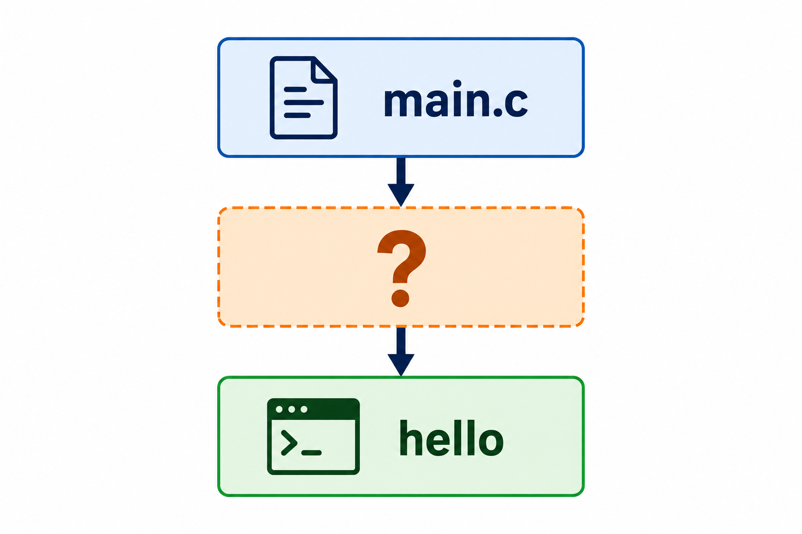

:::
:::: {.column width="25%" .fragment}

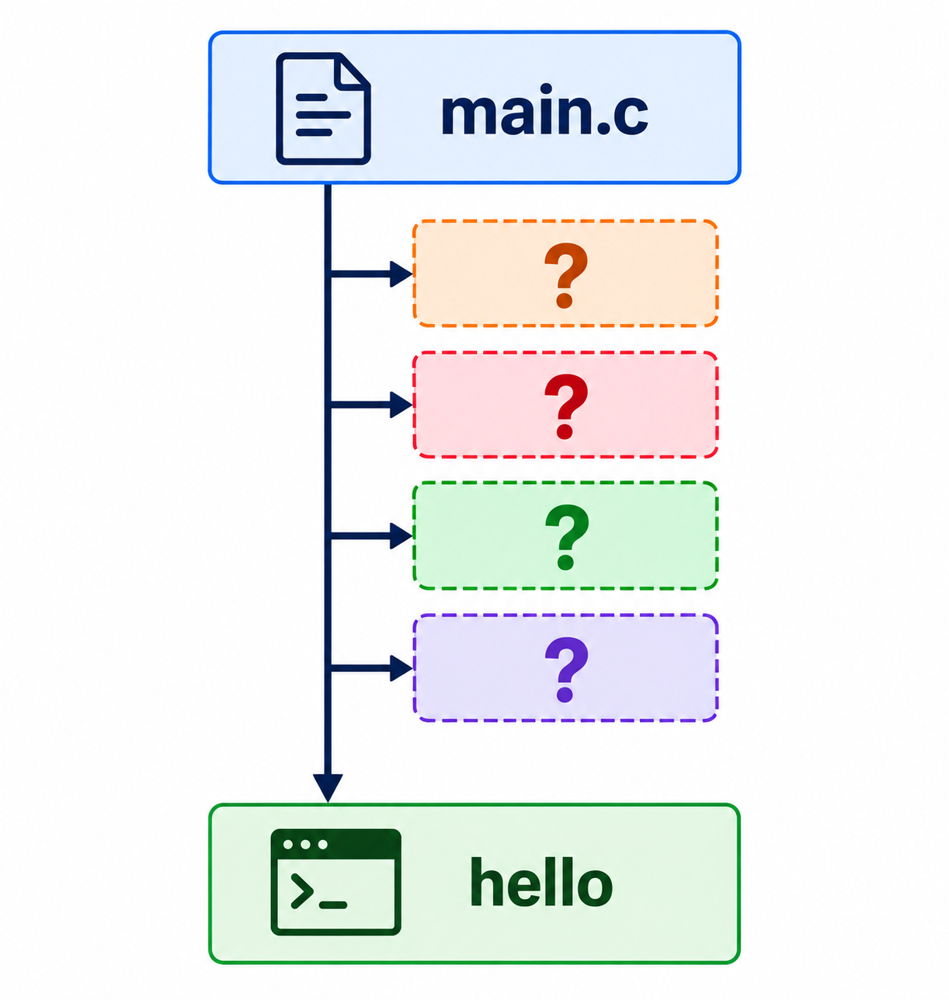

:::
:::: {.column width="25%" .fragment}

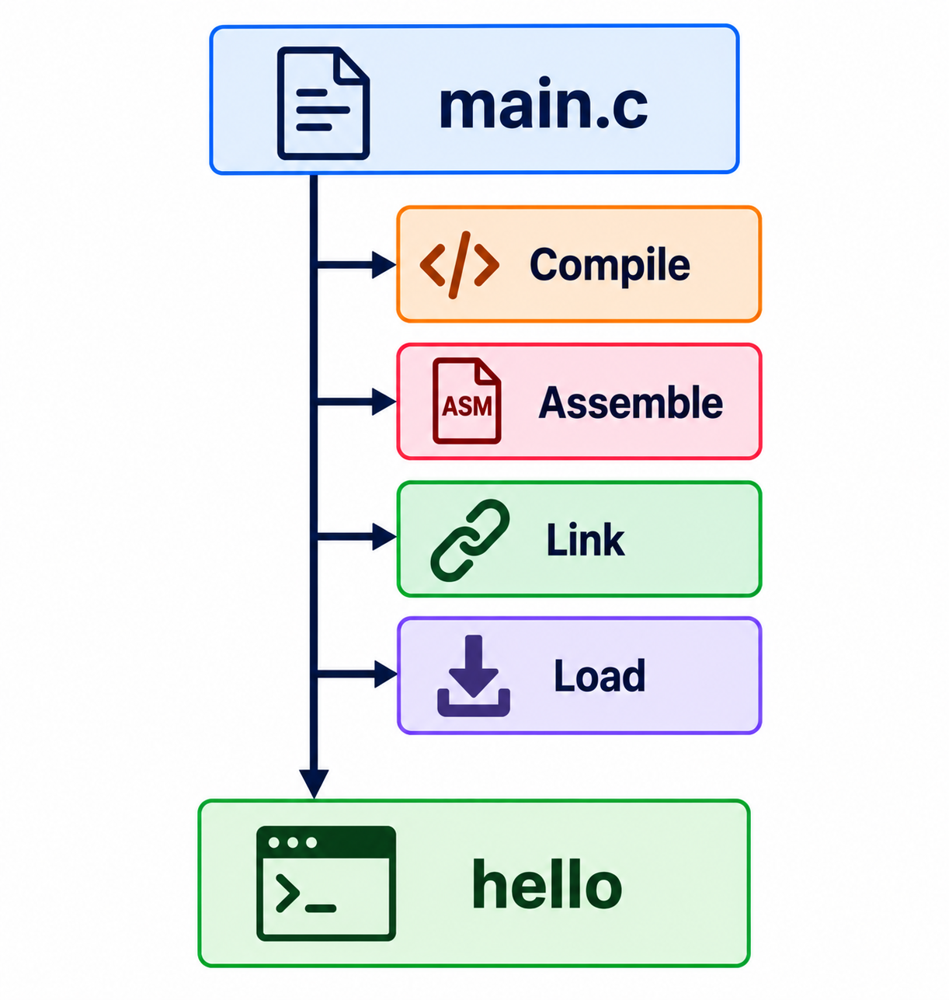

:::
:::: {.column width="25%" .fragment}
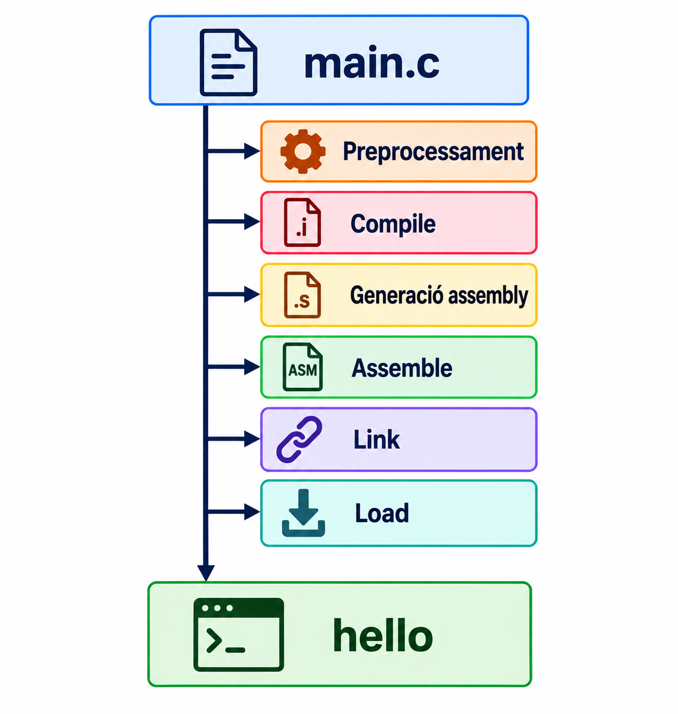
:::
:::

:::{.columns}
::: {.column width="50%"}

::: {.concepte .fragment}
Quan diem informalment *compilar un programa*, estem agrupant diverses etapes diferents que consisteixen en: *Compile → Assemble → Link → Load*. A vegades, també s'inclou el preprocessament com a pas previ a la compilació i la generació d'assembly com a pas posterior.
:::

:::
::: {.column width="50%"}

::: {.bonapractica .fragment}
`gcc` és el **driver** que coordina les diferents eines (preprocessador, compilador, assemblador, enllaçador). Per això `gcc -c main.c` i `gcc main.o mathutils.o -o programa` fan coses tan diferents.
:::

:::
:::


## El pipeline

:::{style="text-align:center;"}
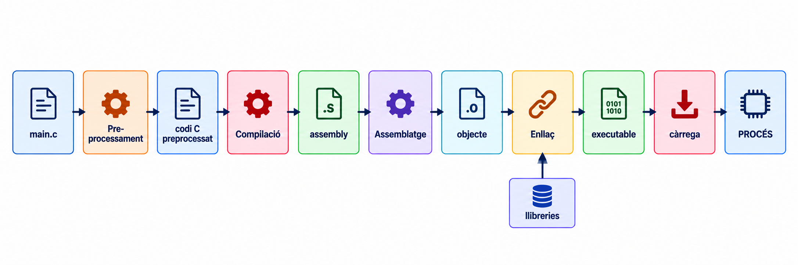
:::

::: {.concepte}
Cada etapa transforma un artefacte en un altre. Aquests artefactes intermedis normalment **no es desen a disc** quan feu `gcc main.c -o hello`, és el mateix `gcc` (el driver) qui els passa internament d'una eina a la següent. Si voleu observar-los, useu `-E` (atura't al preprocessat), `-S` (atura't a l'assembly) o `-c` (atura't a l'objecte).
:::

# El preprocessador

## Què fa #include?

```{.c code-line-numbers="false" }
#include <stdio.h>

int main(void)
{
    printf("Hello\n");
}
```

::: {.exercici .fragment}
On està definida `printf`?
:::

:::{.solucio .fragment}
No és a `main.c`.  La funció `printf` està implementada a la llibreria C (`libc`). El fitxer de capçalera `stdio.h` conté la **declaració** de `printf`, que el compilador necessita per comprovar que l'ús que en fem és correcte. La implementació real de `printf` està a la llibreria, que el linker afegirà al programa final.
:::

:::{.reflexio .fragment}
Què significa realment aquest `#include`?
:::

## #include no és enllaçar

:::{.columns }
::: {.column width="35%"}


---

```{.bash code-line-numbers="false" }
gcc -E main.c -o main.i
```

:::
::: {.column width="65%"}

::: {.errorcomu}
`#include <stdio.h>` **no** significa **afegeix la llibreria stdio al programa**.
:::

::: {.definicio .fragment}
`#include` significa: insereix el contingut del fitxer de capçalera en aquest punt, durant el preprocessament. El preprocessador el tracta com una **inclusió textual** del fitxer, és a dir, còpia literalment el contingut del fitxer de capçalera al fitxer font abans de compilar-lo.
:::

::: {.concepte .fragment}
El `.h` proporciona declaracions i informació necessària al compilador. No és, per si mateix, la implementació de `printf`.
:::

:::
:::

## Capçalera vs implementació

::::: {.columns}
::: {.column width="33%"}
`mathutils.h`
```{.c code-line-numbers="false" }
int suma(int a, int b);
```
:::
::: {.column width="33%"}
`mathutils.c`
```{.c code-line-numbers="false" }
int suma(int a, int b)
{
    return a + b;
}
```
:::
::: {.column width="34%"}
`main.c`
```{.c code-line-numbers="false" }
#include "mathutils.h"

int main(void)
{
    return suma(2, 3);
}
```
:::
:::::

::: {.concepte}
Habitualment, el `.h` exposa la **interfície** i el `.c` conté la **implementació**. *És una simplificació pedagògica*: un `.h` també pot contenir `#define`, `typedef`, `struct`, `enum`, funcions `static inline` o declaracions `extern`. 
:::

## Declaració ≠ definició

::: {.definicio}
`int suma(int a, int b);`  això és una **declaració**.
:::

::: {.definicio .fragment}
`int suma(int a, int b) { return a + b; }` això és una **definició**.
:::

::: {.reflexio .fragment}
Per què ens interessa separar-les?
:::

::: {.concepte .fragment}
Perquè diversos fitxers poden utilitzar una funció sense haver-ne de copiar la implementació. Això prepara directament la compilació separada.
:::

# Compilació separada

## Un programa pot tenir molts fitxers

:::{style="text-align:center;"}
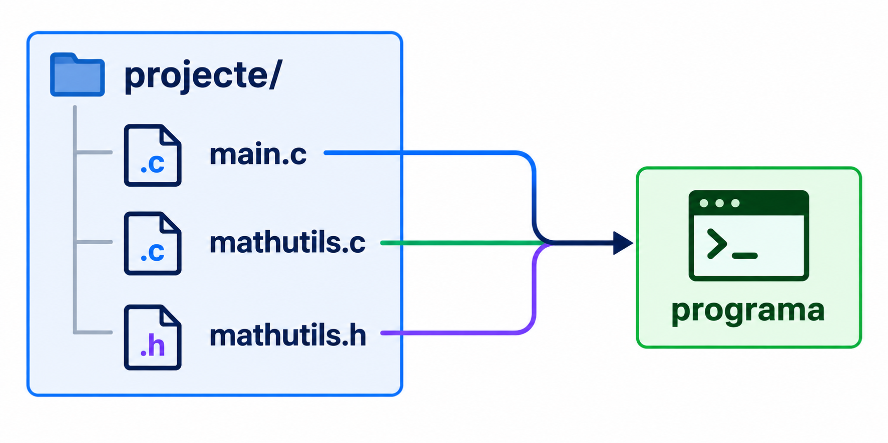{width=60%}
:::


::: {.reflexio .fragment}
Hem de compilar-ho tot com un únic fitxer?
:::


## Compilació separada

:::{style="text-align:center;"}
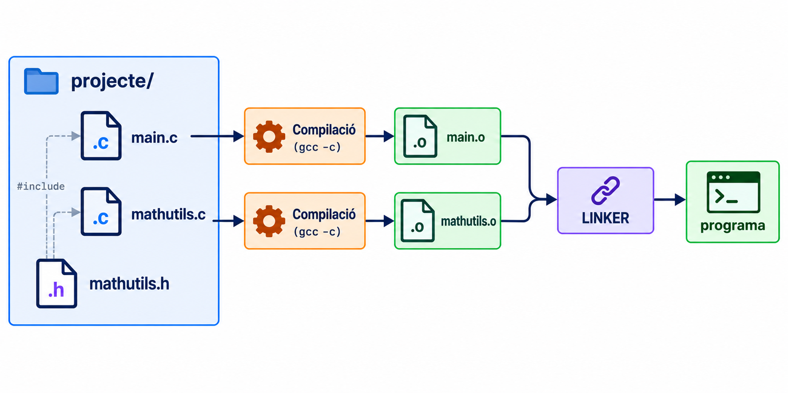{width=60%}
:::


::: {.solucio}
La **compilació separada** permet compilar cada fitxer `.c` independentment i obtenir un `.o`. Després, el *linker* combina els objectes i resol les referències entre ells.
:::

## Què és un .o?

::::: {.columns}
::: {.column width="50%"}

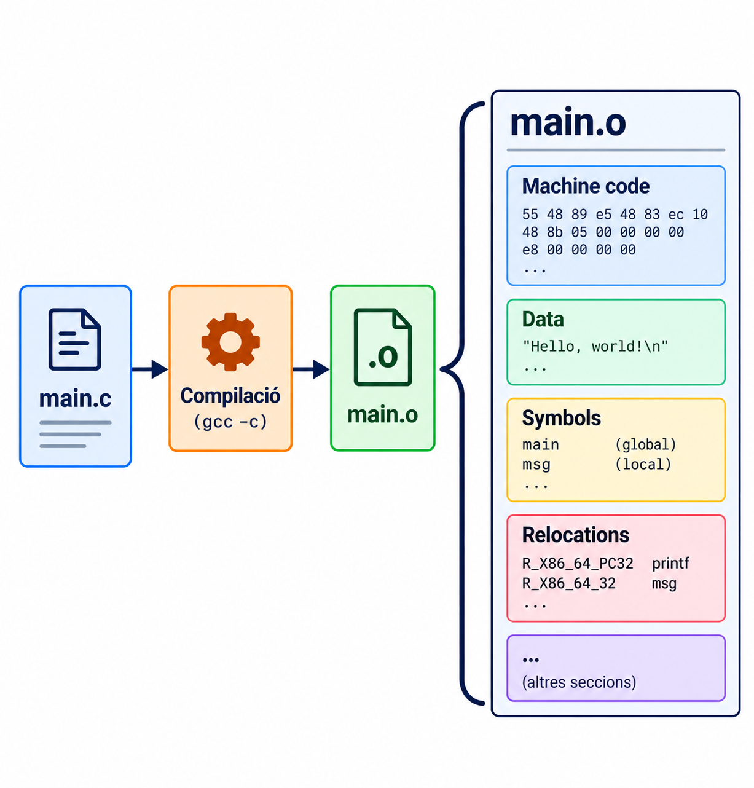


:::
::: {.column width="50%"}

::: {.definicio}
**Object file**: conté codi màquina, dades, símbols i informació de reubicació, però encara no és necessàriament un executable complet.
:::


::: {.concepte .fragment}
Un objecte és una peça del programa que encara pot tenir referències que el linker haurà de resoldre. **Encara no estem parlant de l'espai d'adreces d'un procés**, un `.o` té *sections* pròpies del format ELF, no les regions TEXT/DATA/HEAP/STACK.
:::

:::
:::

## Ho podem veure amb `gcc`

```{.bash code-line-numbers="false" }
gcc -c main.c -o main.o
gcc -c mathutils.c -o mathutils.o
ls
```

si tot ha anat bé, veureu aquests fitxers:

```
main.c  main.o  mathutils.c  mathutils.h  mathutils.o
```

::: {.definicio}
`-c` significa: compila/transforma però no facis l'enllaç final.
:::

## I ara el linker

```{.bash code-line-numbers="false" }
gcc main.o mathutils.o -o programa
```

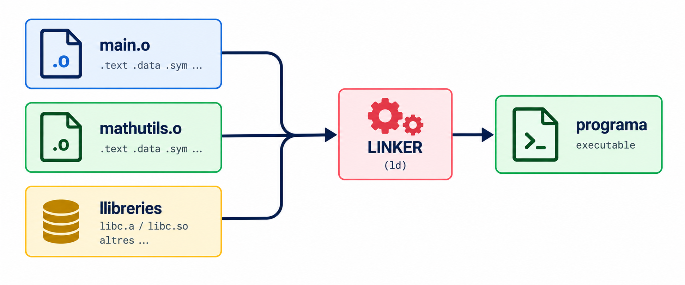

::: {.reflexio}
Quina cosa nova ha hagut de fer el linker, que `gcc -c` no feia?
:::


# El linker

## Referències entre fitxers

```{.c code-line-numbers="false" }
int suma(int, int);

int main(void)
{
    return suma(2, 3);
}
```

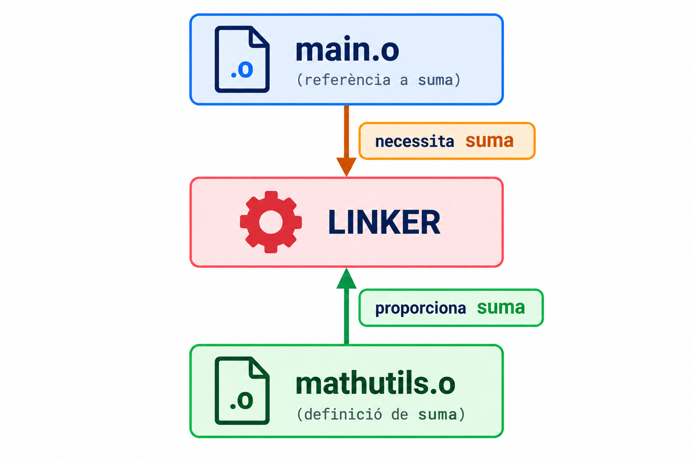

::: {.concepte}
`main.o` sap que existeix `suma`, però no necessàriament on estarà definitivament el seu codi dins de l'executable. `mathutils.o` **proporciona** `suma`.
:::


## Símbols

:::{style="text-align:center;"}
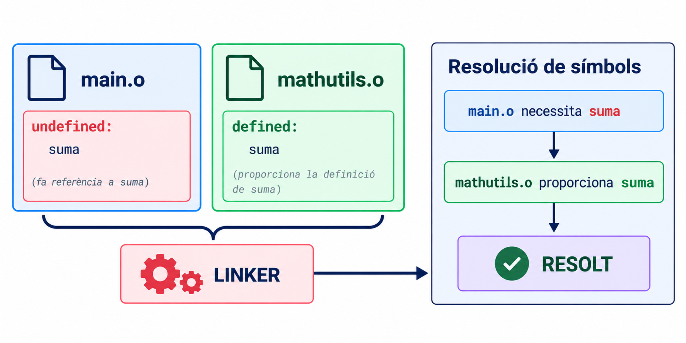{width=60%}
:::

::: {.concepte}
El linker connecta les referències amb les definicions corresponents. Probablement la idea més important d'aquest bloc.
:::

::: {.bonapractica}
El linker: **(1)** resol símbols, **(2)** aplica les reubicacions necessàries, **(3)** combina els objectes i **(4)** genera l'executable.
:::

## Què passa si falta?

```{.bash code-line-numbers="false" }
gcc main.o -o programa
```

i obteniu un error com aquest:

```
undefined reference to `suma`
```

::: {.errorcomu}
El problema **no** és del compilador. El fitxer `main.c` es podia compilar perfectament però l'error apareix durant el **LINK**.
:::


## Dos errors diferents

### Error de compilació

:::{r-fit-text}
`main.c` → COMPILER → error
:::

```{.c code-line-numbers="false" }
int main(void)
{
    printf("Hello")
}
```

&nbsp;

### Error d'enllaç

:::{r-fit-text}
`main.c` → COMPILER → `main.o`
        → LINKER → undefined reference
:::

&nbsp;

::: {.concepte}
No tots els errors que apareixen quan fem `gcc` són errors del compilador.
:::

# Llibreries

## I printf?

```{.c code-line-numbers="false" }
#include <stdio.h>
printf("Hello\n");
```

::: {.reflexio}
Si `printf` no està implementada a `main.c`, d'on surt?
:::

::: {.concepte .fragment}
`stdio.h` → declaració de `printf`. `libc` → la seva implementació.
:::

::: {.bonapractica .fragment}
`gcc main.c -o hello` funciona sense que hàgiu fet cap enllaç **explícit**. No cal escriure `-lc` perquè el driver de `gcc` enllaça automàticament les llibreries estàndard necessàries, `libc` inclosa.
:::

## Una llibreria és codi reutilitzable

::::: {.columns}
::: {.column width="50%"}

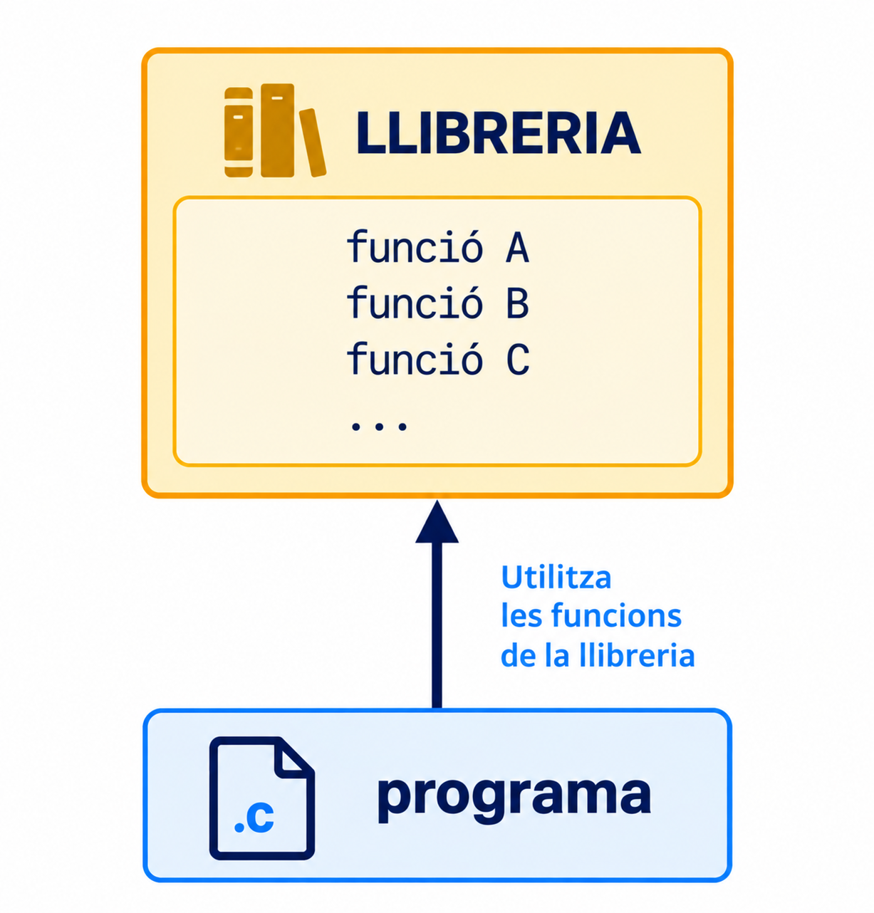

:::
::: {.column width="50%"}

::: {.definicio}
Una llibreria permet reutilitzar codi ja implementat.
:::

```{.c code-line-numbers="false" }
#include <math.h>
double x = sqrt(25.0);
```

:::
:::

## .h i llibreria són coses diferents

::::: {.columns}
::: {.column width="50%"}

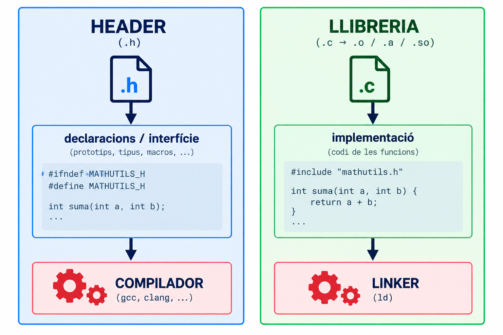

:::
::: {.column width="50%"}

::: {.concepte}
`.h` → interfície que el **compilador** necessita. Llibreria → implementació que el **linker** necessita.
:::

::: {.errorcomu}
`#include` i `-l...` resolen problemes **diferents**.
:::

::: {.bonapractica}
Una llibreria **estàtica** es resol durant l'enllaç i una llibreria **compartida** hi pot intervenir també el carregador dinàmic en temps d'execució.
:::

:::
:::

## `-l`

```{.bash code-line-numbers="false" }
gcc main.c -lm -o programa
```

::: {.exemple}
`-lm` significa: **demana al linker** que enllaci amb `libm`. `#include <math.h>` proporciona les declaracions que el compilador necessita; `-lm` és cosa del linker.
:::

::: {.bonapractica}
Es pot utilitzar `-L` que permet indicar al linker directoris addicionals on buscar llibreries. No substitueix `-l`. No entrem avui a explicar `-L`, `rpath`, `LD_LIBRARY_PATH`, etc.
:::

## Llibreries estàtiques i dinàmiques

:::{style="text-align:center;"}
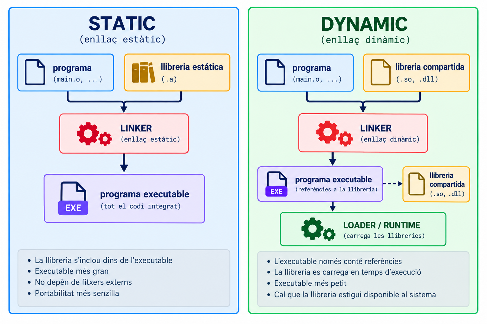{width="70%"}
:::

::: {.concepte}
Una llibreria pot formar part de l'executable final o ser carregada com a objecte compartit.
:::


# El problema real

## I si tenim 20 fitxers?

```{.bash code-line-numbers="false" }
ls projecte
main.c  parser.c  parser.h memory.c  memory.h utils.c  utils.h  ...

# Cal compilar cada fitxer i després enllaçar-los tots junts:
gcc -c main.c
gcc -c parser.c
gcc -c memory.c
gcc -c utils.c
gcc main.o parser.o memory.o utils.o -o programa
```

::: {.reflexio}
Ho volem escriure nosaltres cada vegada?
:::

## Necessitem automatitzar la construcció

::: {.definicio}
**make**: una eina que descriu dependències i executa les ordres necessàries per actualitzar els fitxers generats, no és **una eina per compilar**.
:::

::: {.concepte}
`make` determina quines parts cal recompilar a partir de les dependències.
:::

## El primer Makefile

```{.makefile code-line-numbers="false" }
programa: main.o mathutils.o
	gcc main.o mathutils.o -o programa

main.o: main.c mathutils.h
	gcc -c main.c -o main.o

mathutils.o: mathutils.c
	gcc -c mathutils.c -o mathutils.o
```

::: {.reflexio}
Què estem descrivint? No diem simplement *executa aquestes ordres*, diem que `programa` **depèn de** `main.o` + `mathutils.o`.
:::

::: {.errorcomu .fragment}
`make` **no** sap per si sol les dependències del programa. Les ha de conèixer perquè **nosaltres** les hi hem declarat al Makefile (o perquè les hem generat automàticament amb alguna eina). No podem assumir *make sap que `main.c` utilitza `mathutils.h`*, sap el que declarem.
:::

## Target, prerequisites, recipe

```{.makefile code-line-numbers="false" }
programa: main.o mathutils.o
	gcc main.o mathutils.o -o programa
```

::: {.definicio}
- **target**: `programa`. 
- **prerequisites**: `main.o mathutils.o`. 
- **recipe**: `gcc ...`. 
- **target**, **prerequisites** i **recipe** són els elements bàsics d'una regla en GNU Make. 
- GNU Make defineix precisament les regles com `target : prerequisites`, seguit de la recipe.
:::

## `make` pensa en dependències

:::{style="text-align:center;"}

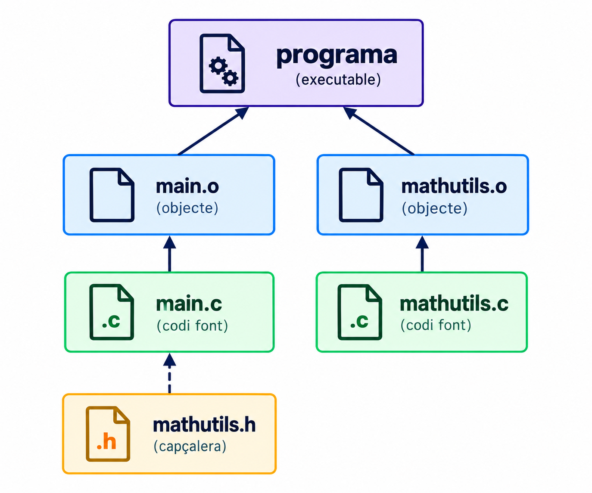{width="50%"}

:::


::: {.concepte}
El Makefile descriu un graf de dependències.
:::

## El poder de `make`

```{.bash code-line-numbers="false" }
make
```

Aquí `make` genera el programa a partir de les dependències que hem declarat al Makefile. Si tot ha anat bé, veureu:

:::{.exemple title="Sortida de make"}
```
main.o        → cal compilar
mathutils.o   → cal compilar
programa      → cal enllaçar
```
:::

Si modifiqueu `mathutils.c` i torneu a fer `make`, veureu:

:::{.exemple title="Sortida de make després de modificar mathutils.c"}
```
main.o        → no cal
mathutils.o   → cal recompilar
programa      → cal reenllaçar
```
:::

::: {.concepte}
`make` evita treballar de més. GNU Make comprova si els *prerequisites* són més recents que el *target* i només reconstrueix allò que queda obsolet.
:::

## I si canvia un .h?

Si modifiqueu `mathutils.h` i torneu a fer `make`, veureu:

:::{.exemple title="Sortida de make després de modificar mathutils.h"}
```
main.o        → cal recompilar (depèn de mathutils.h)
mathutils.o   → no cal
programa      → cal reenllaçar
```
:::

Això vol dir que `main.o` s'ha de recompilar perquè depèn de `mathutils.h`, i després cal tornar a enllaçar l'executable.

```{.bash code-line-numbers="false" }
main.o: main.c mathutils.h
```

::: {.reflexio}
Com sap `make` que `main.o` depèn de `mathutils.h`? Perquè li ho hem especificat nosaltres al Makefile, no perquè ho hagi deduït.
:::

::: {.concepte}
Les dependències no són només entre fitxers `.c`. Els `.h` també poden provocar recompilacions, però, com sempre, només si les hem declarat.
:::

# Fer un Makefile una mica millor

## Variables

```{.makefile code-line-numbers="false" }
CC = gcc
CFLAGS = -Wall -Wextra -std=c17

$(CC) $(CFLAGS) -c main.c -o main.o
```

::: {.concepte}
Les variables fan el Makefile més fàcil de mantenir. GNU Make considera les definicions de variables un dels elements bàsics d'un Makefile.
:::

## Un Makefile complet (versió explícita)

:::{.columns}
:::: {.column width="50%"}

```{.makefile code-line-numbers="false" }
CC = gcc
CFLAGS = -Wall -Wextra -std=c17
TARGET = programa
OBJS = main.o mathutils.o

$(TARGET): $(OBJS)
	$(CC) $(OBJS) -o $@
main.o: main.c mathutils.h
	$(CC) $(CFLAGS) -c main.c -o main.o
mathutils.o: mathutils.c
	$(CC) $(CFLAGS) -c mathutils.c -o mathutils.o

.PHONY: clean
clean:
	rm -f $(OBJS) $(TARGET)
```

:::
:::: {.column width="50%"}

::: {.concepte}

- `$@` → nom del target
- `$<` → primer prerequisite
- `$^` → tots els prerequisites. 
- GNU Make proporciona aquestes variables automàticament.
:::

:::
:::


## Simplificant: la regla implícita

:::{.columns}
:::: {.column width="50%"}

```{.makefile code-line-numbers="false" }
main.o: main.c mathutils.h
	$(CC) $(CFLAGS) -c main.c -o main.o
```

es pot escurçar a:

```{.makefile code-line-numbers="false" }
main.o: main.c mathutils.h
```

::: {.bonapractica}
GNU Make ja té una regla implícita per construir un `.o` a partir d'un `.c`, fent servir `$(CC)`/`$(CFLAGS)`, utilitzant les variables i regles implícites corresponents.
:::

:::
:::: {.column width="50%"}

```{.makefile code-line-numbers="false" }
CC = gcc
CFLAGS = -Wall -Wextra -std=c17

TARGET = programa
OBJS = main.o mathutils.o

$(TARGET): $(OBJS)
	$(CC) $(OBJS) -o $@

main.o: main.c mathutils.h
mathutils.o: mathutils.c

.PHONY: clean
clean:
	rm -f $(OBJS) $(TARGET)
```

:::
:::

## make clean

```{.bash code-line-numbers="false" }
make clean
```

```{.makefile code-line-numbers="false" }
clean:
	rm -f $(OBJS) $(TARGET)
```

::: {.reflexio}
Per què `clean` no és un fitxer?
:::

::: {.concepte}
Perquè és una **acció**, no un artefacte. Per això `.PHONY: clean`. GNU Make classifica aquests com a *phony targets*, que sempre s'executen quan es demanen.
:::

# Síntesi

## Demostració: compilar i enllaçar amb `make`

<div id="gcc-make-demo"></div>

<script>
AsciinemaPlayer.create(
  'cast/04_construccio_programa/gcc-make-demo.cast',
  document.getElementById('gcc-make-demo'),
  {
    autoPlay: false,
    loop: false,
    speed: 0.8,
    cols: 150,
    rows: 20
  }
);
</script>

## El mapa complet

:::{style="text-align:center;"}
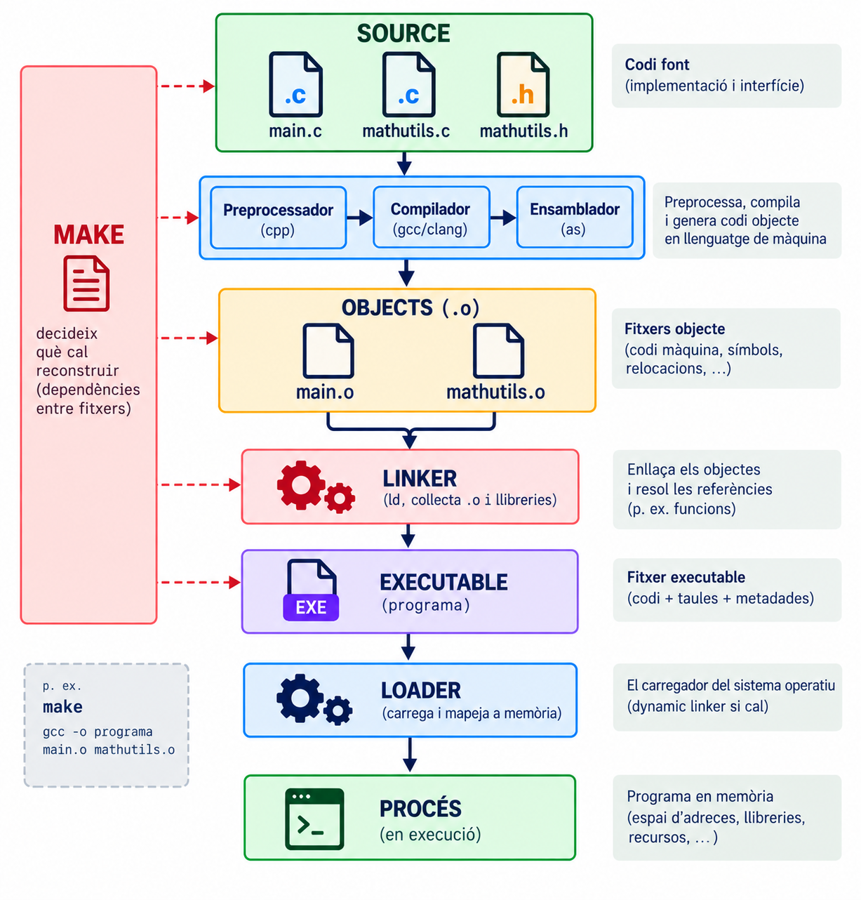{width="50%"}
:::

## Connexió amb la sessió de memòria

:::{style="text-align:center;"}
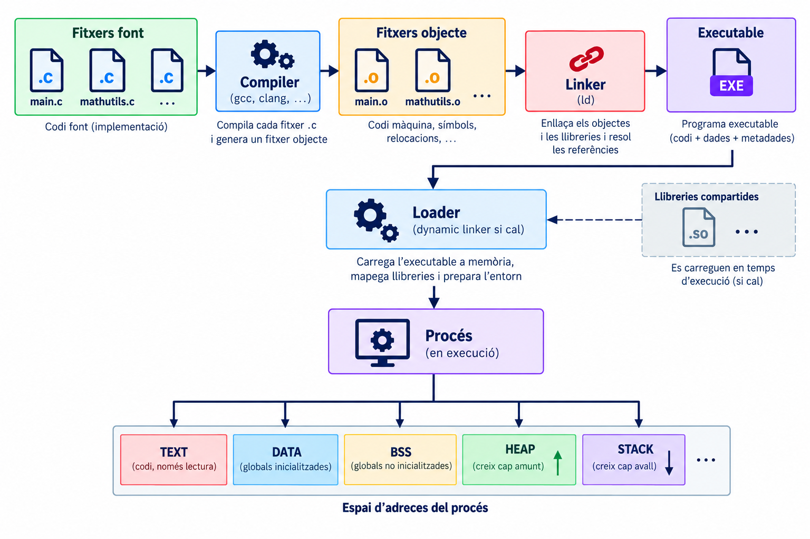{width="50%"}
:::

::: {.bonapractica}
L'executable proporciona part del contingut **inicial** de l'espai d'adreces del procés, el codi i les dades inicialitzades. No és exactament el mateix dir `.o` TEXT que procés TEXT: un és una *section* ELF, l'altre és una regió de l'espai d'adreces en temps d'execució, encara que hi hagi relació directa entre totes dues.
:::


## Tres errors, tres llocs

1. Els errors de sintaxi apareixen en temps de **compilació**.
2. Els errors de `undefined reference` apareixen en temps d'**enllaç**.
3. Els errors de `segmentation fault` apareixen en temps d'**execució**.

::: {.concepte .fragment}
Els dos primers són problemes de **construcció** del programa. El tercer no és **una etapa que ha fallat**. És un senyal generat com a conseqüència d’un accés de memòria no vàlid, i només pot aparèixer quan el programa ja s’està executant.
:::

## Què hem après?

::: {.resum}
1. Un programa C es construeix en diverses etapes.
2. Els `.c` es poden compilar separadament fins a obtenir `.o`.
3. El linker combina objectes i llibreries i resol referències.
4. `make` descriu dependències i evita reconstruccions innecessàries.
:::

## Lectures addicionals

::: {.lectures}
- MIT 6.S096 — Compilation Pipeline
- Berkeley CS61C — Compiler, Assembler, Linker, Loader
- Illinois CS341 — Compiling and Linking
- MIT — Makefile Primer
- GNU Make Manual
:::

