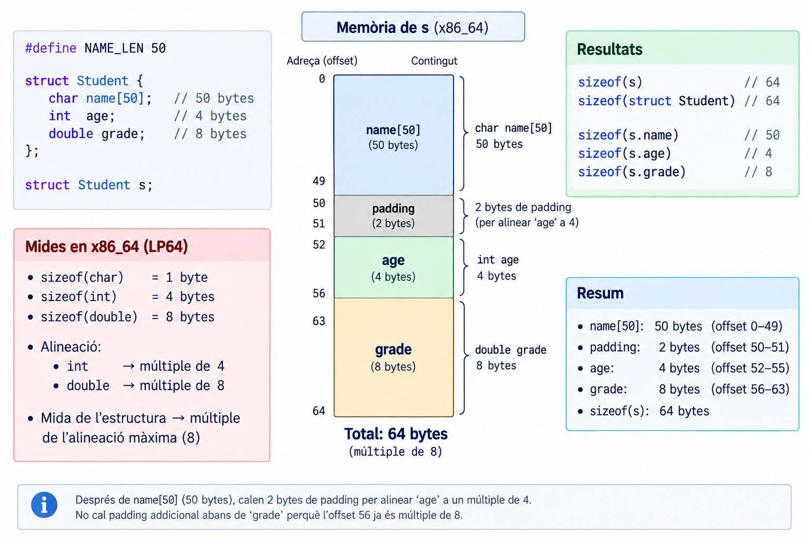
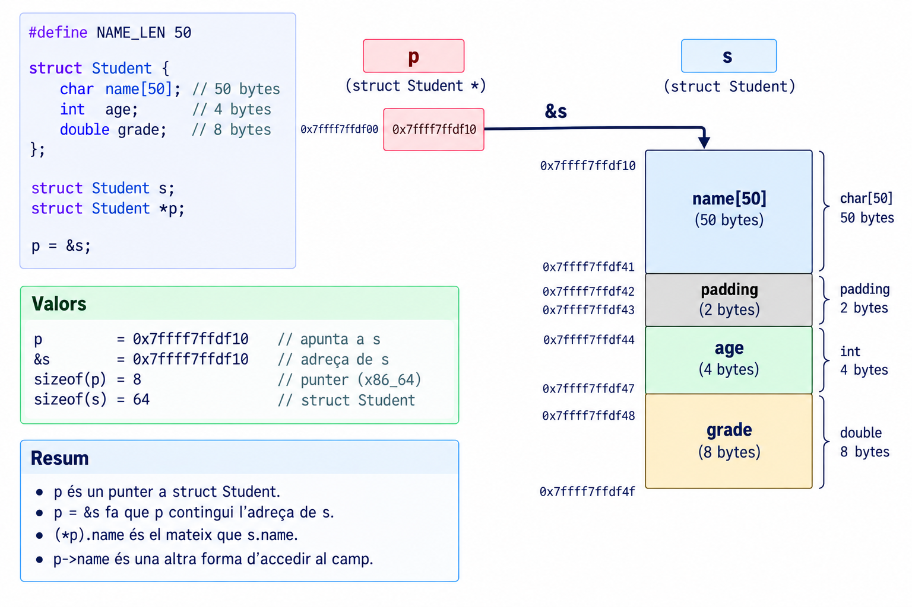
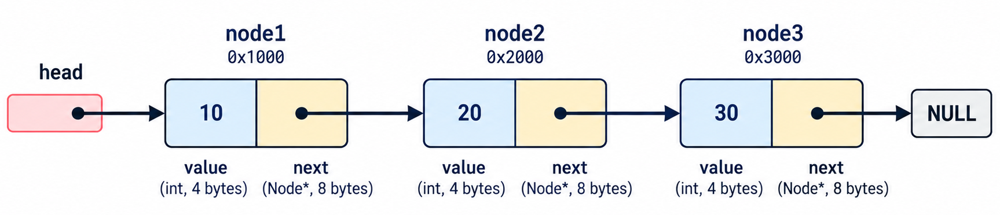
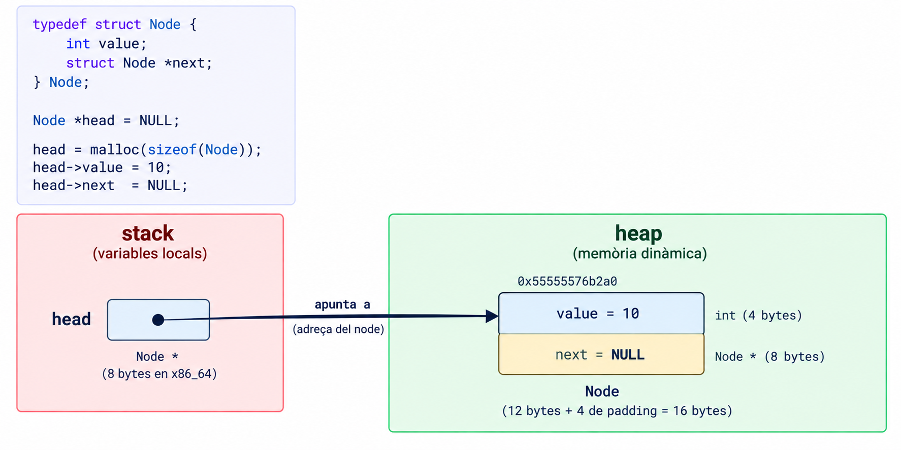
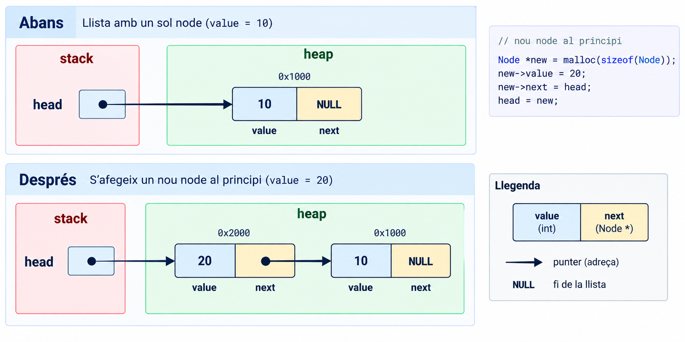
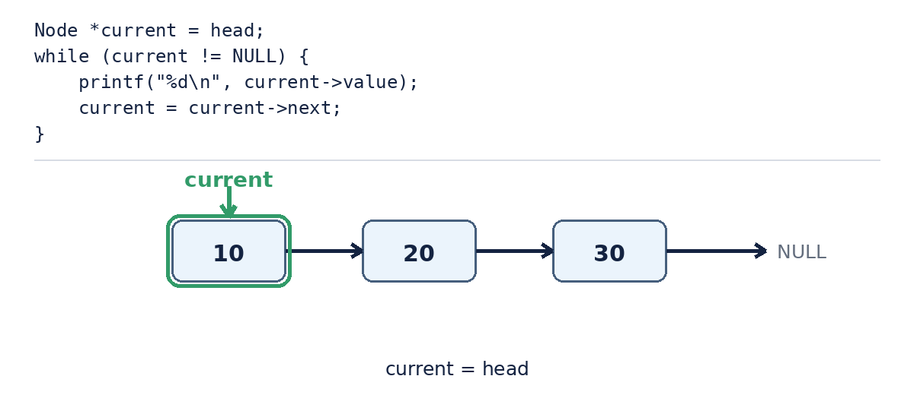

# Introducció

## De variables a estructures de dades {.center}

::: {.r-fit-text}
struct · typedef · enum · linked lists
:::

## Objectius d'aprenentatge

::: {.objectius}
- Agrupar dades relacionades amb `struct` i distingir tipus de variable
- Crear àlies de tipus amb `typedef`
- Expressar un conjunt tancat de valors amb `enum`
- Combinar `struct` amb punters (`.` vs `->`) i memòria dinàmica (`malloc`)
- Construir i recórrer una *linked list*, i alliberar-la sense deixar punters penjats
- Organitzar-ho en `.h`/`.c`/`Makefile`
:::

## Prerequisits

::: {.prerequisits}
- Espai de memòria d'un procés (TEXT/DATA/HEAP/STACK)
- Punters, `malloc`/`free`, ownership.
- `int **`.
- `.h` = interfície / `.c` = implementació, `Makefile`.
:::

## Recordem què sabem

```{.c code-line-numbers="false" }
int age;
float temperature;
char name[50];
```

::: {.reflexio .fragment}
Què passa quan aquestes variables formen part de la mateixa entitat?
:::

:::{.exemple title="Un estudiant" .fragment}
Imagina que volem **representar un estudiant amb nom, edat i nota**. Podem fer-ho amb tres variables separades: `name`, `age` i `grade`. Però això no és gaire pràctic. 


1. Si volem passar un estudiant a una funció, hauríem de passar tres arguments.
2. Si volem crear un array d'estudiants, hauríem de crear tres arrays separats
3. Si volem afegir un camp més (per exemple, el número d'identificació), hauríem de modificar tot el codi que utilitza aquestes variables.
:::

# struct

## Agrupar dades relacionades

```{.c code-line-numbers="false" }
struct Student {
    char name[50];
    int age;
    float grade;
};
```

::: {.concepte}
Una `struct` permet agrupar diferents dades sota una mateixa estructura.
:::

## Tipus vs variable

```{.c code-line-numbers="false" }
struct Student {
    char name[50];
    int age;
    float grade;
};
```

::: {.concepte}
Això **no** crea cap `Student`. Defineix un **tipus**.
:::

```{.c code-line-numbers="false" }
struct Student s;
```

::: {.concepte}
Ara sí, hem **instanciat** el tipus.
:::

:::{.resum}
`struct Student{...}` $\Rightarrow$ defineix $\Rightarrow$ tipus $\Rightarrow$  `struct Student s` instanciem $\Rightarrow$ la variable `s`
:::

## Els camps

```{.c code-line-numbers="false" }
struct Student s;

s.age = 20;
s.grade = 8.5;

printf("%s\n", s.name);
```

::: {.reflexio}
Què representa `s.age`?
:::

::: {.concepte}
El camp `age` de la variable `s`. L'operador és `.`
:::

## Una struct ocupa memòria

:::{style="text-align:center;"}
{ width=70%}
:::


# typedef

## struct Student és una mica llarg

```{.c code-line-numbers="false" }
struct Student student1;
struct Student student2;
```

Podem crear un àlies:

```{.c code-line-numbers="false" }
typedef struct {
    char name[50];
    int age;
    float grade;
} Student;

Student student1;
Student student2;
```


## Què fa realment typedef?

:::{.concepte}
Una `struct` defineix un **tipus**. Un `typedef` dóna un **àlies** a un tipus existent, és a dir, dóna un altre nom a un tipus ja existent. Això és útil per fer el codi més llegible i concís.
:::

:::{.exemple title="typedef d'un tipus bàsic" .fragment}

```{.c code-line-numbers="false" }
typedef unsigned int uint;
```

::: {.concepte}
`uint` no és un tipus nou amb una representació diferent. És un altre **nom** per a `unsigned int`.
:::

:::

# enum

## Quan una variable només pot tenir alguns valors?

```{.c code-line-numbers="false" }
int state;
```

Però només volem: `IDLE`, `RUNNING`, `STOPPED`.

```{.c code-line-numbers="false" }
enum State {
    IDLE,
    RUNNING,
    STOPPED
};
```

::: {.concepte}
`enum` permet donar noms a un conjunt de constants enteres relacionades.
:::

## Utilitzar un enum

```c
enum State state;

state = RUNNING;

if (state == RUNNING) {
    ...
}
```

::: {.errorcomu}
Un `enum` **no impedeix** assignar-hi qualsevol enter: `state = 42;` compila igualment. Millora la llegibilitat i la intenció del codi, no és una restricció imposada pel compilador.
:::

## Els valors de l'enum

```{.c code-line-numbers="false" }
enum State {
    IDLE,
    RUNNING,
    STOPPED
};
```

Per defecte: `IDLE = 0`, `RUNNING = 1`, `STOPPED = 2`.

::: {.concepte}
El compilador associa valors enters als enumeradors. Nosaltres normalment treballem amb els seus **noms**, no amb els números.
:::

## typedef enum

```{.c code-line-numbers="false" }
typedef enum {
    IDLE,
    RUNNING,
    STOPPED
} State;

State state = RUNNING;
```

::: {.concepte}
`struct + typedef` i `enum + typedef` són dos patrons que trobareu constantment en C.
:::

# struct i punters

## Un punter a una struct

:::{.columns}
:::: {.column width="25%"}

```{.c code-line-numbers="false" }
Student s;
Student *p = &s;
```

::: {.reflexio}
Què conté `p`?
:::

::: {.concepte .fragment}
L'adreça de `s`
:::

:::
:::: {.column width="75%" .fragment}



:::
:::

## `.` vs `->`

```{.c code-line-numbers="false" }
Student s;
s.age = 20;

Student *p = &s;
p->age = 20;
```

::: {.definicio}
`p->age` és equivalent a `(*p).age`.
:::

Per tant, quan tenim un punter a una struct, utilitzem `->` per accedir als camps. Si tenim la struct directament, utilitzem `.`.

::: {.exemple}
- `Student s`   → `s.age`
- `Student *p`  → `p->age`
:::

# structs i funcions

## Passar una struct a una funció

```{.c code-line-numbers="false" }
void print_student(Student s)
{
    printf("%s\n", s.name);
}

print_student(s);
```

::: {.concepte}
La funció rep una **còpia completa** de l'estructura.
:::

::: {.errorcomu}
A diferència d'un **array**, que decau a punter quan es passa a una funció, és a dir, es passa l'adreça del primer element, una `struct` **no decau**, es copia sencera, camp a camp. `sizeof(s)` dins de la funció torna a donar la mida completa, no la d'un punter.
:::


## Passar un punter a la struct

```{.c code-line-numbers="false" }
void change_grade(Student *s, float grade)
{
    s->grade = grade;
}

change_grade(&student, 9.0);
```

:::{.exemple title="Passar un punter a una struct" .fragment}
`main` ──`&student`──► `change_grade()` ──`s`->`grade`──► **mateixa memòria**
:::

::: {.concepte .fragment}
Passar l'adreça evita la còpia i permet modificar l'original.
:::

# Memòria dinàmica amb structs

## El problema dels arrays

```{.c code-line-numbers="false" }
Student students[100];
```

::: {.reflexio}
Què passa si no sabem quants estudiants tindrem?
:::

```{.c code-line-numbers="false" }
Student *students = malloc(n * sizeof(Student));
```

:::{.concepte}
Recordeu que `malloc` retorna un punter a la memòria reservada al **heap**. El punter viu a la **stack** i apunta a *objectes del tipus Student* la memòria del **heap**.
:::

## malloc i free

```{.c code-line-numbers="false" }
Student *s = malloc(sizeof(Student));

s->age = 20;

free(s);
```

::: {.reflexio}
Qui és responsable d'alliberar aquesta memòria?
:::

::: {.concepte}
El programa.
:::

# Linked list

## Per què una linked list?

Imaginem que volem guardar un nombre variable d'estudiants, i que volem afegir-ne sense haver de reservar un array de mida fixa. I a més, volem que cada estudiant conegui el següent.

:::{.exemple title="Linked list" .fragment}
[10] → [20] → [30] → NULL
:::

::: {.concepte .fragment}
Una llista enllaçada (*linked list*) és una estructura de dades que permet afegir i eliminar elements de manera eficient, sense necessitat de redimensionar un array. Cada element (o *node*) conté les dades i un punter al següent node.
:::

## Un node

:::{.columns}
:::: {.column width="33%"}

```{.c code-line-numbers="false" }
typedef struct Node {
    int value;
    struct Node *next;
} Node;
```

:::
::: {.column width="33%" .fragment}

::: {.concepte}
Una `struct` pot contenir un punter a una altra `struct` del **mateix tipus**.
:::

:::
::: {.column width="33%" .fragment}

:::{.reflexio .fragment }
Per què `struct Node` (amb nom) i no una struct anònima com al patró de `Student`? 
:::

:::
:::

:::{.solucio .fragment}
Perquè dins del propi cos (`struct Node *next;`) encara **no existeix** cap `typedef` complet a què referir-se, només el *tag* `struct Node`. Aquest ja és prou vàlid com a tipus, perquè només en necessitem un **punter** (la mida d'un punter no depèn de la mida d'allò a què apunta).
:::

:::{.fragment}

:::


## La llista


::: {.reflexio}
On són aquests nodes?
:::

::: {.concepte}
La variable `head` és a la **stack**. Els nodes són al **heap**. 
:::


## Crear el primer node




## Afegir un segon node




# Recórrer i alliberar

## Traversal




::: {.concepte}
`current = current->next` no mou el node. Mou el **punter**.
:::

## Alliberar la llista

```{.c code-line-numbers="false" }
while (head != NULL) {
    Node *next = head->next;
    free(head);
    head = next;
}
```

::: {.errorcomu}
No podem fer `free(head)` i després llegir `head->next` — seria exactament un **punter penjat**, el mateix concepte del Pralab 03. Per això guardem `next` **abans** de fer `free`.
:::

# Del programa al mòdul

## Una linked list ja és un mòdul

```{.bash code-line-numbers="false" }
tree project
```

```
project
├── main.c
├── linkedlist.c
├── linkedlist.h
└── Makefile
```


## linkedlist.h

:::{.columns}
:::: {.column width="60%"}

```{.c code-line-numbers="false" }
#ifndef LINKEDLIST_H
#define LINKEDLIST_H

typedef struct Node Node;

Node *list_create(int value);
void list_add_front(Node **head, int value);
void list_print(const Node *head);
void list_free(Node *head);

#endif
```

:::
::: {.column width="40%"}

::: {.definicio}
`typedef struct Node Node;` és un **tipus incomplet** (*forward declaration*): declara que `Node` existeix, sense dir encara com és per dins.
:::

:::
:::

::: {.bonapractica}
**QUI** inclou `linkedlist.h` **no pot** accedir a `node->value` directament, perquè el compilador no en coneix els camps. Només pot fer servir les funcions que oferim. És una primera mostra real d'encapsulació. El tipus viu a la llibreria, els usuaris de la llibreria veuen només un *opaque type*. 
:::

## linkedlist.c

:::{.columns}
:::: {.column width="60%"}

```{.c code-line-numbers="false" }
#include "linkedlist.h"
#include <stdlib.h>

struct Node {
    int value;
    struct Node *next;
};

void list_add_front(Node **head, int value)
{
    Node *node = malloc(sizeof(Node));

    node->value = value;
    node->next = *head;
    *head = node;
}
```

:::
::: {.column width="40%"}

::: {.bonapractica}
`Node **head` no és cap concepte nou: és exactament el mateix patró d'`int **` del Pralab 04 (*out-parameter*, perquè la funció pugui modificar el `head` del cridant), amb `Node` en lloc d'`int`.
:::

:::
:::


# Síntesi

## El mapa final

::: {.resum}
1. `struct` agrupa dades relacionades sota un mateix tipus; `typedef` li dona un àlies.
2. `enum` expressa un conjunt tancat de valors amb noms, per llegibilitat, no com a restricció imposada.
3. Una `struct` es copia sencera en passar-la a una funció (no decau com un array); passar-hi un punter evita la còpia.
4. Una *linked list* combina `struct` autoreferenciada + `malloc` per crear una estructura de mida variable al heap.
5. Igual que a la sessió de construcció: separar `.h`/`.c` permet amagar la implementació, no només organitzar el codi.
:::

