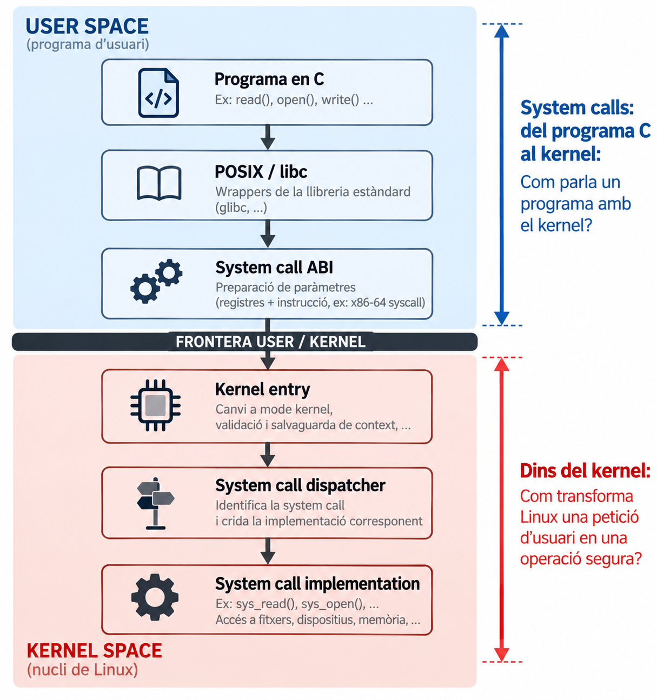
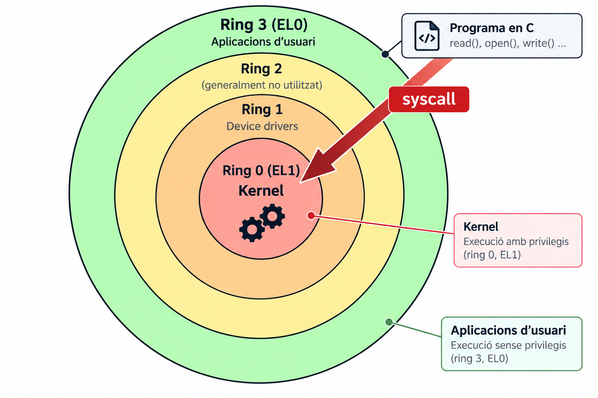
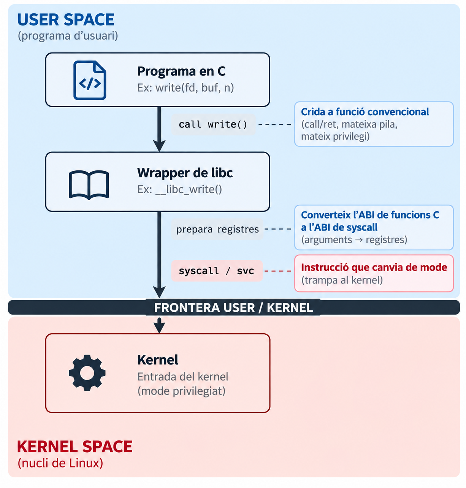
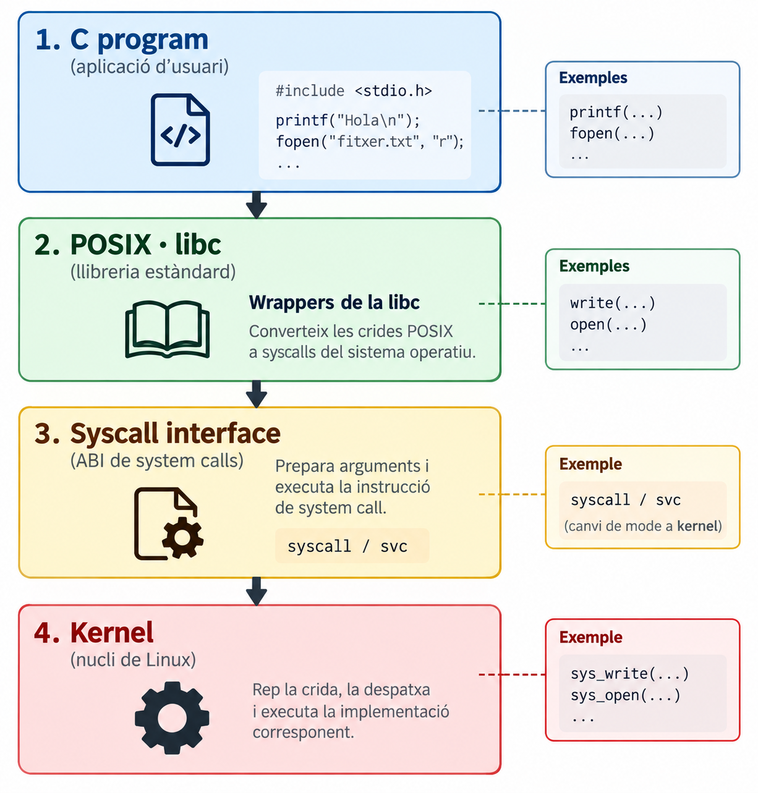
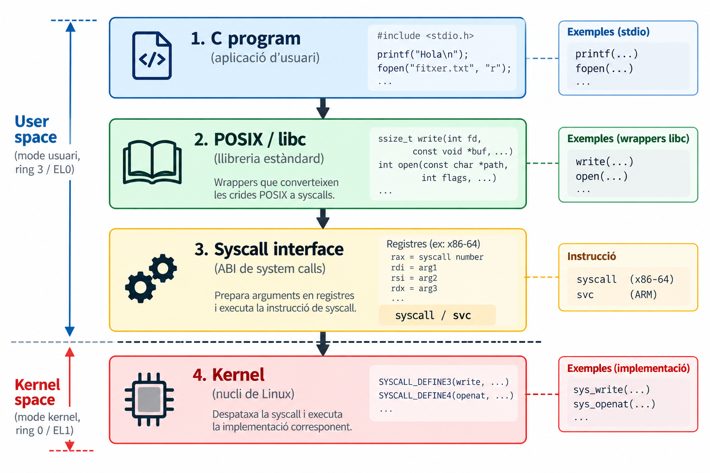
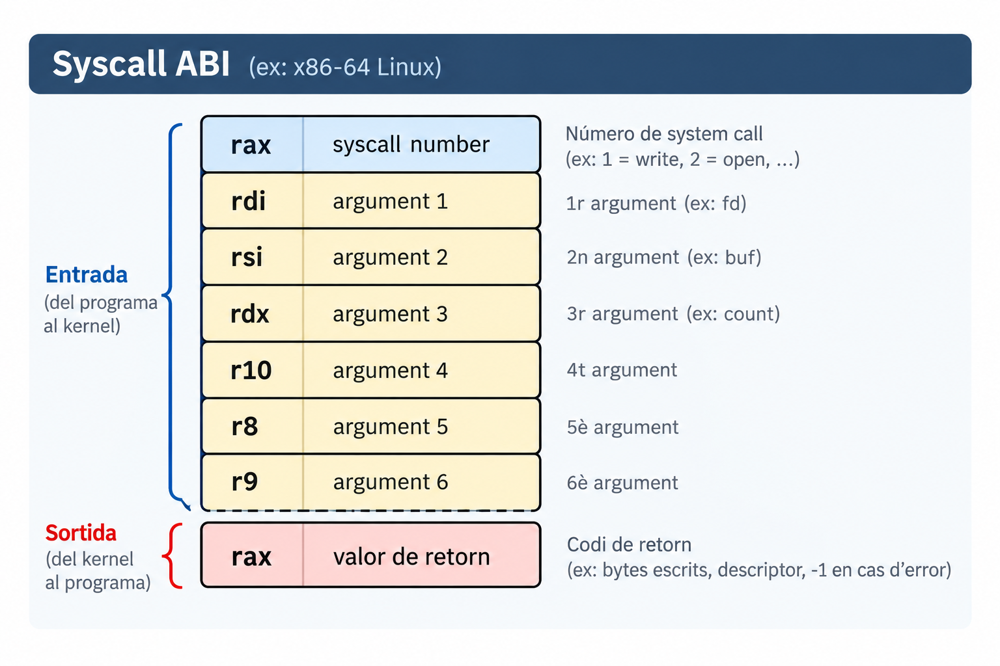
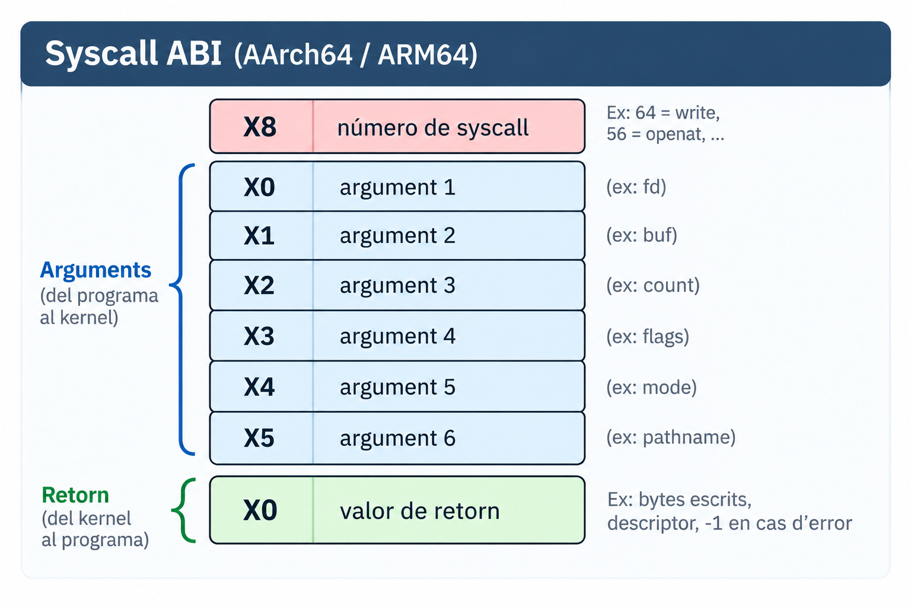
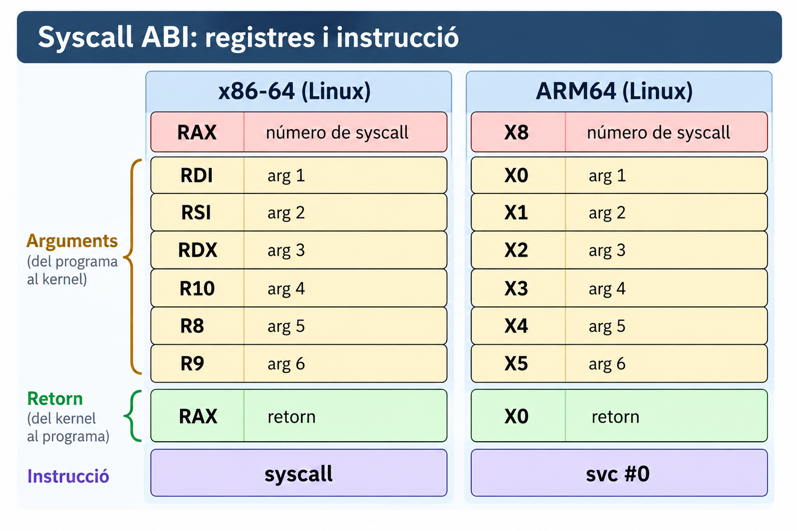
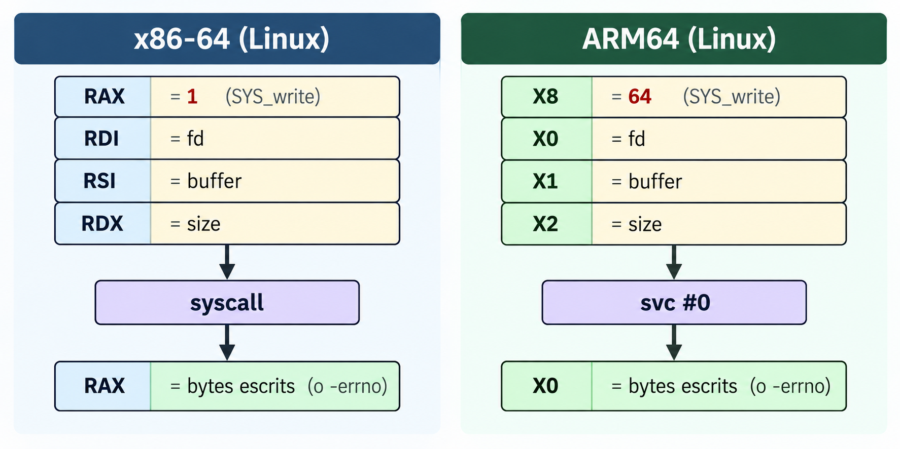
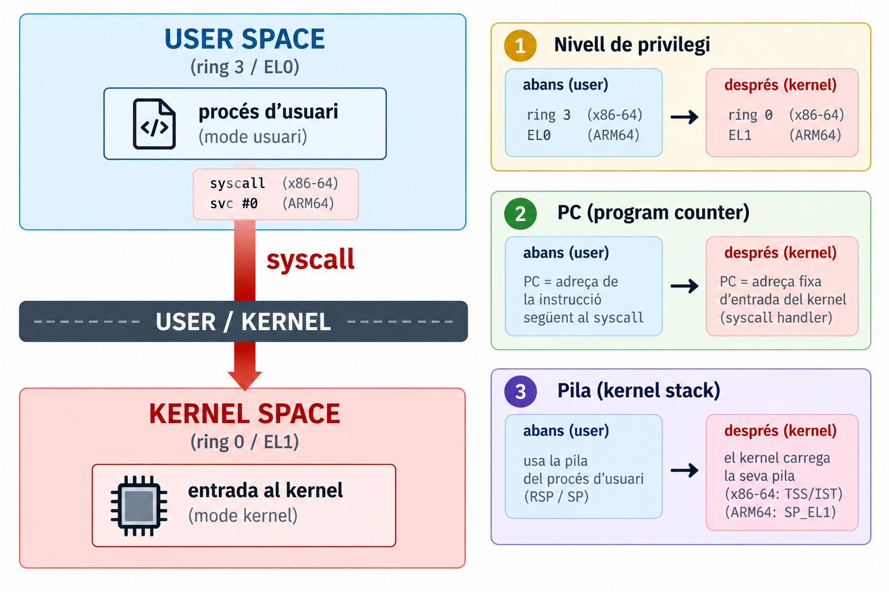

## Objectius

::: {.objectius}

::: {.nonincremental}
- Explicar **per què** un programa d'usuari no pot accedir directament als recursos i què és una *system call*.
- Distingir **API C (POSIX/libc)** de **ABI de syscall**.
- Identificar com la *syscall ABI* transporta el **número**, els **arguments** i el **valor de retorn** mitjançant registres a x86-64 i ARM64, i saber **on consultar** la convenció (`man 2 syscall`).
- Explicar què fa (i què **no** fa) la instrucció `syscall` / `svc`.
- Observar syscalls reals amb `strace` i `gdb`.
:::
:::


## Pregunta central {.center}

:::{.columns}
:::: {.column width="50%"}
{width="80%"}

:::
:::: {.column width="50%"}

::: {.reflexio}
Què passa **realment** quan un programa C necessita un servei del sistema operatiu?
:::

:::
:::


# Part 1 · Motivació {.center}

## Què pot fer C sense demanar res al sistema operatiu?

```{.c code-line-numbers="false" }
int add(int a, int b)
{
    return a + b;
}
```

```{.c code-line-numbers="false" }
main()
  │
  └──► add()        ← una crida normal: call / ret
```

- Tot passa dins de **user space**: mateix procés, mateixa pila, mateixos privilegis.
- **El kernel no intervé.**


## Això no ho podem fer directament des de user space

```{.c code-line-numbers="false" }
write(fd, buffer, size);
```

::: {.reflexio .fragment}
Qui controla realment el fitxer o el dispositiu? Per què el programa no pot, simplement, escriure al disc?
:::

- **Sí** podem *cridar* `write()` des del nostre programa.
- El que **no** podem és accedir **directament** al dispositiu o al subsistema de fitxers **saltant-nos el kernel**.

:::{.fragment}
$$
\text{programa C} \xrightarrow{\text{write()}} \text{kernel} \xrightarrow{\text{sys_write()}} \text{filesystem / driver} \xrightarrow{\text{hardware}} \text{dispositiu}
$$
:::

::: {.definicio title="System call" .fragment}
Interfície controlada entre **user space** i **kernel space**: els serveis que el kernel ofereix als programes d'usuari.
:::

## Protecció de la CPU: rings {.smaller}

:::: {.columns}
::: {.column width="55%"}
- La CPU distingeix **nivells de privilegi**: *ring 0* (kernel) i *ring 3* (programes) a x86; *EL1* i *EL0* a ARM64.
- Certes **instruccions privilegiades** només s'executen al nivell del kernel: accés a dispositius, taules de pàgines, parar la CPU...
- Si un programa d'usuari les intenta executar → **excepció** i el kernel el pot aturar.

::: {.concepte title="Conseqüència" .fragment}
Sense el kernel, un procés d'usuari **no pot** gestionar directament dispositius, fitxers ni la memòria física del sistema.
:::
:::
::: {.column width="45%"}

{fig-alt="Rings de privilegi a x86 i ARM64."}
:::
:::


# Part 2 · libc, POSIX i syscalls {.center}

## Però `write()` és una funció C? 

:::{.columns}
:::: {.column width="50%"}

```{.c code-line-numbers="false" }
write(fd, buffer, size);
```

::: {.reflexio}
Sembla una crida a funció. **Ho és?** I si ho és, per què diem que una syscall *no és una crida a funció*?
:::

:::{.solucio .fragment}
**Sí, `write()` és una funció C**: un *wrapper* de la libc. Són **dues coses diferents encadenades**.
:::

:::
:::: {.column width="50%" .fragment}

{width="80%"}

:::
:::


## API vs implementació · POSIX ≠ libc {.smaller}

:::: {.columns}
::: {.column}
::: {.definicio title="API"}
Contracte **a nivell de codi font**: noms, tipus, semàntica. `ssize_t write(int fd, const void *buf, size_t count);`
:::
::: {.definicio title="POSIX"}
**Especificació** (estàndard) d'una API Unix. Diu *què* ha d'existir, no *com* es fa.
:::
::: {.definicio title="libc"}
**Implementació** de l'API C (i de gran part de POSIX) per a un sistema concret: glibc, musl...
:::
::: {.concepte title="Punts que confonen" .fragment}
- POSIX ≠ libc ≠ kernel.
- La mateixa API POSIX pot acabar en **syscalls diferents** en sistemes diferents.
- `printf`, `fopen` → libc (stdio) · `write`, `open` → *wrappers* de syscall.
:::
:::
::: {.column}
{width="80%"}
:::
::::


## Primera demo: `strace` 

:::{.exercici}
Quantes syscalls creus que farà el programa `hello`?
::::

<div id="strace-demo"></div>

<script>
AsciinemaPlayer.create(
  'cast/06/demo1-strace-hello-x86_64.cast',
  document.getElementById('strace-demo'),
  {
    autoPlay: false,
    loop: false,
    speed: 0.8,
    cols: 150,
    rows: 20
  }
);
</script>


## Demo: `printf()` i *buffering*

<div id="printf-demo"></div>

<script>
AsciinemaPlayer.create(
  'cast/06/demo-printf-buffering-x86_64.cast',
  document.getElementById('printf-demo'),
  {
    autoPlay: false,
    loop: false,
    speed: 0.8,
    cols: 150,
    rows: 20
  }
);
</script>

:::{.exemple .fragment}
Mostra que `printf()` no és una *syscall*, sinó una funció de la **libc** que bufferitza la sortida i només arriba al kernel amb `write`. Amb `strace -e trace=write` sobre un programa que fa tres `printf`, si la sortida va al terminal es veuen 3 write de 8 bytes (una per línia), perquè stdout és habitualment **line-buffered**. Si la redirigim a un fitxer, en surt un de sol de 24 bytes, perquè llavors és habitualment **fully buffered**, i el buffer es buida al final.
:::

# Part 3 — API vs ABI {.center}

## Tres nivells

{}


- `read`, `write`, `close`... són serveis del kernel exposats a través de la interfície de syscalls.
- El nom C i la syscall **no sempre coincideixen**: `open()` acaba fent `openat`, `fork()` acaba fent `clone`.

## Una syscall té una identitat

No n'hi ha prou amb dir `write()`: el kernel ha de saber **quina** syscall se li demana.

::: {.definicio title="Syscall number"}
Enter que identifica cada servei del kernel. El programa el posa en un **registre** abans d'entrar al kernel.
:::

- Els números formen part de l'**ABI d'una arquitectura** i **no s'han de considerar intercanviables entre arquitectures**: `write` és el **1** a x86-64, el **64** a ARM64 i el **4** a i386.
- Fins a **6 arguments**, de mida de paraula (32 o 64 bits), també en registres.

## API vs ABI

::: {.concepte title="API"}
Contracte a nivell de **codi font**:
`ssize_t write(int, const void *, size_t)`
:::

::: {.concepte title="ABI"}
Contracte a nivell de **binari**: quin registre porta què, quina instrucció entra al kernel, què queda modificat.
:::


## x86-64 (Linux)

:::: {.columns}
::: {.column width="45%"}
::: {.nonincremental}



:::
Instrucció: **`syscall`**
:::
::: {.column width="55%"}
::: {.concepte title="Diferència C ABI / syscall ABI"}
- ABI de funcions C (System V): arguments a `RDI, RSI, RDX, RCX, R8, R9`.
- ABI de syscall: el 4t és **R10**. Per què?
- Perquè `syscall` **sobreescriu RCX** (hi deixa l'adreça de retorn) i **R11** (hi deixa RFLAGS).
- Per això, en inline asm s'han de declarar `rcx` i `r11` com a *clobbered*.
:::
:::
::::

## ARM64 (AArch64)

:::{style="text-align:center;"}
{width="40%"}
:::

Instrucció: **`svc #0`** (*supervisor call*).

::: {.concepte title="La interfície depèn de l'arquitectura"}
Registres, instrucció **i números** canvien. Exemple: el número **56** és `clone` a x86-64 i `openat` a ARM64. **No cal memoritzar els registres**: cal saber *que existeixen* i on mirar-los (`man 2 syscall`).
:::

::: {.notes}
El missatge és només: **la interfície i els números depenen de l'arquitectura**. Un exemple net és la col·lisió del **56** (x86-64: `clone`; ARM64: `openat`). El conjunt de syscalls també difereix: x86-64 conserva syscalls històriques (`open`=2, `pipe`=22, `fork`=57, `clone`=56) que la taula **genèrica** que usa l'ABI nativa AArch64 no defineix (només `openat`=56, `pipe2`=59, `clone`=220, `clone3`=435). Es pot comprovar en 10 segons: `grep -E "__NR_(open|fork|pipe|openat|pipe2|clone) " /usr/include/asm-generic/unistd.h` i el mateix a `/usr/include/x86_64-linux-gnu/asm/unistd_64.h`. Compte: parlem de l'**ABI nativa de 64 bits**; l'ABI de compatibilitat ARM de 32 bits sí que té `open`, `fork` i `pipe`. Per això a la diapositiva no fem afirmacions universals.
:::

## Comparació: l'ABI és un contracte arquitectònic

:::{style="text-align:center;"}
{width="60%"}
:::

::: {.notes}
 `man 2 syscall` té la taula per a totes les arquitectures.
:::

## `write()` vista des de l'ABI

```{.c code-line-numbers="false" }
write(fd, buffer, size);
```

{width="70%"}


## Demo 2: una syscall sense libc

<div id="syscall-demo"></div>

<script>
AsciinemaPlayer.create(
  'cast/06/demo2-syscall-sense-libc-x86_64.cast',
  document.getElementById('syscall-demo'),
  {
    autoPlay: false,
    loop: false,
    speed: 0.8,
    cols: 150,
    rows: 20
  }
);
</script>

:::{.exemple title="Exemple de syscall sense libc" .fragment}
Aquest exemple és identic a `write(1, "Hello\n", 6)`, però sense passar per la **libc**. Posa a mà el número de syscall (1) i els arguments als registres RAX, RDI, RSI i RDX, i executa directament la instrucció syscall. Amb strace es veu exactament el mateix write(1, "Hello\n", 6) = 6, i això demostra que el kernel no distingeix qui ha preparat els registres, i que l'ABI és un contracte de registres, no de C. La variant `syscall(SYS_write, …)` fa el mateix amb la funció portable de la libc, sense assemblador.
:::


# Part 4 · La instrucció syscall {.center}

## La frontera



::: {.reflexio}
Què canvia aquí? No només *executem una altra funció*: canvia el **mode d'execució**.
:::

## Com s'hi entra de forma segura?

::: {.reflexio}
No hi ha cap instrucció *passa a mode kernel i salta on vulguis*. Llavors, com es fa sense trencar la protecció?
:::

- La instrucció `syscall` / `svc` **canvia el privilegi i salta a una adreça que el programa NO tria**.
- Aquesta adreça la fixa el **kernel en arrencar**.
- El programa només pot demanar entra al kernel i **el kernel decideix què s'executa**.

::: {.concepte title="Idea de seguretat" .fragment}
Un únic punt d'entrada, controlat pel kernel: així no es pot saltar al mig de codi privilegiat.
:::

::: {.notes}
Aprofundiment: x86-64 → registre especial **MSR `LSTAR`**; ARM64 → **taula de vectors** (`VBAR_EL1`), `svc` genera una excepció síncrona.
Correcció respecte l'any passat: es deia que la CPU salta "a la rutina indicada a la IDT". Això és cert per a `int 0x80` i per a excepcions/interrupcions, **no** per a la instrucció `syscall` de x86-64.
:::

## Què canvia? Què no canvia? {.smaller}

:::: {.columns}
::: {.column}
::: {.concepte title="Què canvia"}
- **Nivell de privilegi** (ring 3 → ring 0 / EL0 → EL1).
- **PC/RIP**: salta a l'entrada fixa del kernel.
- La **pila**: el kernel n'usa la seva (a x86-64, ho fa el codi d'entrada; `syscall` no toca `RSP`).
- Alguns registres (`RCX`, `R11` a x86-64).
:::
:::
::: {.column}
::: {.concepte title="Què NO canvia"}
- **El procés**: mateix PID, mateix espai d'adreces (mateixa taula de pàgines).
- El codi que hi ha a la CPU **no** canvia de procés: no és un **canvi de context** (*context switch*).
- La majoria de registres: es **desen** i es **restauren**.
:::
:::
::::

::: {.errorcomu title="Confusió freqüent" .fragment}
*Mode switch* (user ↔ kernel, dins del **mateix procés**) **≠** *context switch* (passar a executar un **altre procés**). Una syscall és el primer, no el segon.
:::

## Demo 3: veure la instrucció `syscall` amb `gdb`

<div id="syscall-gdb-demo"></div>

<script>
AsciinemaPlayer.create(
  'cast/06/demo3-gdb-instruccio-syscall-x86_64.cast',
  document.getElementById('syscall-gdb-demo'),
  {
    autoPlay: false,
    loop: false,
    speed: 0.8,
    cols: 150,
    rows: 20
  }
);
</script>

:::{.exemple}
La instrucció `dissassemble` permet localitzar `syscall` i `break` ens permet posar un punt d'aturada just abans. Observeu com s'atura just a la instrucció **syscall** dins de `write()`, i abans d'executar-la es veu que `rax = 1` (el número de write) i que rdi, rsi i rdx porten els arguments. Amb un `stepi` s'executa aquesta única instrucció: surt Hello per pantalla, rax passa a valer 6 (els bytes escrits) i rcx i r11 han canviat, perquè syscall els trepitja.
:::


# Part 5 · Tancament {.center}

## Resum

::: {.resum}
::: {.nonincremental}
- Una **syscall** és el mecanisme controlat perquè un programa d'usuari demani serveis al kernel.
- `write()` és una **funció C** (wrapper de libc); la **transició posterior** és el que no és una crida convencional.
- `printf` → stdio (libc, amb *buffering*) → `write` → kernel; `strace` ens deixa veure el tram real.
- La interfície és una **ABI**: el número, els arguments i el retorn viatgen en **registres**; `syscall` (x86-64) o `svc #0` (ARM64). **Depèn de l'arquitectura**: no cal memoritzar-ne els registres, cal saber que existeixen i on consultar-los.
- L'entrada és **controlada**: privilegi i adreça d'entrada els fixa el kernel.
- *Mode switch* ≠ *context switch*.
:::
:::
