## Objectius

::: {.objectius}

::: {.nonincremental}
- Explicar què fa el kernel **en entrar**: kernel stack, registres desats (`pt_regs`).
- Entendre el mínim d'**espai d'adreces virtual** i d'**excepció** necessari per parlar de punters.
- Descriure el **dispatcher** i la *syscall table* com a **model conceptual**.
- Justificar **per què no es pot confiar** en cap argument de user space, i com ho resol `copy_from_user`.
- Interpretar un error: `-errno` al kernel, `-1` + `errno` a la libc.
:::
:::


## Pregunta central {.center}

::: {.reflexio}
Com transforma Linux una petició d'un programa d'usuari en una operació **segura** del kernel?
:::


# Part 1 · Entrada al kernel {.center}

## Què fa el punt d'entrada?

:::{style="text-align:center"}
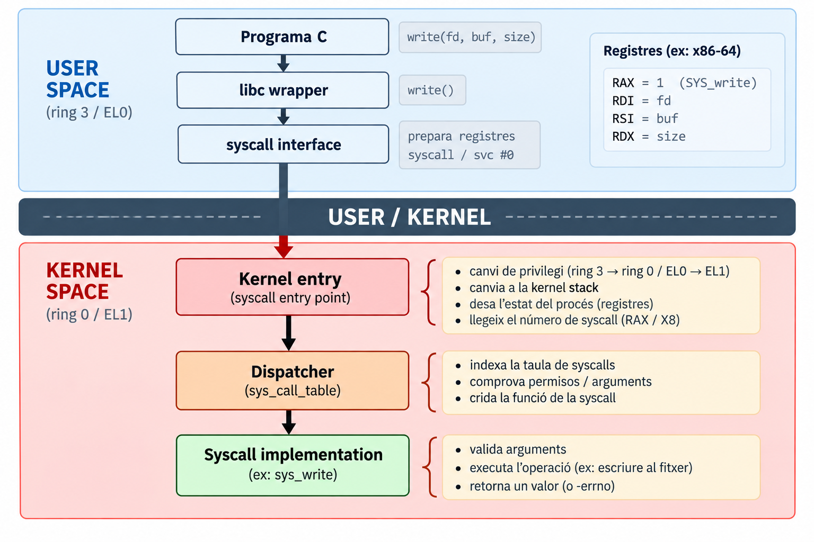{ width=40%}
:::

- La instrucció `syscall` / `svc` fa el mínim: **privilegi + salt a l'entrada fixa**.
- El **codi d'entrada del kernel** fa la resta: canvia de pila i **desa l'estat d'usuari**.

::: {.concepte title="Precisió"}
Una syscall **no és simplement canviar de stack**: l'entrada al kernel *prepara* l'execució sobre la kernel stack i deixa desat tot el que cal per **tornar**.
:::

## User stack i kernel stack

:::{style="text-align:center"}
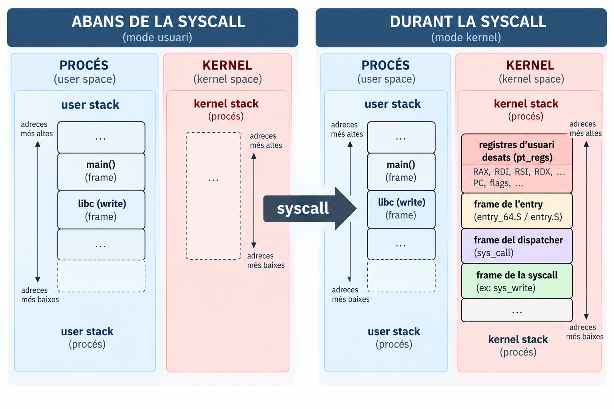{ width=40% }
:::

- El kernel **no pot confiar en el `SP` d'usuari** (podria apuntar a qualsevol lloc): usa **la seva pila**, una per fil/tasca.
- **x86-64**: `syscall` **no** canvia `RSP`; el codi d'entrada ho fa a mà.
- **ARM64**: cada nivell té el seu registre de pila (`SP_EL0` / `SP_EL1`).

## Què es desa? · `struct pt_regs` {.smaller}

:::: {.columns}
::: {.column width="50%"}

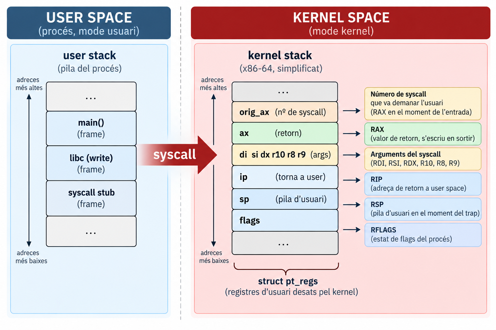


:::
::: {.column width="50%"}
- Linux desa els registres a una estructura **`struct pt_regs`**, a la kernel stack.
- El dispatcher **llegeix el número** de `orig_ax` i els **arguments** dels camps del `pt_regs`.
- El resultat s'escriu a `regs->ax`; en tornar, es **restaura** tot.
- Cada arquitectura té el seu `pt_regs`.
:::
::::


## Demo: veure el número i el `pt_regs`

:::: {.columns}
::: {.column width="65%"}

<div id="demo-gdb-catch"></div>

<script>
AsciinemaPlayer.create(
  'cast/07/demo4-gdb-catch-syscall-x86_64.cast',
  document.getElementById('demo-gdb-catch'),
  {
    autoPlay: false,
    loop: false,
    speed: 0.8,
    cols: 150,
    rows: 20
  }
);
</script>

:::
::: {.column width="35%"}
::: {.reflexio}
Per què `rax = -38` i `orig_rax = 1` **a l'entrada** de la syscall?
:::

::: {.solucio .fragment}
Perquè el kernel deixa `-ENOSYS` (38) per defecte a `ax` i **conserva el número original** a `orig_ax`; el resultat de la syscall el sobreescriurà. És exactament el `regs->orig_ax` / `regs->ax` que veurem al dispatcher.
:::
:::
:::
:::{.exemple .fragment}
Aquesta dema s'atura just a l'entrada de la **syscall**, i el `pt_regs` que veu el kernel es veu des de fora: `orig_rax = 1` és el número que va posar el programa, i `rax = -38 (-ENOSYS)` és el valor per defecte que el kernel deixa a `ax` fins que la syscall hi escrigui el resultat. Un *continue* més enllà, ja surt **Hello** i `rax = 6`, els bytes escrits.
:::

# Part 2 · Espai d'adreces i excepcions {.center}

## Cada procés veu el seu espai d'adreces

:::: {.columns}
::: {.column width="65%"}
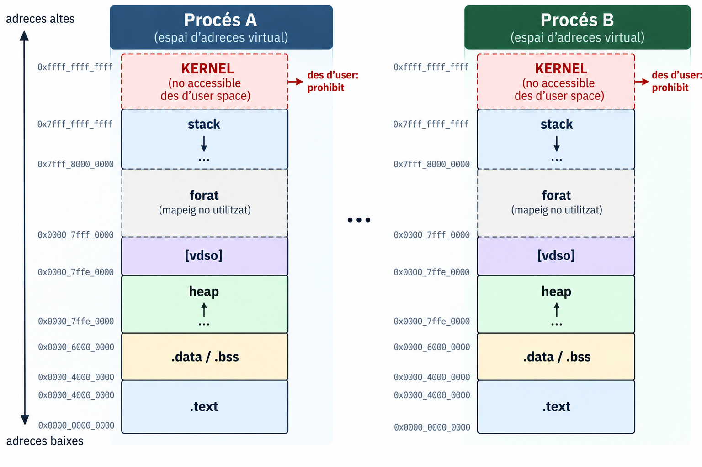
:::
::: {.column width="35%"}
- Les adreces que veu el programa són **virtuals**: la CPU (MMU) les tradueix a memòria física amb l'ajuda del kernel.
- **Dos processos poden usar la mateixa adreça virtual** i veure dades diferents.
- La part alta és del **kernel**: un programa d'usuari no pot accedir-hi.
:::
:::

## Demo: la mateixa adreça, dos processos

<div id="demo-addr"></div>

<script>
AsciinemaPlayer.create(
  'cast/07/demo5-espai-adreces-x86_64.cast',
  document.getElementById('demo-addr'),
  {
    autoPlay: false,
    loop: false,
    speed: 0.8,
    cols: 150,
    rows: 20
  }
);
</script>

:::{.exemple .fragment}
Es llancen dues còpies d'un programa que desa el seu PID a una variable global. Totes dues imprimeixen el mateix `&x=0x40402c` però valors diferents, perquè cada procés té el seu espai d'adreces virtual. A `/proc/PID/maps` es veuen [heap], [stack] i [vdso], i cap tram del kernel: hi és present, però inaccessible des d'user space.
:::

::: {.notes}
- `-no-pie` fa que `&x` sigui idèntic en les dues execucions (en provar-ho: `&x=0x404020` a totes dues). Amb PIE + ASLR variaria.
- Amb `setarch $(uname -m) -R cat /proc/self/maps` (ASLR desactivat) es veuen `[heap]`, `[vdso]`, `[stack]` a adreces estables.
- Pregunta: *per què no surt cap adreça del kernel al `maps`?* → perquè `maps` mostra les adreces que el procés **pot** usar; el kernel hi és present a l'espai d'adreces però és inaccessible.
:::

## Excepcions: la CPU no pot completar una instrucció

::: {.definicio title="Excepció"}
Esdeveniment **síncron** generat per la CPU quan una instrucció no es pot completar (o cal avisar el kernel). El control passa al **kernel**, que decideix què fer.
:::

::: {.nonincremental}
| Tipus | Quan s'informa | Exemple |
|---|---|---|
| **Fault** | abans de completar la instrucció (es pot reintentar) | *page fault* |
| **Trap** | després d'executar la instrucció | *breakpoint* |
| **Abort** | irrecuperable | *double fault* |
:::


## *Page fault*: dues sortides {.smaller}

:::{style="text-align:center"}
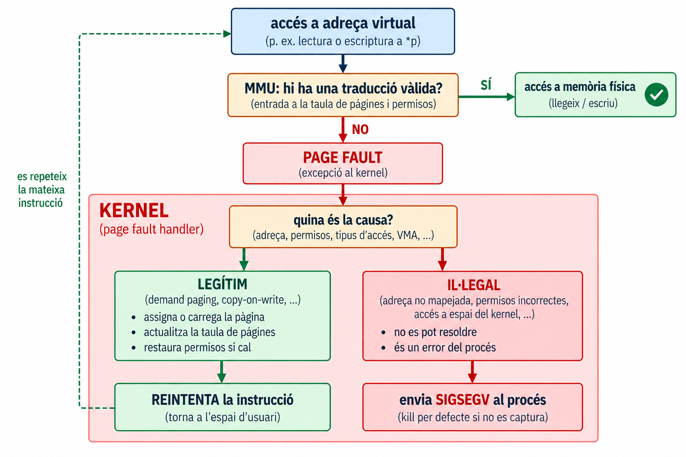{width=60%}
:::

::: {.concepte title="Idea clau"}
Un *page fault* **no és necessàriament un error**: és un mecanisme normal. El que decideix si és un error és el **kernel**, segons l'espai d'adreces del procés.
:::

## Demo: els *page faults* són normals

<div id="demo-page-faults"></div>

<script>
AsciinemaPlayer.create(
  'cast/07/demo6-page-faults-x86_64.cast',
  document.getElementById('demo-page-faults'),
  {
    autoPlay: false,
    loop: false,
    speed: 0.8,
    cols: 150,
    rows: 20
  }
);
</script>

:::{.exemple .fragment}
Un `malloc` de 256 MiB gairebé no dispara cap **page fault**, perquè només reserva memòria virtual. En tocar un byte de cada pàgina de 4 KiB, el recompte de `getrusage` puja en 65.535, un per pàgina. Un page fault no és un error sinó el mecanisme normal (**demand paging**): el kernel assigna la pàgina i reintenta la instrucció.
:::

# Part 3 · El dispatcher {.center}

## Com sap Linux quina operació ha de fer?

:::{style="text-align:center"}
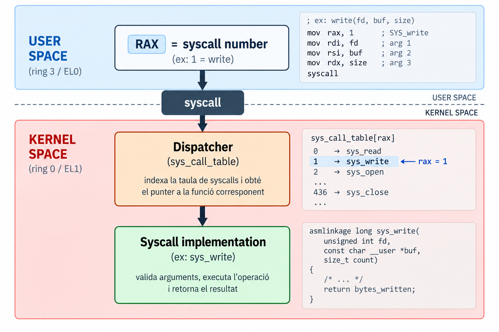{ width=50%}
:::


::: {.reflexio}
Quina funció del kernel s'executa? I si el número no existeix?
:::


## Syscall table (model conceptual)

:::: {.columns}
::: {.column width="65%"}
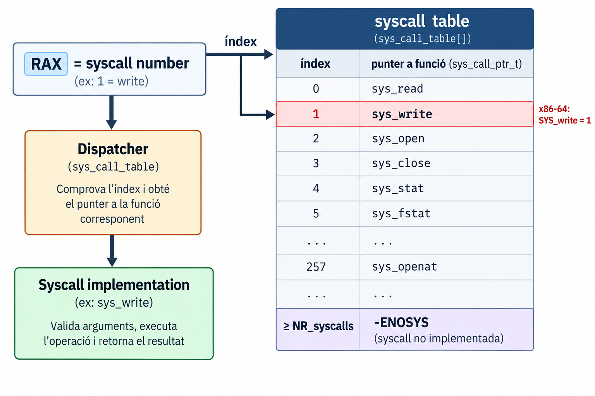
:::
::: {.column width="35%"}
::: {.concepte title="Això és un model"}
La idea *número → funció del kernel* és sempre la mateixa. **La implementació concreta depèn de l'arquitectura i de la versió del kernel** (taula, `switch`...).
:::

- Les taules són **diferents per arquitectura** (a ARM64: `read` = 63, `write` = 64, `openat` = 56).
- Un número fora de rang → **`-ENOSYS`**.

:::
:::


## Del número a `sys_write()`

```{.c code-line-numbers="false" }
SYSCALL_DEFINE3(write, unsigned int, fd,
                const char __user *, buf, size_t, count)
```

- Cada syscall té una funció d'implementació al kernel: `sys_read`, `sys_write`, `sys_openat`...
- El **prefix `__user`** marca el punter com a **adreça d'user space** (no fiable).
- Els arguments de la implementació **vénen dels registres desats** (`pt_regs`).


## El camí complet

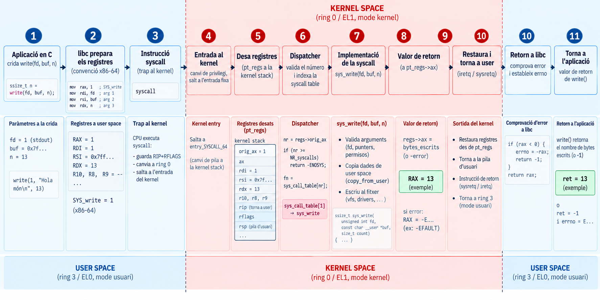


# Part 4 · Els arguments no són fiables {.center}

## Què és `buffer` des del punt de vista del kernel?

```{.c code-line-numbers="false" }
char buffer[100];
write(fd, buffer, 100);
```

- `buffer` és una **adreça de user space**.
- Però `sys_write()` s'executa en **kernel space**, amb privilegis.

::: {.reflexio .fragment}
Pot el kernel confiar en **qualsevol** punter que li dona el programa?
:::

:::{.solucio .fragment}
**No.** Tot el que ve de user space s'ha de considerar **incorrecte o maliciós** fins que es demostri el contrari.
:::

## Quatre casos 

:::{style="text-align:center"}
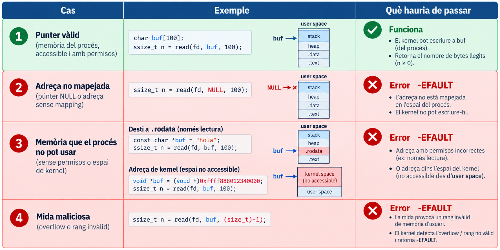{width=60%}
:::

::: {.concepte title="No només es valida el punter"}
Es valida el **rang** `[ptr, ptr + size)` i els **permisos**, no només `ptr`. Amb la mateixa lògica: fd, flags, mides...
:::


## Què podria passar? 

:::: {.columns}
::: {.column width="45%"}
```{.c code-line-numbers="false" }
memcpy(kernel_buffer, user_ptr, size);     
 /* HIPOTÈTIC: cap validació */
```

::: {.concepte title="Model de bug"}
Si el kernel tractés **un valor controlat per l'usuari** com una adreça de memòria privilegiada, **sense validar-lo**, podria **exposar** o **corrompre** dades del kernel.
:::

:::{.definicio}
- **Exposició** (model): el kernel *llegeix* d'una adreça que no és de l'usuari i ho envia cap a fora (p. ex. a un fitxer).

- **Corrupció** (model): el kernel *escriu* en una adreça que no és de l'usuari amb dades que l'usuari controla.
:::


::: 
::: {.column width="55%"}
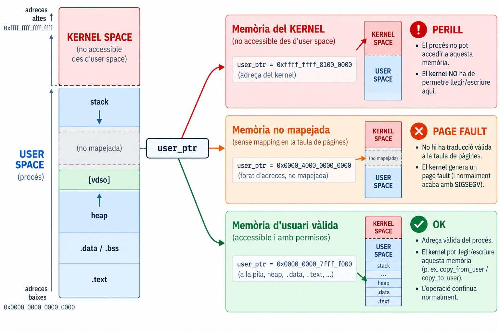
:::
:::

:::{.concepte title="Confused deputy"}
El problema **no és només un segfault**: el kernel actua amb els seus privilegis en nom d'un programa que no en té.
:::

## `copy_from_user()` / `copy_to_user()`

```{.c code-line-numbers="false" }
/* CORRECTE: retorna un valor no nul (-EFAULT) si user_ptr no és vàlid */
if (copy_from_user(&kernel_buffer, user_ptr, size))
    return -EFAULT;

/* INCORRECTE: només va bé si user_ptr és vàlid; si no, el kernel falla */
memcpy(&kernel_buffer, user_ptr, size);
```

::: {.nonincremental}

$$
\text{USER BUFFER} \xrightarrow{\text{copy\_from\_user}} \text{KERNEL BUFFER}
$$

$$
\text{USER BUFFER} \xleftarrow{\text{copy\_to\_user}} \text{KERNEL BUFFER}
$$

:::

- Comproven que el rang és **d'user space**.
- Gestionen el *fault* sense caure: retornen un valor no nul en lloc de fer *panic*.
- Similars: `get_user()`, `put_user()`.

## Demo: la mateixa adreça invàlida, dos finals

<div id="demo-efault"></div>

<script>
AsciinemaPlayer.create(
  'cast/07/demo7-efault-x86_64.cast',
  document.getElementById('demo-efault'),
  {
    autoPlay: false,
    loop: false,
    speed: 0.8,
    cols: 150,
    rows: 20
  }
);
</script>

:::{.exemple .fragment}
Un `write` amb l'adreça 0x1 i un altre amb una adreça del kernel retornen **-1 EFAULT** i el programa continua, perquè el kernel valida els punters amb `copy_from_user`. Un accés directe `*p = 'x'` amb aquella mateixa adreça acaba en **SIGSEGV** i el procés mor (exit 139).
:::

## Una syscall no confia en l'usuari

Tot el que arriba de user space és **potencialment incorrecte**:

- el **número** de syscall,
- els **arguments**,
- els **punters**,
- les **mides** (enormes, negatives, amb *overflow*),
- els **descriptors de fitxer** (`fd` tancat, inexistent, d'un altre tipus),
- els **flags**.

::: {.bonapractica title="Principi de disseny" .fragment}
El kernel **valida-ho-tot a l'entrada** i retorna un error concret (`-EFAULT`, `-EBADF`, `-EINVAL`, `-ENOSYS`...) en lloc de suposar.
:::

# Part 5 · Page faults i taula d'excepcions {.center}

## Com sap el kernel qui ha fallat? 

:::: {.columns}
::: {.column width="65%"}
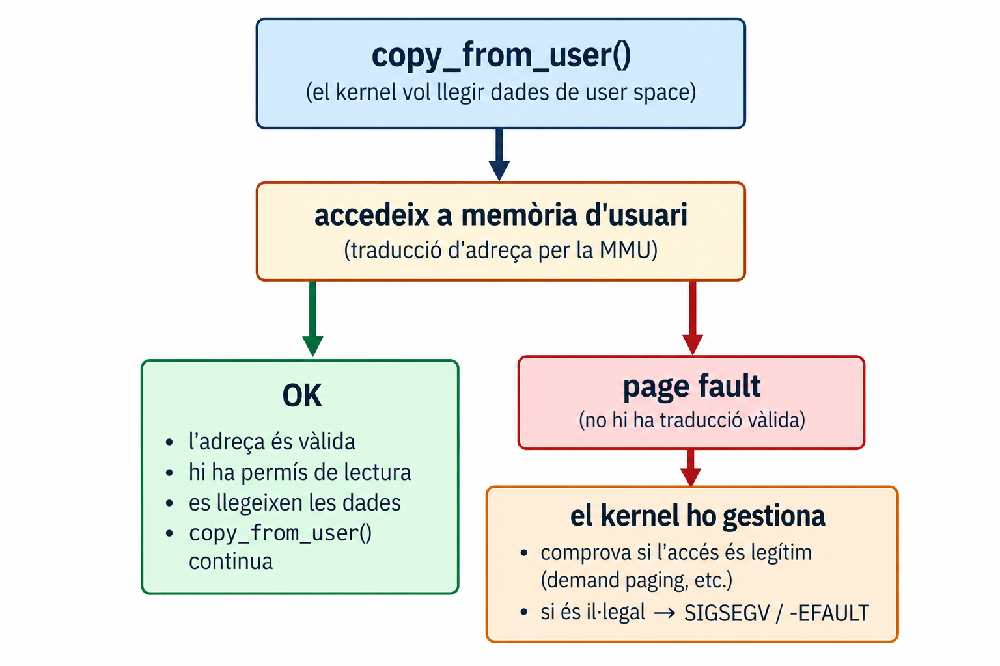
:::
::: {.column width="35%"}

::: {.reflexio}
Dins del kernel, un *page fault* pot ser: (1) un fault legítim (demand paging), (2) un punter invàlid d'usuari, (3) un **bug del kernel**. Com sap el kernel què és?
:::

- **Cas 1**: l'adreça és d'user i vàlida per al procés → el kernel la resol.
- **Casos 2 i 3**: l'adreça d'user és **invàlida** i la instrucció que falla és **del kernel**. Són indistingibles per l'adreça.
:::
:::

## La solució de Linux: la taula d'excepcions

::: {.definicio title="Taula d'excepcions"}
Llista de les **instruccions concretes** del kernel que poden accedir a memòria d'usuari (les de `copy_from_user`, `get_user`...), amb l'adreça on **recuperar-se** si fallen.
:::

:::{style="text-align:center"}
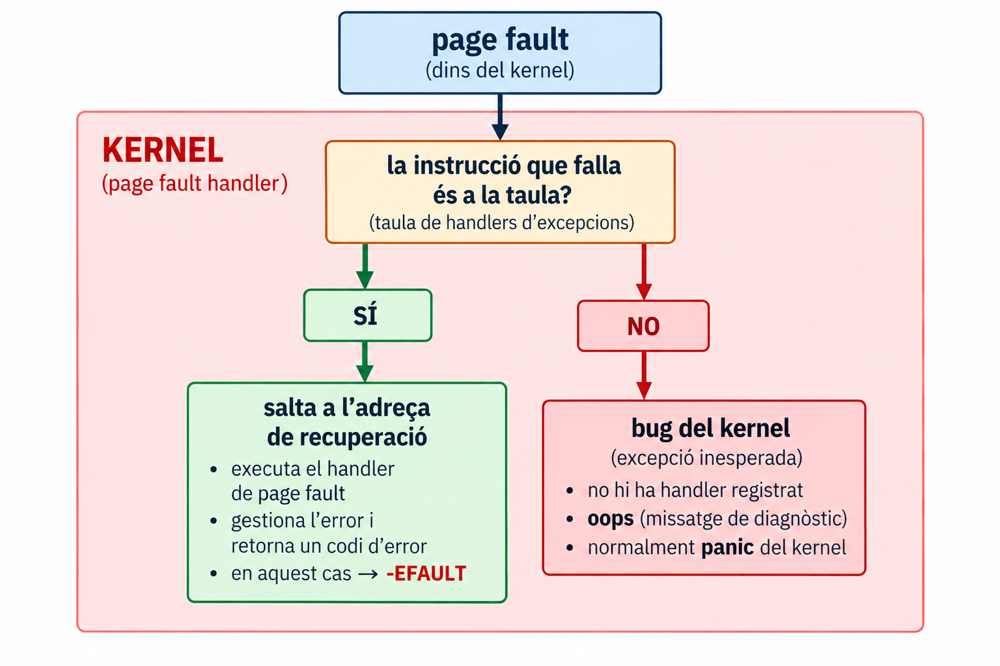{width=40%}
:::

**Resultat**: un accés invàlid a memòria d'usuari es converteix en un **`-EFAULT`** i **no** en un *crash* del kernel.

# Part 6 · Errors i retorn {.center}

## Una syscall també retorna informació

:::: {.columns}
::: {.column width="55%"}
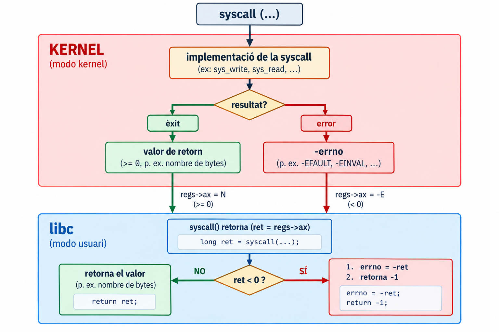
:::
::: {.column width="45%"}
```{.c code-line-numbers="false" }
ssize_t n = write(fd, buf, len);
```

- Èxit → **nombre de bytes**.
- Error → `-1` i `errno` amb el motiu.

::: {.concepte title="Qui fa què?" .fragment}
El **kernel** retorna un valor **negatiu** (`-errno`, dins del rang -4095..-1) al registre de retorn.
El **wrapper de libc** el converteix: `errno = -ret; return -1;`.
:::

::: {.errorcomu title="Confusió freqüent" .fragment}
`errno` **no** és una variable que el kernel retorni: és una variable de la libc (per fil) que omple el wrapper.
:::

:::
:::

## Demo: `open()` que falla

<div id="demo-open"></div>

<script>
AsciinemaPlayer.create(
  'cast/07/demo8-open-enoent-x86_64.cast',
  document.getElementById('demo-open'),
  {
    autoPlay: false,
    loop: false,
    speed: 0.8,
    cols: 150,
    rows: 20
  }
);
</script>

:::{.exemple .fragment}
`strace -e trace=openat` mostra que `open()` acaba com a `openat(...) = -1 ENOENT`: el kernel retorna el codi d'error, i la libc el converteix en -1 més errno, que perror mostra com a **No such file or directory**. Abans d'aquesta línia surten també els `openat` del loader (ld.so.cache, libc.so.6), que mostren que el programa ja ha fet syscalls abans del nostre main.
:::

## Resum

::: {.resum}
::: {.nonincremental}
- El **punt d'entrada** del kernel desa l'estat d'usuari (`pt_regs`) i treballa sobre la **kernel stack**.
- Cada procés té el seu **espai d'adreces virtual**; una **excepció** (com un *page fault*) porta el control al kernel, que decideix què fer.
- El **dispatcher** usa el número per triar la funció (model: *syscall table*); la implementació concreta depèn de l'arquitectura i la versió.
- **No hi ha confiança**: tots els valors de user space es validen; l'accés a memòria d'usuari es fa amb `copy_from_user` / `copy_to_user`.
- La **taula d'excepcions** permet recuperar-se d'un accés invàlid sense caure.
- Errors: el kernel retorna `-errno`; la libc l'exposa com `-1` + `errno`.
:::
:::

$$
\text{Usuari} \xrightarrow{\text{syscall}} \text{entrada al kernel} \xrightarrow{\text{dispatcher}} \text{sys\_xxx} \xrightarrow{\text{retorn}} \text{Usuari}
$$


# Annex {.center visibility="uncounted"}

## Annex A · Codi real del dispatcher x86-64 {visibility="uncounted"}

```{.c code-line-numbers="false" }
/* Linux 6.1, simplificat (arch/x86/entry/common.c) */
static bool do_syscall_x64(struct pt_regs *regs, int nr)
{
    unsigned int unr = nr;              /* negatius → molt grans */

    if (likely(unr < NR_syscalls)) {
        unr = array_index_nospec(unr, NR_syscalls);
        regs->ax = sys_call_table[unr](regs);   /* retorn → RAX */
        return true;
    }
    return false;                        /* → -ENOSYS */
}
```

- `unr < NR_syscalls`: **valida** el número que ve de user space.
- `array_index_nospec`: evita accessos especulatius fora de la taula (Spectre v1).
- El resultat es deixa a `regs->ax`: serà el **RAX** que veurà l'usuari en tornar.

::: {.notes}
- **Aclariment sobre LKL**: la lectura mostra la versió de **32 bits** (`do_syscall_32_irqs_on`, `ia32_sys_call_table[nr](regs->bx, ...)`), que és clara pedagògicament però no és el camí d'x86-64, i els arguments avui es passen com un únic `struct pt_regs *`.
- **Actualització verificada**: un *commit* de Linus Torvalds (2024, `1e3ad78334a6`, "x86/syscall: Don't force use of indirect calls for system calls") va substituir la crida indirecta `sys_call_table[unr](regs)` per `x64_sys_call(regs, unr)`, que és un `switch` generat, per motius de mitigacions d'execució especulativa; **es va portar també a kernels estables**, així que el vostre kernel pot tenir qualsevol de les dues formes. La idea (número → funció) és la mateixa.
:::

## Annex B · `get_user` i la taula d'excepcions { visibility="uncounted"}

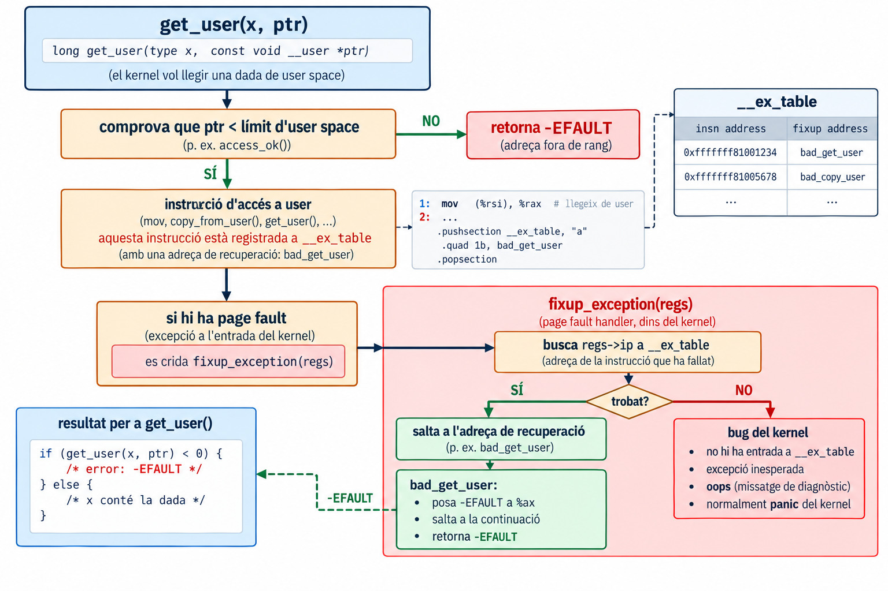


## Annex C · Dues aproximacions per validar { visibility="uncounted"}

:::{.nonincremental}
1. **Comprovar el punter** abans d'usar-lo (cerca a l'espai d'adreces del procés).
2. **No comprovar** i confiar en el *page fault*.
:::

| Cost | Comprovar punter | *Fault handling* |
|---|---|---|
| Adreça vàlida | cerca a l'espai d'adreces | negligible |
| Adreça invàlida | cerca a l'espai d'adreces | cerca a la taula d'excepcions |

Linux tria la 2a (amb la taula d'excepcions)

## Annex D · vDSO: syscalls sense entrar al kernel {visibility="uncounted"}

- Àrea de memòria **mapejada a user space** amb codi generat pel kernel (`[vdso]` a `/proc/PID/maps`).
- Serveix per a crides que només **llegeixen** dades que el kernel actualitza (`gettimeofday`, `time`, `clock_gettime`...): no cal canviar de mode.

::: {.concepte title="Doble finalitat" .fragment}
1. **Rendiment**: eviten el cost de la transició.
2. **Abstracció**: la libc no ha de saber si la CPU prefereix `int 0x80`, `sysenter` o `syscall`; ho decideix el kernel.
:::


## Annex E · Codi del kernel

- [Linux 6.16.4, `arch/x86/entry/syscall_64.c`](https://elixir.bootlin.com/linux/v6.16.4/source/arch/x86/entry/syscall_64.c#L94)

-  [Linux 6.16.4, `arch/x86/include/asm/ptrace.h`](https://elixir.bootlin.com/linux/v6.16.4/source/arch/x86/include/asm/ptrace.h)
