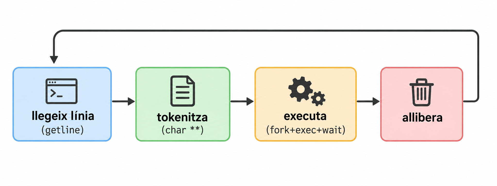
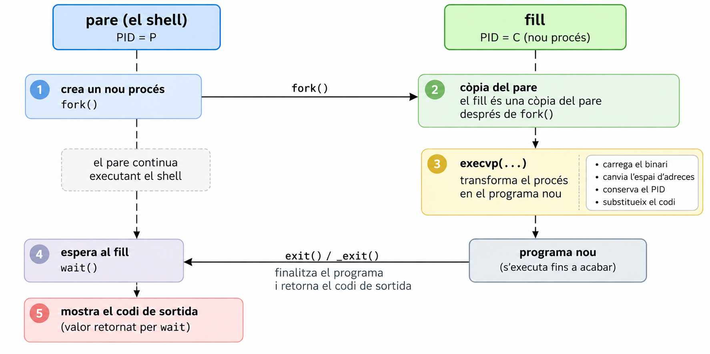

## Introducció

Cada cop que obres una terminal i escrius `ls -l ; pwd`, hi ha un programa que fa tot el treball: llegeix la línia, la trosseja, decideix què s'ha d'executar i en quin ordre, **crea processos** i espera que acabin. Aquest programa és el **shell**.

> **Què ha de passar entre que escric una línia i que es veu el resultat?**

El cor de qualsevol shell és aquest cicle, i el construirem peça a peça:



:::{.programari}
- `gcc`. **Sistema de referència: Debian bookworm, amb gcc 12.2.**
- Compila sempre amb `gcc -Wall -Wextra -g -O0`. 
- **Extra**: Compilar amb `-fsanitize=address,undefined` per a una comprovació més rigorosa. Et dirà a l'instant si tens una fuita o un accés fora de límits. Recorda que és una opció **de compilació**, no un argument del programa.
- Eines de diagnòstic que farem servir: `strace` (`sudo apt install strace`) i `man` (`sudo apt install manpages-dev`).
:::

:::{.bonapractica}
**El `man` és el teu company.** Cada cop que apareix una funció nova, la decisió de com usar-la es pren llegint el seu `man`, no recordant-ho de memòria. Aquestes són les que farem servir (el número és la secció: `man 3 getline`, `man 2 fork`). Consulta totes les funcions amb `man`:
`getline`, `strcspn`, `fork`, `wait`, `execvp`, `perror`, `_exit`

:::{.concepte}
- `man 3 getline` obre la pàgina. El número és la **secció**: `1` ordres del shell, `2` crides al sistema (`fork`, `wait`), `3` biblioteca de C (`printf`, `strcspn`). `man printf` pot obrir l'ordre de shell i no la funció: per això escrivim `man 3 printf`.
- Es navega amb **espai** (avança), **b** (enrere), **/text** (cerca; **n** per a la següent coincidència) i **q** (surt).
- Les pàgines tenen sempre la mateixa estructura. Les que importen: **SYNOPSIS** (la signatura i **quins `#include` calen**), **DESCRIPTION**, **RETURN VALUE** (què retorna, i com s'indica l'error) i **NOTES/ERRORS**.
- Si no saps com es diu la funció: `man -k paraula` (o `apropos`) cerca per descripció, i `man 3 string` llista la família de funcions de cadenes.

Abans de cridar una funció per primera vegada, llegeix **SYNOPSIS** i **RETURN VALUE**.
:::

:::

:::{.concepte title="Mapa de la sessió"}

| Part | Què fem | Estat |
|--|---------|-------|
| A | Llegir una línia amb `getline` i veure les diferències amb `scanf` i `fgets` | Completa |
| B | Executar una comanda amb `fork` + `execvp` + `wait` | Completa, **amb un error que has de trobar** |
| C | Tokenitzar la línia (`char **`) | Pendent: el que et falta per fer funcionar `ls -l` |
:::

---

### Part A · El prompt de la mini-shell (Lectura de línia)

#### A.1 — Quina funció triem per llegir?

La primera idea que ve al cap és `scanf`. Anem a posar-la a prova.

Crea `main.c`:

```{.c}
#include <stdio.h>

int main(void)
{
    char buf[64];

    printf("> ");
    scanf("%s", buf);
    printf("llegit: '%s'\n", buf);

    printf("> ");
    scanf("%s", buf);
    printf("llegit: '%s'\n", buf);

    return 0;
}
```

Fixa't que `scanf("%s", buf)` necessita un buffer per guardar la cadena que l'usuari escriu. En aquest cas, `buf` té **64 bytes**. Aquesta versió únicament permet executar dues instruccions. Una alternativa més elegant seria fer un bucle:

```{.c}
#include <stdio.h>

int main(void)
{
    char buf[64];

    while (1) {
        printf("> ");
        scanf("%s", buf);
        printf("llegit: '%s'\n", buf);
    }

    return 0;
}
```

Per compilar i executar:

::: {.terminal}
```bash
gcc -o main main.c
./main
# o bé, per fer-ho millor
gcc -Wall -Wextra -g -O0 -fsanitize=address,undefined -o main main.c
./main
```
:::

Escriu `ls -l` **una sola vegada** i observa què passa. Després prova `Ctrl-D` amb la versió en bucle: què fa? (Pista: mira què retorna `scanf` quan arriba al final de l'entrada i qui ho comprova.)

<details>
<summary><b>Pots veure el raonament</b></summary>

:::{.solucio}
`buf` conté `ls`, i el programa **no ha esperat** que escriguis res al segon `scanf`: aquest llegeix `-l` directament, que ja era a l'entrada.

```{.text}
> llegit: 'ls'
> llegit: '-l'
```

`%s` llegeix **una paraula** (s'atura al primer espai), i deixa la resta de la línia a l'entrada pendent de ser llegida. Un shell necessita la **línia sencera** (`ls -l`, amb espais), perquè en tractar-la nosaltres decidirem què són arguments, operadors, etc.

Amb `Ctrl-D`, `scanf` retorna `EOF`, però el programa no ho comprova: el bucle no s'acaba mai i va imprimint l'últim valor de `buf`. Un motiu més per no usar `scanf` sense mirar-ne el valor de retorn.
:::

</details>

Queda un problema més greu, que hem d'entendre bé: **la mida del buffer**.

::: {.exercici}
Si declarem `char buf[8]` i l'usuari escriu 30 lletres, què fa `scanf("%s", buf)`? Compila `main.c` amb `-fsanitize=address` i comprova-ho:

```{.c}
#include <stdio.h>

int main(void)
{
    char buf[8];

    scanf("%s", buf);
    printf("llegit: '%s'\n", buf);

    return 0;
}
```
:::

<details>
<summary><b>Pots veure el raonament</b></summary>

:::{.solucio}
`AddressSanitizer` avorta amb `stack-buffer-overflow`: `scanf` ha escrit **31 bytes en un buffer de 8**. `scanf` no té manera de saber de quina mida és `buf` (només rep l'adreça), així que escriu fins que acaba l'entrada. Sense el sanitizer seria **comportament indefinit**: podria no fer res visible, fer petar el programa o, pitjor, deixar que algú sobreescrigui la pila amb dades escollides: una vulnerabilitat clàssica.

Es pot limitar amb `%7s`, però llavors **trunquem** la comanda sense avisar, i a més seguim llegint només una paraula.
:::

</details>

::: {.exercici}
**I `fgets(buf, sizeof buf, stdin)`?** Aquesta sí que rep la mida i no es desborda. Prediu què imprimeix aquest programa amb `buf[8]` si l'entrada és `ls -l -a -h` + Enter, i després `ok` + Enter:

```{.c}
#include <stdio.h>

int main(void)
{
    char buf[8];

    while (fgets(buf, sizeof buf, stdin) != NULL) {
        printf("llegit: '%s'\n", buf);
    }

    return 0;
}
```
:::

<details>
<summary><b>Pots veure el raonament</b></summary>

:::{.solucio}
Surten **tres** lectures per només dues línies:

```{.text}
llegit: 'ls -l -'
llegit: 'a -h
'
llegit: 'ok
'
```

`fgets` llegeix com a molt `mida - 1` caràcters (el darrer lloc és per al `'\0'`). La línia `ls -l -a -h` no hi cap i queda **partida en dues**: el nostre shell veuria les comandes `ls -l -` i `a -h`. Per evitar-ho hauríem de detectar si el `\n` hi és, i continuar llegint en cas contrari: més codi, més errors possibles. I, sigui quina sigui la mida que triem, **sempre hi haurà una línia més llarga**.

Una cosa més: `gets(buf)` (sense mida) **va ser eliminada de l'estàndard en C11** precisament per ser impossible d'usar amb seguretat.
:::

</details>

Anem a la solució que fa servir `getline`, que **llegeix la línia sencera** i **s'autoajusta a la mida necessària**. Fixa't que en el manual diu que `getline` **retorna el nombre de bytes llegits**, i que **el buffer és dinàmic**: si és massa petit, `getline` el redimensiona amb `realloc`. Això vol dir que hem de passar un **punter a punter** (`char **`) i un **punter a mida** (`size_t *`).

```{.c}
#include <stdio.h>
#include <stdlib.h>

int main(void)
{
    char *linia = NULL;
    size_t cap = 0;

    while (1) {
        printf("> ");

        ssize_t n = getline(&linia, &cap, stdin);
        printf("has escrit: '%s' (%zd bytes llegits)\n", linia, n);
    }

    free(linia);

    return 0;
}
```

#### A.2 — Treure el salt de línia 

`getline` ens dona `"ls -l\n"`. Si el passéssim tal qual a `execvp`, buscaria un programa que es digui `ls\n`. Hem de treure el `\n`. Tenim tres maneres de fer-ho:

- (a) `linia[n - 1] = '\0';` (el `\n` és l'últim caràcter, no?)
- (b) `linia[strcspn(linia, "\n")] = '\0';`
- (c) buscar el `\n` amb `strchr` i, si no és `NULL`, posar-hi un `'\0'`.

::: {.exercici}
Obre `man 3 strcspn`. Què fa? Què retorna `strcspn("ls -l\n", "\n")`? I després **pensa en el cas límit**: què passa amb (a) i amb (b) si l'última línia de l'entrada **no acaba en `\n`** (per exemple, si l'usuari prem `Ctrl-D` enmig d'una línia, o si fem `printf 'pwd\nls' | ./programa`)?
:::

<details>
<summary><b>Pots veure el raonament</b></summary>

:::{.solucio}
`strcspn(s, reject)` retorna la **longitud del tros inicial de `s` que no conté cap dels caràcters de `reject`**. Amb `"ls -l\n"` i `"\n"` retorna `5`: just la posició on hi ha el `\n`. Si no hi ha cap `\n`, retorna `strlen(s)`: la posició del `'\0'`.

Per tant, a (b) sempre escrivim `'\0'` en una posició vàlida: si hi ha `\n`, el substitueix; si no n'hi ha, **escriu un `'\0'` damunt d'un altre `'\0'`** (inofensiu).

A (a), en canvi, **assumim que el `\n` hi és**, i si no hi és, esborrem l'últim caràcter útil. L'opció (c) també és correcta, però demana un `if` i una variable més. Escollim (b): **una sola línia i sense casos especials**.
:::

</details>

#### A.3 — El bucle complet

Crea `shell.c`:

```{.c}
#include <stdio.h>
#include <stdlib.h>
#include <string.h>

int main(void)
{
    char *linia = NULL;
    size_t cap = 0;

    while (1) {
        printf("> ");

        ssize_t n = getline(&linia, &cap, stdin);

        if (n < 0) {
            printf("\n");
            break;
        }

        linia[strcspn(linia, "\n")] = '\0';

        printf("has escrit: '%s' (%zd bytes llegits)\n", linia, n);
    }

    free(linia);

    return 0;
}
```

Fixa't:

- **`n < 0` es comprova abans de tocar `linia`.** Si `getline` falla (o l'usuari prem `Ctrl-D`), no hem de processar res.

També cal tenir en compte que l'usuari necessita una `comanda` per sortir. Podem fer que escriure `q` acabi el bucle i anomenarem aquestes comandes **built-in** (no són programes externs, sinó que el shell les processa ell mateix). 

```{.c}
#include <stdio.h>
#include <stdlib.h>
#include <string.h>

#define ACABAR(s) (strcmp((s), "q") == 0)

int main(void)
{
    char *linia = NULL;
    size_t cap = 0;

    while (1) {
        printf("> ");

        ssize_t n = getline(&linia, &cap, stdin);

        if (n < 0) {
            printf("\n");
            break;
        }

        linia[strcspn(linia, "\n")] = '\0';

        if (ACABAR(linia))
            break;

        printf("has escrit: '%s' (%zd bytes llegits)\n", linia, n);
    }

    free(linia);

    return 0;
}
```

:::{.concepte}
Per convenció, les macros s'escriuen en **MAJÚSCULES** (`ACABAR`). Així es distingeixen d'una funció a simple vista (una macro no es comporta exactament com una funció: per exemple, avalua l'argument tantes vegades com el fa servir) i evitem col·lisions amb noms de la biblioteca estàndard. Si l'haguéssim anomenat `exit`, estaríem redefinint una funció de `<stdlib.h>`, cosa que és comportament indefinit.
:::

:::{.reflexio}
Aquesta solució encara no és perfecta: si l'usuari escriu `q` amb espais, tabuladors,... al davant o al darrere (`"  q"`, `"q  "`, `"  q  "`), el shell **no surt**. Mes endavant veurem com **tokenitzar** la línia i detectar millor les built-in.
:::

---

### Part B — Executar una comanda

Ja sabem llegir una línia. Ara toca fer que el programa **executi** el que l'usuari escriu. En Unix això no es fa amb una sola crida: es fa amb tres peces que cooperen.




#### B.1 —`fork` 

::: {.exercici}
Sense compilar-lo, prediu què imprimeix aquest programa i **quantes vegades** apareix cada línia. Després compila'l i comprova-ho.

```{.c}
#include <stdio.h>
#include <unistd.h>

int main(void)
{
    printf("abans del fork\n");

    pid_t pid = fork();

    if (pid == 0) {
        printf("soc el fill\n");
    } else {
        printf("soc el pare, el fill es diu %d\n", pid);
    }

    printf("fi (pid %d)\n", getpid());

    return 0;
}
```
:::

<details>
<summary><b>Pots veure el raonament</b></summary>

:::{.solucio}
`abans del fork` surt **una sola vegada** (només el pare existia en aquell moment). Les línies posteriors al `fork` les executen **els dos processos**, així que `fi (pid ...)` surt **dues vegades**. L'ordre entre pare i fill **no està garantit**: depèn del planificador.

```{.text}
abans del fork
soc el pare, el fill es diu 4312
soc el fill
fi (pid 4311)
fi (pid 4312)
```

:::

</details>

#### B.2 — Esperar el fill i llegir com ha acabat

Sense `wait`, el pare pot continuar (i tornar a mostrar el prompt) abans que el fill acabi, i el fill queda com a **zombie** quan acaba. Per això el pare ha d'esperar.

Llegeix `man 2 wait`, apartats **SYNOPSIS**, **DESCRIPTION** (les macros `WIFEXITED`, `WEXITSTATUS`, `WIFSIGNALED`, `WTERMSIG`) i **RETURN VALUE**.

```{.c}
pid_t pid = fork();

if (pid == 0) {
    /* codi del fill */
} else {
    int status;

    wait(&status);

    if (WIFEXITED(status)) {
        printf("codi: %d\n", WEXITSTATUS(status));
    }
}
```

::: {.exercici}
1. `status` **no és** directament el codi de sortida. Què és? Per què cal `WEXITSTATUS`?
2. Quan és `WIFEXITED(status)` fals? Dona un exemple de programa que ho provoqui.
3. Quin codi de sortida diries que usa el shell quan una comanda **no existeix**? Comprova-ho al teu shell real: `no_existeix; echo $?`
:::

<details>
<summary><b>Pots veure el raonament</b></summary>

:::{.solucio}
1. `status` empaqueta **diversa informació** en un sol enter: si el procés ha sortit amb `exit` o l'ha matat un senyal, el codi de sortida, el senyal... Les macros desempaqueten cada part. Imprimir `status` directament dona valors com `256` per a un `exit(1)`.
2. Quan el procés **no** ha acabat amb `exit`, sinó mort per un senyal. Per exemple, un programa que faci `raise(SIGSEGV);` (amb `#include <signal.h>`) acaba amb `SIGSEGV`. Llavors s'ha d'usar `WIFSIGNALED` i `WTERMSIG`. (Evita `*(int *)0 = 1;` per provar-ho: és comportament indefinit i, amb optimitzacions, el compilador pot eliminar-lo.)
3. **127**, per convenció (*command not found*). Per això el fill de la nostra `executa` farà `_exit(127)` si `execvp` falla.
:::

</details>

#### B.3 — Llegim `execvp`

Aquesta és la crida on és més fàcil equivocar-se, i **tota la informació és al `man`**.

::: {.exercici}
Obre `man 3 execvp` i respon:

1. Quina és la signatura? Quin és el tipus del segon paràmetre?
2. Què fa la `p` del nom? I la `v`?
3. Què cal complir **obligatòriament** amb l'array d'arguments? Busca-ho a la descripció: *The array of pointers **must** be terminated by...*
4. Quin ha de ser `argv[0]`?
5. Què retorna si va bé? I si falla?
:::

<details>
<summary><b>Pots veure el raonament</b></summary>

:::{.solucio}
1. `int execvp(const char *file, char *const argv[]);`: el segon és un **array de punters a cadena** (`char **`).
2. `p`: busca l'executable als directoris del `PATH` (per això podem escriure `ls` i no `/usr/bin/ls`). `v`: els arguments es passen en un **v**ector (array), per oposició a `execlp`, que els rep com a llista de paràmetres.
3. L'array **ha d'acabar amb un punter `NULL`**. És com `execvp` sap quants arguments hi ha: no rep cap longitud.
4. El nom del programa (el mateix que `file`). La resta d'elements són els arguments.
5. **Si va bé, no retorna mai**: el codi després de la crida ja no existeix. Si retorna, sempre és `-1` (i `errno` indica la causa). Per això el codi que segueix un `execvp` és *únicament* el tractament de l'error.

Exemple correcte, escrit a mà:

```{.c}
char *args[] = { "ls", "-l", NULL };
execvp(args[0], args);
```
:::

</details>

#### B.4 — La funció `executa`

```{.c}
int executa(char **argv)
{
    pid_t pid = fork();

    if (pid < 0) {
        perror("fork");
        return -1;
    }

    if (pid == 0) {
        execvp(argv[0], argv);
        perror(argv[0]);
        _exit(127);
    }

    int status;

    wait(&status);

    if (WIFEXITED(status)) {
        return WEXITSTATUS(status);
    }

    return 128 + WTERMSIG(status);
}
```

Fixa't en els detalls (cadascun és una decisió que s'ha pres llegint el `man`):

| Detall | Per què |
|--------|---------|
| `if (pid < 0)` amb `perror("fork")` | `fork` pot fallar (sense memòria, límit de processos). El shell **ha de seguir viu**, no fer `exit`. |
| Després d'`execvp`, només `perror` + `_exit(127)` | Si arribem aquí, `execvp` ha fallat. No hem de continuar executant el codi del shell dins del fill! |
| `_exit` i **no** `exit` al fill | `exit` buida els buffers de `stdio` heretats del pare; `_exit` no |
| `128 + WTERMSIG(status)` | Convenció del shell per a un procés mort per senyal (p. ex. `139` = `SIGSEGV`). |
| `wait(&status)` + macros | `wait` retorna el PID del fill i omple `status`; és `executa` qui el desempaqueta (`WEXITSTATUS`, `WTERMSIG`) i retorna el codi, de manera que el pare (el bucle del shell) podrà decidir què fer amb ell. |

#### B.5 — Primera versió de la mini-shell

Aquest és **el punt on vam deixar la sessió**. Funciona a mitges. :)

```{.c}
#include <stdio.h>
#include <string.h>
#include <sys/types.h>
#include <sys/wait.h>
#include <unistd.h>
#include <stdlib.h>

#define ACABAR(s) (strcmp((s), "q") == 0)

int executa(char **argv);

int main(void)
{
    char *linia = NULL;
    size_t cap = 0;

    while (1) {
        printf("> ");

        ssize_t n = getline(&linia, &cap, stdin);

        if (n < 0) {
            printf("\n");
            break;
        }
        linia[strcspn(linia, "\n")] = '\0';
        printf("has escrit: '%s' (%zd bytes llegits)\n", linia, n);

        if (ACABAR(linia))
            break;

        executa(&linia);
    }

    free(linia);

    return 0;
}

int executa(char **argv)
{
    pid_t pid = fork();

    if (pid < 0) {
        perror("fork");
        return -1;
    }

    if (pid == 0) {
        execvp(argv[0], argv);
        perror(argv[0]);
        _exit(127);
    }

    int status;

    wait(&status);

    if (WIFEXITED(status)) {
        return WEXITSTATUS(status);
    }

    return 128 + WTERMSIG(status);
}
```

Compila'l i prova **tres** coses:

```{.bash}
gcc -Wall -Wextra -g -O0 -fsanitize=address,undefined -o shell shell.c
./shell
> ls
> ls -l
> q
```

::: {.exercici}
**Exercici 1: troba l'error.**

Segurament has vist això en escriure `ls`:

```{.text}
> ls
has escrit: 'ls' (3 bytes llegits)
ls: Bad address
```

1. Què vol dir `Bad address`? Quin `errno` és? (`man 3 errno`, busca `EFAULT`.)
2. Per què `execvp` rep una adreça dolenta? **Mira de quin tipus és el que li passem com a `argv` i què hi ha a continuació a la memòria.** (Pista: repassa la resposta 3 de B.3.) Fixa't que ni `-Wall` ni `-Wextra` t'han avisat de res: el tipus `char **` és correcte per al compilador, i l'error només es veu en execució.
3. Fes servir `strace` per veure-ho amb els teus ulls:
   ```{.bash}
   strace -f -e trace=execve ./shell
   ```
   Què hi ha dins l'array que rep `execve`? Com acaba la crida?
4. Passa a un altre problema: si ho arregles de la manera més ràpida possible (un array de dos elements), `ls` funcionarà... però `ls -l`? Per què no? Què caldrà fer amb la línia?
:::
