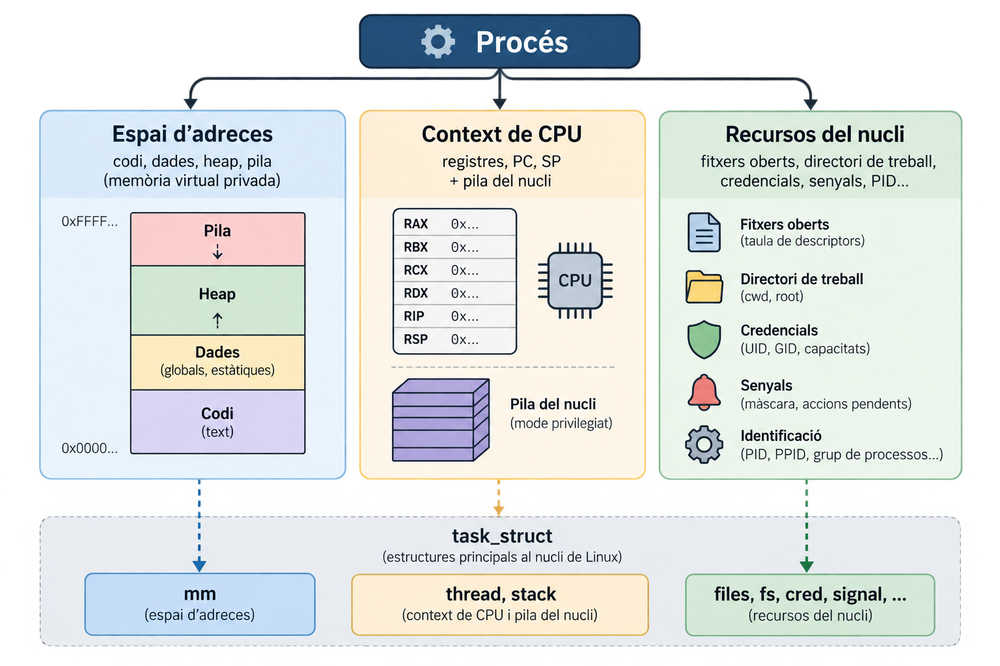
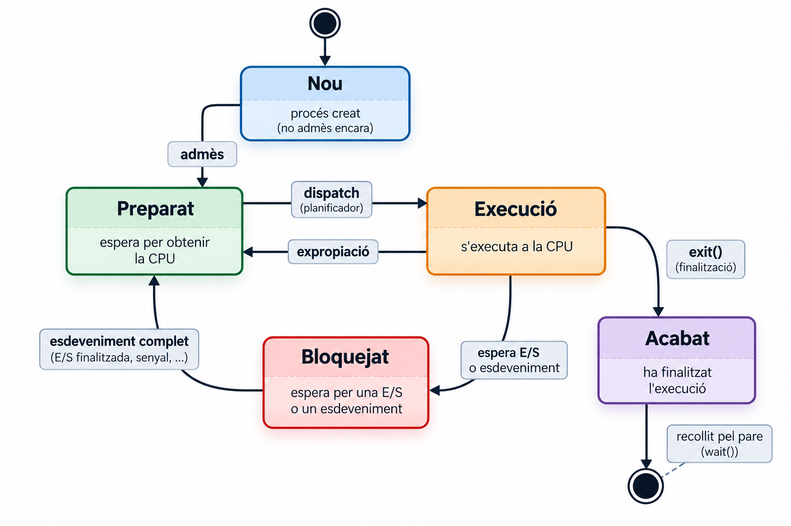
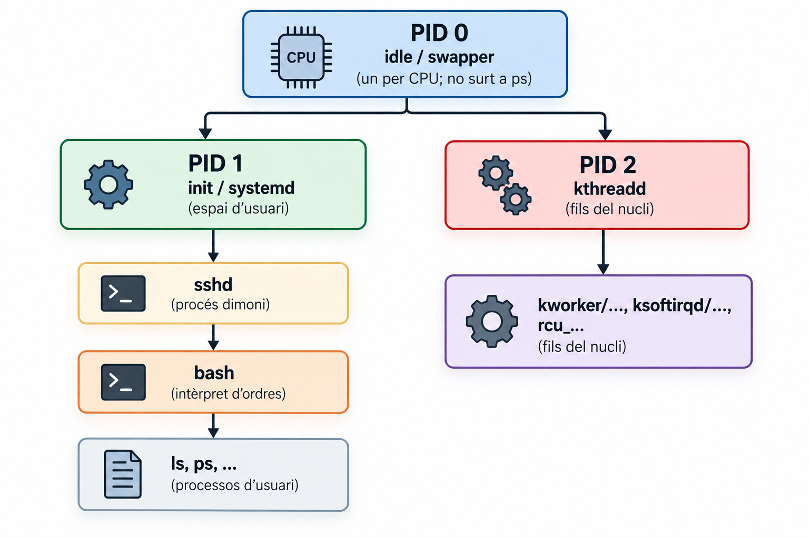
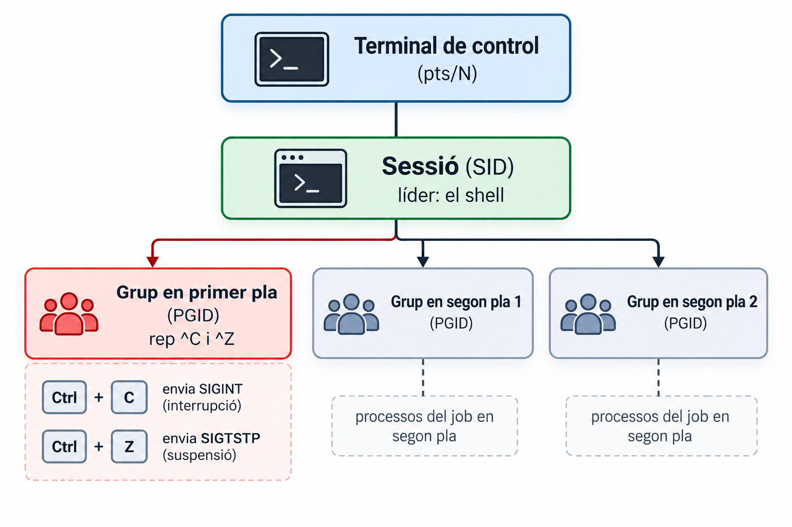

## Objectius 

::: {.objectius title="Què aprendrem avui"}
-   Distingir **programa** i **procés**, i descriure què el compon: **espai d'adreces**, **context de CPU** i **recursos del nucli**.
-   Explicar què és un **canvi de context**, què el provoca i en què es diferencia d'un canvi de mode.
-   Aplicar el **model de 5 estats** i traduir-lo als estats reals de Linux (`R`, `S`, `D`, `T`, `Z`).
-   Llegir la **PCB** de Linux (`task_struct`) i inspeccionar un procés real amb `ps`, `top` i `/proc`.
-   Situar un procés a l'**arbre**: PID 0/1/2, grups de processos i sessions.
:::

## Punt de partida

::: {.prerequisits title="Ho hem vist a les sessions de crides al sistema"}
-   El maquinari té (com a mínim) dos modes: **usuari** i **nucli**. El codi d'usuari no pot tocar el maquinari ni la memòria del nucli.
-   Hi ha tres maneres d'**entrar al nucli**: **crida al sistema** (síncrona), **excepció** (síncrona) i **interrupció** (asíncrona).
-   En entrar, la CPU **canvia de mode** i salta a un punt fix que el nucli ha configurat.
:::


## Programa vs. procés 

::: {.definicio title="Procés"}
Un **procés** és una **instància d'un programa en execució**: una entitat *activa* amb el seu propi espai d'adreces, el seu context de CPU i els seus recursos del nucli.
:::

| | **Programa** | **Procés** |
|:---------------|:-----------------------------|:-----------------------------|
| Naturalesa | Passiu: un **fitxer** (p. ex. ELF) | Actiu: existeix **mentre s'executa** |
| Té | Codi i dades inicials | Espai d'adreces, registres, fitxers oberts, PID... |
| Quantitat | 1 fitxer | **Molts processos** del mateix programa |

Si 10 usuaris executen `vi`, hi ha **10 processos**, però el **codi** és el mateix fitxer i el nucli el **comparteix** a memòria.

## Demo · un programa, tres processos 


<div id="demo-sameexec"></div>

<script>
AsciinemaPlayer.create(
  'cast/01/sameexe.cast',
  document.getElementById('demo-sameexec'),
  {
    autoPlay: false,
    loop: false,
    speed: 0.8,
    cols: 150,
    rows: 20
  }
);
</script>

:::: {.exemple title="Què cal observar"}
::: nonincremental
-   Tres processos `sleep` amb **PID diferents** i el mateix pare.
-   El codi (`r-xp`) és **el mateix fitxer i el mateix inode**: el nucli en comparteix les pàgines.
:::
::::


## Un procés són tres coses 

:::{style="text-align:center"}
{ width=50%}
:::

::: {.concepte title="Dues il·lusions"}
El nucli ofereix a cada procés (1) la il·lusió de **tenir la CPU per a ell sol** (flux de control propi) i (2) la de **tenir tota la memòria per a ell sol** (espai d'adreces privat).
:::

## Canvi de mode vs. canvi de context

| | **Canvi de mode** | **Canvi de context** |
|:---------------|:-----------------------------|:------------------------------|
| **Què canvia** | El **nivell de privilegi** (usuari ↔ nucli) | **Quina tasca executa** a la CPU |
| **Qui**        | mateixa tasca | un altra tasca |
| **Procés** | El **mateix** procés | Un procés **diferent** |
| **Causes** | Crida al sistema, excepció, interrupció | Expropiació, bloqueig (E/S), `sched_yield`, `exit` |
| **Es desa** | El mínim (PC, SP, indicadors...) | El **context complet** + canvi d'espai d'adreces |
| **Cost** | Baix | **Més alt** (TLB, cachés, planificador) |

::: {.errorcomu title="No és el mateix"}
Una crida al sistema **no** implica un canvi de context: el procés entra al nucli i **en surt sense perdre la CPU**. Només si la crida **bloqueja** (p. ex. `read()` d'un disc) el nucli en dóna la CPU a un altre.
:::

## Què passa en un canvi de context 

:::{style="text-align:center"}

```{mermaid}
%%| echo: false
sequenceDiagram
    participant A as Procés A (mode usuari)
    participant K as Nucli
    participant B as Procés B

    A->>K: interrupció de rellotge (canvi de mode, pila del nucli de A)
    K->>K: desa el context de A (registres, PC, SP) a la seva pila del nucli i al task_struct
    K->>K: el planificador tria B
    K->>K: canvia de pila del nucli i d'espai d'adreces (taula de pàgines de B)
    K->>K: restaura el context de B
    K-->>B: torna a mode usuari (iret / eret): B continua on ho havia deixat
    Note over A,B: A queda preparat: el seu context espera al task_struct
```

:::

## Canvis de context: voluntaris i no voluntaris 

::: {.concepte title="Dues classes"}
-   **Voluntari**: el procés **cedeix** la CPU perquè s'ha de bloquejar (`read`, `sleep`, `wait`...).
-   **No voluntari**: el nucli li **pren** la CPU (**expropiació**: se li ha acabat el temps o hi ha algú més prioritari).
:::

:::{.exemple .fragment title="Com comprovar-ho"}

Linux ho compta per procés a `/proc/PID/status`: `voluntary_ctxt_switches` i `nonvoluntary_ctxt_switches` :

``` {.bash code-line-numbers="false"}
grep ctxt /proc/$$/status
```

:::


## El model de 5 estats 

::::: columns
::: {.column width="50%"}



:::

::: {.column width="50%"}
| Transició | Qui la provoca |
|:------------------|:----------------------|
| Preparat → Execució | **Planificador** |
| Execució → Preparat | **Rellotge** (expropiació) |
| Execució → Bloquejat | **El procés** (crida bloquejant) |
| Bloquejat → Preparat | **Maquinari** (interrupció) o un altre procés |
| Execució → Acabat | **El procés** (`exit`) o un senyal |
:::
:::::

::: {.concepte title="Regla"}
Només el **planificador** decideix quin procés *preparat* passa a *execució*. Un procés **mai** es desbloqueja a si mateix.
:::

## Els estats reals de Linux 

:::{.exemple}
Per veure ,és informació sobre els processos poder fer `man ps` i llegir la secció **PROCESS STATE CODES**. 
:::

| `ps` | Nucli | Què significa |
|:--:|:-----------------------|:---------------------------------------|
| **R** | `TASK_RUNNING` | **A la CPU *o* a la cua d'execució** (executant-se o preparat) |
| **S** | `TASK_INTERRUPTIBLE` | Dorm esperant un esdeveniment; un **senyal el desperta** |
| **D** | `TASK_UNINTERRUPTIBLE` (i `KILLABLE`) | Dorm **sense atendre senyals** (típic: E/S) |
| **T** | `__TASK_STOPPED` | **Aturat** per senyal (`SIGSTOP`, `SIGTSTP`); `SIGCONT` el reprèn |
| **t** | `__TASK_TRACED` | Aturat per un **depurador** (`ptrace`) |
| **I** | `TASK_IDLE` | Fil del nucli **inactiu** |
| **Z** | `EXIT_ZOMBIE` | **Acabat**, esperant que el pare el reculli |
| **X** | `EXIT_DEAD` | Mort (no es veu mai) |

:::{.exemple}
Podeu consultar [sched.h](https://elixir.bootlin.com/linux/v7.2.8/source/include/linux/sched.h#L108) es representen els estats de les tasques. **TASK_RUNNING** indica que la tasca és runnable: pot executar-se, tant si està esperant que el planificador li assigni la CPU com si s'està executant en aquell moment. En canvi, **TASK_INTERRUPTIBLE** i **TASK_UNINTERRUPTIBLE** representen diferents formes d'espera (dormit).
:::

## `R` no vol dir «executant-se» 

:::: {.concepte title="Preparat i Execució, a Linux, són el mateix estat"}
Al camp d'estat del nucli **no hi ha cap valor Running diferent de Ready**: `TASK_RUNNING` cobreix tots dos. Que un procés estigui *a la CPU* o *a la cua* és una **dada del planificador**, no un estat. El model de 5 estats és el bon **model mental**, però `ps` no distingeix aquests dos estats.
::::

::: {.errorcomu title="`D` és l'estat que fa por"}
Un procés en **`D`** **no respon ni a `SIGKILL`** fins que acabi l'espera (típicament E/S a disc o xarxa: un NFS caigut). Compta també al *load average*. Si molts processos són en `D`, el sistema va lent **encara que la CPU estigui lliure**.
:::

## Un model històric: UNIX System V (Bach) 

::: {.errorcomu title="Model històric: no és Linux"}
Molts llibres descriuen **9 estats**: *executant en mode usuari*, *executant en mode nucli*, *preparat en memòria*, *dormit en memòria*, *preparat intercanviat*, *dormit intercanviat*, *expropiat*, *creat* i *zombi*.
:::

| Model  | A **Linux** |
|:----------------------------|:-------------------------------------------|
| **Swapping** de processos **sencers** (estats intercanviat) | Linux fa **paginació**: intercanvia **pàgines**, no processos |
| **Nucli no expropiable**: un procés *expropiat* torna sempre a mode usuari | Un procés pot perdre la CPU **mentre executa codi del nucli** (segons `CONFIG_PREEMPT*`) |
| El **mode** (usuari/nucli) forma part de l'**estat** | El mode és **ortogonal** a l'estat del planificador |

:::{.definicio title="Ortogonal"}
Dos conceptes són **ortogonals** si **no depenen l'un de l'altre**: el mode d'execució (usuari/nucli) és independent de l'estat del planificador (preparat, execució, bloquejat...).
:::

## Demo · `fg` i `bg`

::::: columns
::: {.column width="50%"}

<div id="demo-ctrlz_ssh_T1"></div>

<script>
AsciinemaPlayer.create(
  'cast/01/ctrlz_ssh_T1.cast',
  document.getElementById('demo-ctrlz_ssh_T1'),
  {
    autoPlay: false,
    loop: false,
    speed: 0.8,
    cols: 50,
    rows: 20
  }
);
</script>

:::
::: {.column width="50%"}

<div id="demo-ctrlz_ssh_T2"></div>

<script>
AsciinemaPlayer.create(
  'cast/01/ctrlz_ssh_T2.cast',
  document.getElementById('demo-ctrlz_ssh_T2'),
  {
    autoPlay: false,
    loop: false,
    speed: 0.8,
    cols: 50,
    rows: 20
  }
);
</script>

:::
:::


## La PCB de Linux: `task_struct` 

**PCB**: l'estructura de dades del nucli amb **tot el que sap d'un procés**. A Linux és `struct task_struct` (`include/linux/sched.h`).

| Categoria | Camps (nucli 6.1, seleccionats) | Per a què |
|:--------------|:-----------------------------------|:--------------------------|
| Estat | `__state`, `exit_state`, `exit_code`, `exit_signal` | Estat i com ha acabat |
| Identitat i arbre | `pid`, `tgid`, `real_parent`, `parent`, `children`, `sibling`, `group_leader` | Qui és i on és a l'arbre |
| Planificació | `prio`, `static_prio`, `policy`, `sched_class`, `se`, `on_cpu` | Prioritat i estadístiques |
| Memòria | `mm`, `active_mm` | L'espai d'adreces |
| Context de CPU | `thread` (registres desats), `stack` (pila del nucli), `thread_info` | Reprendre el procés |
| Recursos | `files`, `fs`, `nsproxy`, `signal`, `sighand`, `cred` | Fitxers, dir. de treball, *namespaces*, senyals, credencials |
| Nom | `comm` | Nom curt (`ps` el mostra) |


## PID, TGID i TID 

:::{.concepte title="PID, TGID i TID"}
Cada *task* té el seu identificador **`pid`** al nucli. El que l'espai d'usuari anomena **PID** és el **`tgid`** (l'identificador del *grup de fils*), i el que anomena **TID** és el **`pid`** de la *task*.
:::

| Espai d'usuari | Camp del nucli | Valor |
|:---------------|:--------------|:----------------------------|
| `getpid()` | `tgid` | Igual per a **tots els fils** d'un procés |
| `gettid()` | `pid` | **Únic per a cada fil** |
| Fil principal | `pid == tgid` | El fil principal té TID = PID |

:::{.concepte title="Fil" .fragment}
Un **fil** és una *task* que comparteix amb les altres l'espai d'adreces i part dels recursos. Cada fil té un **TID** propi, però tots els fils del mateix procés tenen el mateix **TGID**. Un **procés** és un conjunt de fils amb el mateix **TGID**.
:::

## Demo · fils = tasks amb el mateix TGID 

```{.c }
static void *fil(void *arg) {
    printf("fil %ld: getpid()=%d gettid()=%ld\n",(long)arg, getpid(), syscall(SYS_gettid));
    fflush(stdout);sleep(30);return NULL;
}

int main(void) {
    pthread_t t[3];
    for (long i = 0; i < 3; i++)
        if (pthread_create(&t[i], NULL, fil, (void *)i) != 0)
            return EXIT_FAILURE;
    printf("main:  getpid()=%d gettid()=%ld\n", getpid(), syscall(SYS_gettid));
    fflush(stdout);
    for (int i = 0; i < 3; i++)
        pthread_join(t[i], NULL);
    return EXIT_SUCCESS;
}
```

## Demo · fils = tasks amb el mateix TGID 

<div id="demo-threads"></div>

<script>
AsciinemaPlayer.create(
  'cast/01/threads.cast',
  document.getElementById('demo-threads'),
  {
    autoPlay: false,
    loop: false,
    speed: 0.8,
    cols: 150,
    rows: 20
  }
);
</script>

:::: {.exemple title="Què cal observar"}
::: nonincremental
-   **Un sol PID**, però `NLWP = 4`: el fil principal i tres fils més.
-   Cada fil té **TID propi** i `/proc/PID/task/` en llista un per fil.
:::
::::


## `/proc`: la PCB des de l'espai d'usuari 

::::: columns
::: {.column width="55%"}
`/proc/<pid>/` és un **pseudo-sistema de fitxers**: el nucli genera el contingut **en llegir-lo**, a partir de la PCB i altres estructures. No és el «taula de processos» real.

| Entrada | Què mostra |
|:--------------|:----------------------------|
| `status` | Estat, PID, PPID, memòria, canvis de context |
| `stat` | El mateix, en una línia (l'usa `ps`) |
| `cmdline`, `environ` | Arguments i entorn (separats per `\0`) |
| `fd/`, `cwd`, `exe` | Fitxers oberts, directori, executable |
| `maps` | Espai d'adreces |
| `task/` | Un directori per fil |
:::

::: {.column width="45%"}
:::: {.bonapractica title="Llegiu-ho bé"}
`less /proc/<pid>/stat` és il·legible. Useu `cat /proc/<pid>/status`, i per a `environ`:

``` {.bash code-line-numbers="false"}
tr '\0' '\n' < /proc/$$/environ
```
`$$` és el PID del shell actual.
::::
:::
:::::

## Demo · `/proc/PID` 

<div id="demo-procfs"></div>

<script>
AsciinemaPlayer.create(
  'cast/01/procfs.cast',
  document.getElementById('demo-procfs'),
  {
    autoPlay: false,
    loop: false,
    speed: 0.8,
    cols: 150,
    rows: 20
  }
);
</script>


## L'arbre de processos: PID 0, 1 i 2 

::::: columns
::: {.column width="55%"}



:::

::: {.column width="45%"}
-   Els únics processos **sense pare** són el **PID 0** (l'inactiu). **PID 1 i PID 2 són fills seus**, no orfes.
-   El **PID 1** neix com a **fil del nucli** que fa **`exec`** de `/sbin/init`.
-   **Init** és el pare de tots els processos **d'usuari** (i adopta els orfes), **no** de tots els processos.
-   Els **fils del nucli** `[kworker/...]` són fills del PID 2.
:::
:::::

## Demo · l'arbre de processos 

<div id="demo-tree"></div>

<script>
AsciinemaPlayer.create(
  'cast/01/tree.cast',
  document.getElementById('demo-tree'),
  {
    autoPlay: false,
    loop: false,
    speed: 0.8,
    cols: 150,
    rows: 20
  }
);
</script>


## Grups de processos i sessions 

::::: columns
::: {.column width="50%"}

:::

::: {.column width="50%"}
-   Un **grup de processos** (PGID) agrupa processos relacionats; una ordre com `a | b | c` és **un grup**.
-   Una **sessió** (SID) agrupa grups i està lligada a un **terminal de control**.
-   Els senyals del terminal (`^C`, `^Z`) van al **grup en primer pla**.
-   Es pot enviar un senyal a tot un grup: `kill -TERM -- -<PGID>`.
:::
:::::


## Demo · grups de processos i sessions 


<div id="demo-groups"></div>

<script>
AsciinemaPlayer.create(
  'cast/01/groups.cast',
  document.getElementById('demo-groups'),
  {
    autoPlay: false,
    loop: false,
    speed: 0.8,
    cols: 150,
    rows: 20
  }
);
</script>


## Observar processos: `ps` i `top` 

::::: columns
::: {.column width="52%"}

:::{.terminal}
``` {.bash code-line-numbers="false"}
ps                     # els del teu usuari i terminal
ps -e                  # tots els processos
ps -ef --forest        # arbre amb PPID
ps -o pid,ppid,pgid,sid,tty,stat,wchan:20,cmd
ps -L -p <pid>         # els fils d'un procés
pstree -p -s $$        # de l'arrel al meu shell
```
:::

:::{.concepte}
**`ps` sense opcions** mostra els processos amb el **mateix usuari efectiu i el mateix terminal de control** que l'ordre, no «els de la sessió».
:::

:::

::: {.column width="48%"}
| Columna (`ps -l`) | Significat |
|:-------|:-------------------------|
| `S` | Estat (`R S D T Z`) |
| `PPID` | PID del pare |
| `C` | Ús de CPU (%) |
| `PRI`, `NI` | Prioritat i *nice* |
| `SZ` | Mida en **pàgines** |
| `WCHAN` | Funció del nucli on **dorm** |
| `TIME` | CPU **acumulada** |
:::
:::::

:::{.concepte}
- **Load average** (1, 5, 15 min): mitjana de tasks en **`R` + `D`**. 
- Un valor alt amb la CPU lliure vol dir molts processos en **`D`**.
:::

## Demo · `ps` com a eina d'inspecció de processos


<div id="demo-ps"></div>

<script>
AsciinemaPlayer.create(
  'cast/01/ps_guiat.cast',
  document.getElementById('demo-ps'),
  {
    autoPlay: false,
    loop: false,
    speed: 0.8,
    cols: 150,
    rows: 20
  }
);
</script>


## Resum 


::: {.resum}
-   Un **procés** és un programa **en execució**: espai d'adreces, context de CPU i recursos del nucli.
-   El nucli **canvia de context** (per bloqueig o expropiació) per repartir la CPU: no és el mateix que un canvi de mode.
-   El model de **5 estats** s'ha de traduir a Linux: `R` cobreix *preparat* i *execució*; `D` pot no respondre immediatament als senyals mentre està en aquesta espera.
-   La **PCB** (`task_struct`) és el que `fork()`/`clone()` copia o comparteix: la clau de la sessió següent.
-   L'arbre té arrel al **PID 0**; **init** és avantpassat dels processos **d'usuari**.
:::

## Extra · `strace`

<div id="demo-strace_ssh"></div>

<script>
AsciinemaPlayer.create(
  'cast/01/strace_ssh.cast',
  document.getElementById('demo-strace_ssh'),
  {
    autoPlay: false,
    loop: false,
    speed: 0.8,
    cols: 150,
    rows: 20
  }
);
</script>