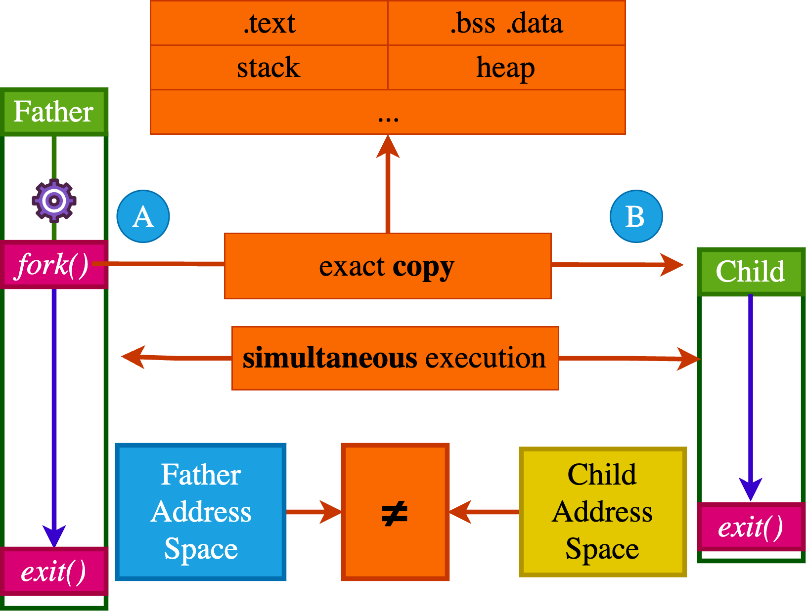
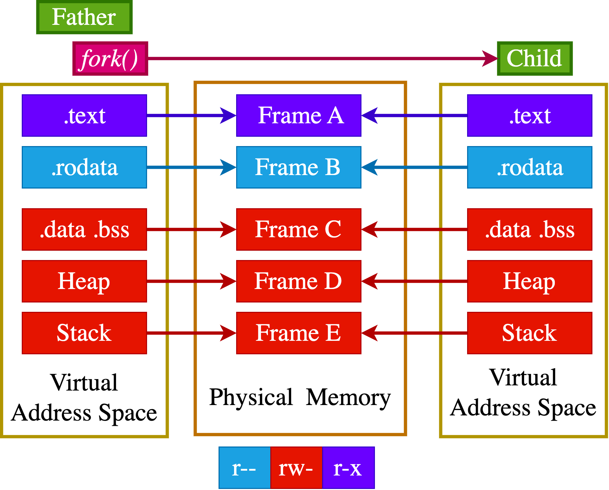
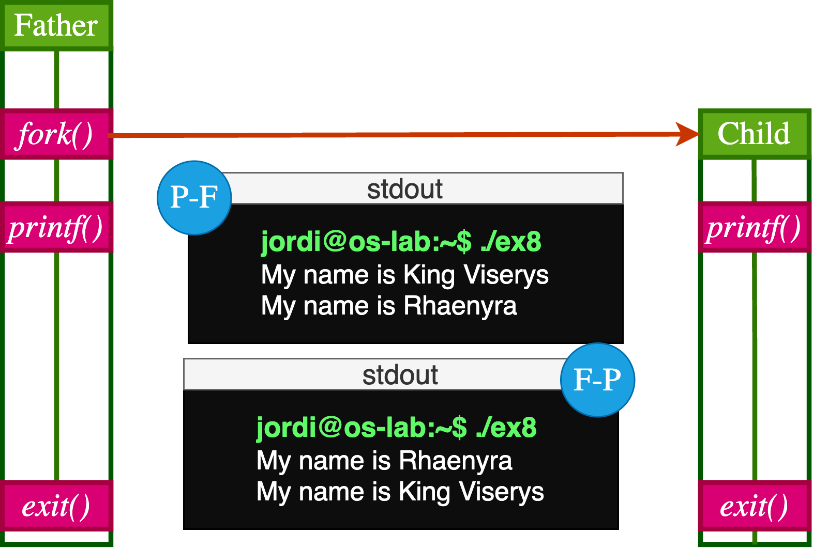
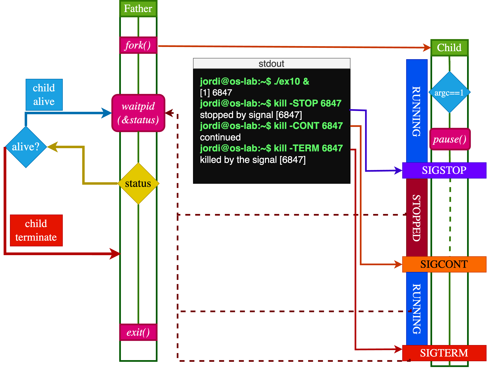
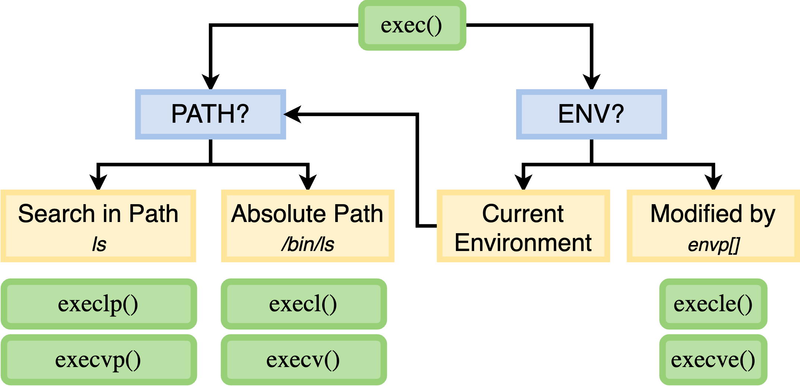

## Mecanisme de Creació `fork()`

:::::: columns
:::: {.column width="45%"}

`fork()` crea una **còpia exacta** del procés actual (*el pare*). Aquesta còpia esdevé el procés *fill* i s'executa **independentment** i **simultàniament**.

``` {.c code-line-numbers="false"}
#include <sys/types.h> # pid_t
#include <unistd.h>    # fork()
int main() {
    pid_t pid = fork();
    exit(0);
}
```

::: {.callout-warning title="Espai de Memòria"}
Els processos **pare (A)** i **fill (B)** *no comparteixen espai de memòria*. Cada procés té el seu propi espai d'adreces virtuals. No obstant això, el contingut inicial de la memòria del procés pare es copia a l'espai d'adreces del fill.
:::
::::

::: {.column width="55%"}

:::
::::::

## Jerarquia de Processos · `fork()`

#### ex1.c

``` {.c code-line-numbers="false"}
#include <stdlib.h>
#include <unistd.h>
#include <sys/types.h>
int main() {
    pid_t pid;
    pid = fork();
    sleep(20);
    exit(0);
}
```

<br>

#### Terminal A

``` {.bash code-line-numbers="false"}
watch -n 1 "ps -ef | grep ex1"
```

<br>

#### Terminal B

``` {.bash code-line-numbers="false"}
echo $$ && gcc ex1.c -o ex1 && ./ex1
```

## Execució Independent:`fork()`

::::::::::: columns
::::::::: {.column width="50%"}
:::: {.callout-note title="Valors de retorn: ```fork()```"}
::: nonincremental
-   Si `fork()` té èxit:
    -   Retorna un valor $>0$ al procés **pare** (*el PID del procés fill*).
    -   Retorna **0** al procés **fill**.
:::
::::

:::: {.callout-caution title="Consideracions"}
::: nonincremental
-   Si `fork()` falla en el procés **pare**, retorna un valor $<0$ i el codi d'error es guarda a la variable *errno*.
-   Si `fork()` falla, no es crea cap **procés fill**.
:::
::::

:::: {.callout-tip title="Observacions"}
::: nonincremental
-   La instrucció `exit(0)` s'executa tant pel procés **pare** com pel **fill**.
-   Cada procés executa el seu propi `printf` de manera independent.
:::
::::
:::::::::

::: {.column width="50%"}
#### ex2.c

``` {.c code-line-numbers="false"}
#include <stdio.h>
#include <unistd.h>
#include <errno.h>
int main() {
    pid_t pid = fork();
    if (pid == 0) {
        printf("Hello, I am the child.\n");
    } else if (pid > 0) {
        printf("Hello I am the father.\n");
    } else {
        perror("Error creating process");
    }
    exit(0);
}
```

------------------------------------------------------------------------

#### Execució

``` {.bash code-line-numbers="false"}
gcc ex2.c -o ex2 && ./ex2
```
:::
:::::::::::

## Registres i `fork()`

:::::: columns
::: {.column width="70%"}
```{mermaid}
%%| echo: false
sequenceDiagram
    participant P as Pare
    participant K as Kernel
    participant C as Fill

    Note over P: Estat abans de fork()<br>RAX = ?, PC = adreça_crida_fork
    P->>K: `fork()`
    activate K
    K-->>P: Retorn al Pare:<br>RAX = Child PID <br>PC = adreça_següent_instrucció
    K-->>C: Retorn al Fill:<br>RAX = 0<br>PC = adreça_següent_instrucció
    deactivate K

    par Execució paral·lela des del mateix punt
        P-->>P: Pare: Continua l'execució.(`if (RAX > 0)`)
        C-->>C: Fill: Continua l'execució.(`if (RAX == 0)`)
    end

    Note over P,C: Ambdós processos s'executen de manera independent
```
:::

:::: {.column width="30%"}
```{mermaid}
%%| echo: false
sequenceDiagram
    participant P as Pare
    participant K as Kernel

    Note over P: Estat abans de fork()<br>RAX = ?, PC = adreça_crida_fork
    P->>K: `fork()`
    activate K
   
    alt Error a `fork()`
        P--xK: Retorna al pare:<br>RAX = -1
        Note over P: `errno` s'estableix.
    end

```

::: {.callout-note title="Observació"}
A l'arquitectura x86, el registre **RAX** s'utilitza per emmagatzemar el valor de retorn de la crida al sistema `fork()`. En altres arquitectures, s'utilitzen registres equivalents (sovint *R0* o *X0*).
:::
::::
::::::

## Gestió d'errors: `fork()`

| Error | Descripció | Raons |
|:-----------------|:-----------------|:-----------------------------------|
| *EAGAIN* | S'han assolit els límits del sistema. | \- Límits de processos (**RLIMIT_NPROC**)<br>- Límits de fils (*threads-max*)<br>- Esgotament dels PIDs disponibles (*pid_max*)<br>- Límits de cgroup |
| *ENOMEM* | Memòria del Kernel insuficient. | \- Escassetat de RAM o Swap<br>- Problemes amb els espais de noms PID |
| *ENOSYS* | `fork()` no és compatible. | \- Maquinari sense unitat de gestió de memòria (*MMU*)<br>- SO no compatible amb `fork()` |
| *ERESTARTNOINTR* | Crida interrompuda i reiniciada. | Intern al Kernel, no és un error vist directament per l'aplicació. |

## Forkbomb

:::::::: columns
:::::: {.column width="60%"}
::: {.callout-warning title="Què és una Forkbomb?"}
A **forkbomb** és un atac de denegació de servei que crea ràpidament un nombre massiu de processos, sobrecarregant els recursos del sistema i fent-lo inoperable.

``` {.c code-line-numbers="false"}
int main() {
    while (1) {
        fork();
    }
```
:::

:::: {.callout-note title="Mecanismes de Protecció"}
::: nonincremental
El nucli implementa dos mecanismes per prevenir les *forkbombs*:

1.  **Límits de processos per usuari**: Cada usuari té un límit configurable sobre el nombre de processos que pot crear, establert per `ulimit -u`.
2.  **Límit global de processos**: El sistema té un límit global sobre el nombre total de processos que pot crear, configurat per `pid_max` (*típicament 32768*).
:::
::::
::::::

::: {.column width="40%"}
```{mermaid}
%%| echo: false
sequenceDiagram
    participant P as Procés Forkbomb 
    participant K as Nucli (Kernel)
    
    P->>K: fork() (1r intent)
    activate K
    K-->>P: Retorna PID del fill1
    deactivate K
    
    par Creació Exponencial
        P->>K: fork() (2n intent)
        activate K
        K-->>P: Retorna PID del fill2
        deactivate K
        
        fork1->>K: fork() (1r fill)
        activate K
        K-->>fork1: Retorna PID del fill3
        deactivate K
    end
    
    Note over K: Processos creats: 4
    
    loop Fase de Saturació
        P/fills->>K: fork() (Nou intent)
        activate K
        alt Abans del límit
            K-->>P/fills: Retorna nou PID
        else Després del límit
            K-->>P/fills: Retorna -1 (EAGAIN)
        end
        deactivate K
    end
    
    Note over K: Estat Final:<br>- Límit de processos assolit<br>- CPU al 100%<br>- Nous forks bloquejats.
```
:::
::::::::

## Gestió de Memòria · `fork()` {.smaller}

:::::::: columns
::: {.column width="50%"}
{.smaller}
:::

:::::: {.column width="50%"}
:::: {.callout-note title="Observacions"}
::: nonincremental
1.  En el moment de `fork()` $\rightarrow$ El **pare** i el **fill** comparteixen el mateix espai d'adreces **físic**.
2.  Cada procés té el seu propi espai d'adreces **virtual**, que *tradueix* a l'espai d'adreces **físic** compartit.
:::
::::

::: {.callout-tip title="Duplicats idèntics"}
Inicialment, el **pare** i el **fill** són *duplicats idèntics*. A partir d'aquest moment, cada procés té el seu propi espai d'adreces virtual, i **qualsevol modificació en un no afecta l'altre**.
:::
::::::
::::::::

## Duplicació $\rightarrow$ Independència {.smaller}

::::: columns
::: {.column width="50%"}
``` {.c code-line-numbers="false"}
static int i = 11; //.data
int main() {
    int j= 22; // Stack
    int *z = malloc(sizeof(int)); // Heap

    pid_t pid;
    switch (pid=fork())
    {
    case 0:
        i *= 3; 
        j *= 3;
        *z=44;
        break;
    default:
        sleep(3);
        *z=55;
        break;
    }
 
    printf("PID=%ld %s data=%d stack=%d heap=%d\n", 
        (long) getpid(), 
        (pid == 0) ? "(child) " : "(parent)",i,j,*z);
    free(z);
    exit(0);
}
```
:::

::: {.column width="50%" .fragment}
```{mermaid}
%%| echo: false
sequenceDiagram
    participant P as Pare
    participant OS as Kernel
    participant C as Fill

    Note over P: i=11, j=22, z=NULL
    P->>OS: `fork()`

    par
        C->>OS: i *= 3 (.data) [i es converteix en 33]
        activate OS
        OS-->>C: Duplica Pàgina, Actualitza VMA
        deactivate OS

        C->>OS: j *= 3 (stack) [j es converteix en 66]
        activate OS
        OS-->>C: Duplica Pàgina, Actualitza VMA
        deactivate OS

        C->>OS: *z = 44 (heap) [z apunta a 44]
        activate OS
        OS-->>C: Duplica Pàgina, Actualitza VMA
        deactivate OS
    end

    P->>OS: *z = 55 (heap) [z apunta a 55]
    activate OS
    OS-->>P: Duplica Pàgina, Actualitza VMA
    deactivate OS

    C->>C: Prints: data=33 stack=66 heap=44
    P->>P: Prints: data=11 stack=22 heap=55
```
:::
:::::

## Copy-On-Write (CoW)

:::::: columns
::: {.column width="50%"}
```{mermaid}
%%| echo: false
sequenceDiagram
    participant P as Pare
    participant M as Memòria
    participant C as Fill

    P->>C: Crea Procés Fill
    M->>C: Comparteix Pàgina X


    rect rgba(255, 200, 200, 0.2)
    Note over P,C: Post-fork - Operació escriptura
    P->>M: Modifica Pàgina X
    M->>P: Crea còpia privada X' (RW)
    M->>C: Manté original X (RO)

    end
```
:::

:::: {.column width="50%"}
::: {.callout-note .nonincremental title="Com funciona?"}
Quan `fork()` crea un nou procés, el pare i el fill inicialment comparteixen les mateixes pàgines de memòria. Aquestes es marquen com a **només lectura** per a ambdós processos.

1.  Crea una **còpia privada** d'aquella pàgina per al procés que escriu.
2.  Assigna la nova pàgina amb permisos d'escriptura.
3.  Manté la transparència per a l'aplicació.

Aquest mecanisme optimitza tant el temps com la memòria, ja que només es copia la informació modificada.
:::
::::
::::::


## Indeterminisme `fork()`

::::: columns
::: {.column width="50%"}
``` {.c code-line-numbers="false"}
int main() {
  pid_t pid;
  if ((pid = fork()) < 0) {
    exit(-1);
  } else if (pid == 0) {  
    printf("My name is Rhaenyra")
  } else {
    printf("My name is King Viserys");
  }
  exit(0);
}
```
:::

::: {.column width="50%"}
{width="80%"}
:::
:::::

:::: {.callout-note title="Observacions"}
::: nonincremental
-   La execució del programa és **no determinista**.
-   El procés **pare** i el **fill** poden executar-se en **qualsevol ordre**.
-   L'**planificador** del sistema operatiu decideix quin procés s'executa en un moment donat.
:::
::::

## `wait()` 

::::::::: columns
::::::: {.column width="55%"}
::: {.callout-note title="`wait()`"}
La crida al sistema `wait()` permet que un procés pare bloquegi la seva execució fins que un dels seus processos fills canviï d'estat (normalment, quan finalitza). També recupera informació sobre el fill que ha canviat d'estat.

``` {.c code-line-numbers="false"}
#include <sys/types.h>
#include <sys/wait.h>
pid_t wait(int *_Nullable wstatus);
```
:::

:::: {.callout-note title="Propietats"}
::: nonincremental
-   Retorna el PID del procés fill que ha canviat d'estat, o -1 en cas d'error.
-   Si `wstatus` no és **NULL**, l'estat de sortida del fill s'hi emmagatzema.
:::
::::

::: {.callout-warning title="`SIGCHLD`"}
El senyal `SIGCHLD` s'envia al procés pare quan un fill canvia d'estat.
:::
:::::::

::: {.column width="45%"}
```{mermaid}
%%| echo: false
sequenceDiagram
    participant P as Pare
    participant K as Kernel
    participant C as Fill
    P->>K: fork()
    K-->>C: Crea Procés Fill
    activate C
    K-->>P: Retorna PID del Fill
    C->>C: Execució del Fill
    P->>K: wait()
    K->>K: Bloqueja pare fins que el fill canviï d'estat
    C->>K: exit(42)
    deactivate C
    K->>K: PCB retingut 
    K-->>P: notificació SIGCHLD
    P->>K: Llegeix estat del Fill Reads
    K->>K: Allibera PCB fill
    K-->>P: Retorna estat (42)
```
:::
:::::::::

## Example: `wait()` 

::::::: columns
::::: {.column width="60%"}
``` {.c code-line-numbers="false"}
int main() {
    pid_t pid;
    if ((pid = fork()) < 0) {
        exit(-1);
    } else if (pid == 0) {  
        printf("My name is Rhaenyra")
    } else {
        wait(NULL);
        printf("My name is King Viserys");
        }
    exit(0);
}
```

:::: {.callout-note title="Observacions"}
::: nonincremental
-   El procés **pare** utilitza `wait()` per esperar que el seu **fill** finalitzi abans de continuar. Això assegura que la sortida serà sempre *My name is King Viserys* després de *My name is Rhaenyra*.
-   No garanteix que el fill s'executi primer. Només assegura que el fill acabi abans que el pare reprengui la seva execució.
-   `wait()` és per a un *pare* que espera un *fill*. Un *fill* no pot utilitzar-lo per esperar el seu *pare*.
-   Altres mecanismes, com `pause()` i *senyals*, són necessaris per a diferents escenaris de sincronització.
:::
::::
:::::

::: {.column width="40%"}
```{mermaid}
%%| echo: false
sequenceDiagram
    participant P as Pare (PID X)
    participant K as Kernel
    participant C as Fill (PID Y)
    
    P->>K: fork()
    K-->>C: Crea Procés
    K-->>P: Retorna PID Y
    K-->>C: Returns 0
    
    P->>K: wait()
    Note right of P: Estat: WAITING
    K->>K: Planificador: continua Fill
    
    activate C
    C->>C: printf("My name is Rhaenyra")
    C->>K: exit(0)
    deactivate C
    
    K-->>P: SIGCHLD + status (0)
    Note right of P: Estat: RUNNING
    P->>P: printf("My name is King Viserys")
    P->>K: exit(0)
```
:::
:::::::


## `waitpid()`

::::::::::: columns
:::::: {.column width="60%"}
::: {.callout-tip title="`waitpid()`"}
Permet que un procés pare esperi de manera **selectiva** que un procés fill específic canviï d'estat. També proporciona més control sobre el comportament de l'espera mitjançant opcions addicionals.

``` {.c code-line-numbers="false"}
pid_t waitpid(pid_t pid, int *_Nullable wstatus, int options);
```
:::

:::: {.callout-note title="`Options`"}
::: nonincremental
-   `WNOHANG`: No bloquejar si cap procés fill ha canviat d'estat. Això significa que la crida retorna immediatament.
-   `WUNTRACED`: També retorna per processos fills que han estat aturats (per exemple, per un senyal).
-   `WCONTINUED`: També retorna per processos fills que han estat reprès després d'haver estat aturat (*disponible des de Linux 2.6.10*).
:::
::::
::::::

:::::: {.column width="40%"}
:::: {.callout-caution title="Valors de `pid`"}
::: nonincremental
-   $\lt -1$: Espera qualsevol procés fill el PID del qual sigui igual al valor absolut de pid.
-   $= -1$: Espera qualsevol procés fill.
-   $= 0$: Espera qualsevol procés fill el PID del qual sigui igual al del procés que crida (el pare).
-   $\gt 0$: Espera el procés fill específic identificat per aquest valor de pid.
:::
::::

::: {.callout-warning title="Observació"}
`wait(NULL)` és equivalent a `waitpid(-1, NULL, 0)`
:::
::::::
:::::::::::

## Example: `waitpid()`

::::: columns
::: {.column width="55%"}
``` {.c code-line-numbers="false"}
int main() {
    printf("Dracarys!\n");
    pid_t drogon = fork();
    if (drogon == 0) { 
        sleep(1);  
        printf("Fire and blood in KL!\n");
        exit(0); 
    }
    pid_t rhaegal = fork();
    if (rhaegal == 0) {
        sleep(3); 
        printf("Flying over Saltspear\n");
        exit(0);
    }
```

``` {.c code-line-numbers="false" .fragment}
    waitpid(rhaegal, NULL, 0);
    printf("Rhaegal has returned\n");
    waitpid(drogon, NULL, 0);
    printf("Drogon has returned\n");
    exit(0);
}
```

:::
::: {.column width="45%" .fragment}

```{mermaid}
%%| echo: false
sequenceDiagram
    participant D as Daenerys
    participant K as Kernel
    participant D1 as Drogon
    participant D2 as Rhaegal
  
    Note over D: dracarys!
    D->>K: fork() (Drogon)
    activate D1
    D->>K: fork() (Rhaegal)
    activate D2

    Note over D1: sleep(1)
    D1->>D1: printf("Fire and blood in KL!")
    D1->>K: exit(0)
    deactivate D1

    Note over D2: sleep(3)
    D2->>D2: printf("Flying over Saltspear")
    D2->>K: exit(0)
    deactivate D2

    D->>K: waitpid(Rhaegal)
    K-->>D: Returns Rhaegal's PID (Rhaegal finished)
    D->>D: printf("Rhaegal has returned")
    
    D->>K: waitpid(Drogon)
    K-->>D: Returns Drogon's PID (Drogon finished)
    D->>D: printf("Drogon has returned")

    D->>K: exit(0)
```
:::
:::::

## `wait()`/`waitpid()`: Macros 

El paràmetre **status** de `wait()` o `waitpid()` és un enter (*int*) que conté informació codificada sobre com ha finalitzat (o ha canviat d'estat) el procés fill.

Per a **X86**:

| Bits | Camp | Descripció |
|----|:------|:-----------------------|
| 0-6 | Codi de Senyal | El número del senyal que ha causat la terminació del fill, si n'hi ha. (`WTERMSIG(status)`). |
| 7 | Indicador de Core Dump | Indicador si s'ha generat un core dump. (`WCOREDUMP(status)`). |
| 8-15 | Exit | El valor de retorn de l'`exit()` del fill. (`WEXITSTATUS(status)`) |
| 16-31 | \- | Generalment no utilitzat o reservat. |


::: {.callout-note title="Què passa amb `exit(256)`?" .fragment}
El número 256 es converteix en un codi de sortida de 0 perquè els codis de sortida solen estar limitats a 8 bits (0-255). Això es deu al fet que el sistema operatiu només utilitza els 8 bits menys significatius per al codi de sortida. Per tant, `WEXITSTATUS(status)` retornarà 0.
:::

## `wait()`/`waitpid()`: Status Macros 

-   **`WIFEXITED(status)`**: Retorna cert (no zero) si el procés fill ha finalitzat normalment mitjançant `exit()`.
-   **`WEXITSTATUS(status)`**: Retorna el codi de sortida del fill. *Només* vàlid si `WIFEXITED(status)` és cert.
-   **`WIFSIGNALED(status)`**: Retorna cert si el canvi d'estat del fill ha estat causat per un senyal.
-   **`WTERMSIG(status)`**: Retorna el número del senyal que ha causat la terminació del procés fill. *Només* vàlid si `WIFSIGNALED(status)` és cert.
-   **`WCOREDUMP(status)`**: Retorna cert si el fill ha terminat i ha generat un core dump. *Només* vàlid si `WIFSIGNALED(status)` és cert. (*La disponibilitat pot variar*).
-   **`WIFSTOPPED(status)`**: Retorna cert si el fill ha estat suspès (*aturat*) per un senyal. Per detectar això, `waitpid()` ha de ser cridat amb l'opció `WUNTRACED`.
-   **`WSTOPSIG(status)`**: Retorna el número del senyal que ha aturat el fill. *Només* vàlid si `WIFSTOPPED(status)` és cert.
-   **`WIFCONTINUED(status)`**: Retorna cert si un fill que havia estat aturat ha estat reactivat (amb `SIGCONT`). Requereix l'opció `WCONTINUED` en `waitpid()` (*Linux kernel 2.6 i posteriors*).


## Exemple: `waitpid()` & Macros

:::::: columns
::: {.column width="50%"}
``` {.c .code-overflow-scroll .code-overflow-wrap code-line-numbers="false"}
int main(int argc, char *argv[]){
pid_t pid, w; int status; 
pid = fork();
if (pid == 0) { 
    if (argc == 1) pause(); 
    exit(atoi(argv[1]));
} else {                    
  do {
    w = waitpid(pid, &status, WUNTRACED | WCONTINUED);
    if (w == -1) { perror("waitpid"); exit(EXIT_FAILURE);}
```

```{.c code-line-numbers="false" .fragment}
    if (WIFEXITED(status)) {
      printf("ex8: child %d exited, status=%d\n", 
        w, WEXITSTATUS(status))
```

```{.c code-line-numbers="false" .fragment}
    } else if (WIFSIGNALED(status)) {
      printf("ex8: child %d killed by signal %d\n", 
        w, WTERMSIG(status));    
```

```{.c code-line-numbers="false" .fragment}
    } else if (WIFSTOPPED(status)) {
      printf("ex8: child %d stopped by signal %d\n", 
        w, WSTOPSIG(status));
```

```{.c code-line-numbers="false" .fragment}
    } else if (WIFCONTINUED(status)) {
      printf("ex8: child %d continued\n", w);
```

```{.c code-line-numbers="false"}
  } while (!WIFEXITED(status) && !WIFSIGNALED(status));
}
```
:::

:::: {.column width="50%"}


::: {.callout-warning .fragment title="Pregunta?"}
Quin serà el resultat després d'executar `./ex8 42`?
:::
::::
::::::

## Estat Zombie

::: {.callout-note title="TASK_ZOMBIE"}
Després d'executar `exit()`, un procés no s'elimina immediatament. En lloc d'això, entra en l'estat **zombie** fins que el seu procés pare processa la notificació `SIGCHLD` o crida a `wait()` o `waitpid()`. Si el pare no ho fa, el fill roman en aquest estat indefinidament.
:::

::::: columns
::: {.column width="50%"}
``` {.c code-line-numbers="false"}
// kernel/exit.c
void do_exit(long code) {
    struct task_struct *tsk = current;
    tsk->exit_code = code;          
    exit_files(tsk);               
    exit_mm(tsk);                 
    exit_notify(tsk, group_dead);   
}
```
:::

::: {.column width="50%"}
``` {.c code-line-numbers="false"}
// kernel/exit.c
static void exit_notify(struct task_struct *tsk, 
    int group_dead) {
    tsk->exit_state = EXIT_ZOMBIE;  
    if (group_dead)
        tsk->exit_state |= EXIT_DEAD;
    tsk->exit_signal : SIGCHLD;
    do_notify_parent(tsk, sig);
}
```
:::
:::::

## Orfes (I)

Un procés fill esdevé un **orfe** si el seu pare mor abans que ell. En aquest cas, el nucli reassigna el fill al procés `init` (PID 1), que és responsable de netejar els processos orfes.

```{mermaid}
%%| echo: false
sequenceDiagram
    participant Pare
    participant Kernel
    participant Fill
    participant Init
    
    Parent->>Kernel: exit() // Mor el pare
    Kernel->>Kernel: find_zombie_children()
    Note right of Child: Orfe, fill sense pare
    Kernel->>Child: reparent_to_init()
    loop Cada 0.5s
        Init->>Kernel: wait()
        Kernel->>Init: Retorna estat
        Kernel->>Child: release_task()
    end
```

## Orfes i Zombies

| Escenari | Mecanisme del Nucli | Temps | Consequències |
|------------------|------------------|------------------|------------------|
| **Pare Actiu** | Reté `task_struct` fins a `wait()` | Indefinit | \- Consumeix entrada a la taula de processos<br>- PID es manté ocupat |
| **Pare Mort** | `reparent_to_init()` (PPID←1) | $\le 1$ ms | \- Init neteja en segon pla (`init` periodicament crida `wait()`) <br>- Alliberació asíncrona |
| **Reinici del Sistema** | `kill(pid, SIGKILL)` | 0 | \- Alliberació forçada (via `do_exit()` global) <br>- Sense garantia d'estat |
| **Pare ignora SIGCHLD** | Zombie persistent | $\infty$ | \- Requereix intervenció manual |

## Example: Factoria de Zombies

::::: columns
::: {.column width="50%"}
#### zombie.c

``` {.c code-line-numbers="false"}
int main() {
pid_t pid; int i;
for (i = 0; ; i++) {
    pid = fork();
    if (pid > 0) {
        printf("Zombie #%d born:\n",i + 1); 
        sleep(1);
    } else {
        printf("*drool* Boooo! Arrgghh! *slobber*\n");
        exit(0);
    }
}
return 0;
}
```
:::

::: {.column width="40%"}
#### Terminal 1

``` bash
$ gcc zombie.c -o zombie
$ ./zombie
Zombie #1 born:
Zombie #2 born:
Zombie #3 born:
...
```

------------------------------------------------------------------------

#### Terminal 2

``` bash
$ watch -n 1 "ps u -C zombie"
```
:::
:::::

::: aside
Inspired by <https://www.refining-linux.org/archives/7-Dr.-Frankenlinux-or-how-to-create-zombie-processes.html>
:::

## Transformació: `exec()`

:::::::: columns
:::::: {.column width="65%"}
::: {.callout-note title="Processos Independents?"}
Tots els processos (excepte PID 1) tenen un pare i es creen amb `clone()`. Però com poden `bash` i `ls` ser programes separats?
:::

::: {.callout-note title="Syscall `exec()`"}
Permet **transformar un procés fill en un nou programa**. La família de funcions `exec` substitueix l'espai d'adreces del procés actual amb un nou programa carregat des d'un fitxer executable (*normalment en format ELF*).
:::

| Component | Abans de `exec()` | Després de `exec()` |
|------------------|----------------------|--------------------------------|
| Espai d'Adreces | Mapeig original | Nou mapeig **ELF** |
| Taula de Fitxers | Heretat | Heretat (excepte `FD_CLOEXEC`) |
| Registres CPU | Context original | **EIP**=punt d'entrada, **ESP**=pila |
| Senyals | Handlers personalitzats | Tots restablerts a `SIG_DFL` |
| Memòria Compartida | `MAP_SHARED` preservada | `MAP_PRIVATE` eliminada |

::::::

::: {.column width="35%"}
```{mermaid}
%%| echo: false
sequenceDiagram
    participant P as Original
    participant K as Kernel
    participant N as Nou

    P->>K: execve("/bin/ls", ["ls","-l"], envp)
    activate K

    K->>K: Valida ELF (e_ident, permissions)
    K->>K: flush_old_exec()
    K->>K: free_pgtables()
    K->>K: load_elf_binary()

    Note over P,N: El PID no canvia: és el mateix procés a nivell de nucli

    Note over K,N: Crear Nou Context
    K->>N: Map .text (RX)
    K->>N: Map .data/.bss (RW)
    K->>N: setup_arg_pages(argv, envp) ⟶ stack
    K->>N: setup_brk() ⟶ heap
    K->>N: start_thread(entry_point) <br> PC/IP ← entry point of the ELF binary

    deactivate K

    Note over N: Nova execució de codi
    N-->>K: Syscalls Futures
    K-->>N: Returna

    Note right of P: Els espai d'adreces original <br> s'ha destruït <br> `task_struct` és el mateix <br> però amb el nou codi carregat
```
:::
::::::::

## Familia `exec()`

::::::::: columns
::::: {.column width="40%"}


:::: {.callout-note title="Valors de retorn"}
::: nonincremental
-   Mai retorna en cas d'èxit (*substitueix completament el procés*).
-   Retorna -1 només en cas d'error (*s'estableix `errno`*).
:::
::::
:::::

::::: {.column width="60%"}
``` {.c code-line-numbers="false"}
#include <unistd.h>
// Variants with argument list (variable arguments)
int execl(const char *path, const char *arg0, ..., NULL);                
int execlp(const char *file, const char *arg0, ..., NULL);                  
int execle(const char *path, const char *arg0, ..., NULL, 
    char *const envp[]);
```

------------------------------------------------------------------------

``` {.c code-line-numbers="false"}
#include <unistd.h>
// Variants with argument vector (array)
int execv(const char *path, char *const argv[]);                         
int execvp(const char *file, char *const argv[]);                       
int execve(const char *path, char *const argv[],
    char *const envp[]);             
```

:::: callout
::: nonincremental
-   `execve()` és la crida al sistema bàsica (*les altres són embolcalls de glibc*).
-   Gestiona correctament SUID/SGID.
:::
::::
:::::
:::::::::

## Exemple: `ls -la`

::::: columns
::: {.column width="50%"}
``` {.c code-line-numbers="false"}
int main() {
    pid_t pid = fork();
    if (pid == -1) { 
        perror("fork");
        exit(-1);
    } else if (pid == 0) { 
        char *args[] = {"ls", "-la", NULL};
        execv("/bin/ls", args);
        perror("execv fallat"); 
        exit(-1);
    } else { 
        int status;
        pid_t w = waitpid(pid, 
            &status, WUNTRACED);
    } exit(0);
}
```

------------------------------------------------------------------------

``` {.bash code-line-numbers="false"}
gcc ex7.c -o ex7
./ex7
total 24
drwxr-xr-x  2 user user 4096 Feb 20 10:00 .
drwxr-xr-x 10 user user 4096 Feb 20 09:58 .. 
-rwxr-xr-x 1 user user 70512 Feb 20 14:57 ex7
-rw-r--r-- 1 user user   107 Feb 20 13:23 ex7.c
```
:::

::: {.column width="50%"}
```{mermaid}
%%| echo: false
sequenceDiagram
    box rgb(240,240,240) Parent Process
    participant P
    end
    
    box rgb(240,240,240) Kernel
    participant K
    end
    
    box rgb(240,240,240) Child Process
    participant F
    end

    P->>K: Calls `fork()`
    activate K
    K-->>F: Crea una nova còpia del procés (Fill, PID Y)<br> amb memòria idèntica (CoW)
    K-->>P: Retorna PID Y al Pare
    deactivate K
    
    par Execució Concurrent
        F->>K: Crida `execv("/bin/ls", ["ls","-la"], NULL)`
        
        activate K
        K->>K: Valida `/bin/ls` (permissos, format)
        K->>K: Esborra tota la memòria del Fill (F)**
        K->>K: Carrega `ls` a la memòria del Fill**<br>  (codi, dades, nova pila)
        K->>K: Reconfigura els registres de la CPU i el PC/IP<br>  al punt d'entrada de `ls`
        deactivate K

        activate F
        F->>F: Executa el programa `/bin/ls -la`<br>Genera la llista a `stdout`.
        F->>K: `exit(0)` (Finalitza `/bin/ls`)
        deactivate F
        
        activate P
        P->>K: `waitpid(PID Y, &status, WUNTRACED)`
        deactivate P
    end

    K-->>P: Notifica al Pare que el fill (ara `ls`) ha acabat.
    activate P
    P->>K: `exit(0)` (Finalitza el Pare)
    deactivate P
```
:::
:::::
