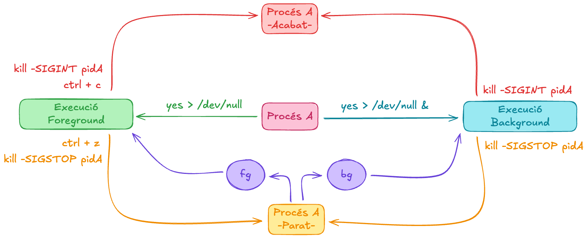
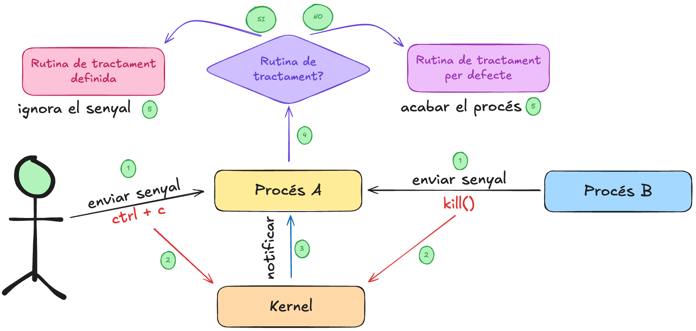

## Què són els senyals? 

Un **senyal** és una notificació asíncrona enviada pel nucli a un procés per informar d’un esdeveniment (*com una excepció o acció de l’usuari*).

```{.c}
int x = 0;
int y = 5 / x;
```

- El procés A s’executa en mode usuari.
- Es produeix una excepció (divisió per zero).
- El nucli detecta l’error i envia al procés un senyal SIGFPE.
- El procés pot tenir una rutina de tractament o seguir l’acció per defecte (**acabar**).
- El procés A es finalitza, degut al Gestor de senyals.


## Flux dels esdeveniments 

```{mermaid}
%%| echo: false
sequenceDiagram 
    participant K as Nucli
    participant A as Procés A
    A->>K: Excepció (divisió per zero)
    K->>A: Envia senyal SIGFPE al procés A
    A->>A: Té rutina de gestió de senyal?
    alt Sí
        A->>A: Executa rutina de gestió de senyal
    else No
        A->>K: Acció per defecte (finalitza procés)
    end
```

## Tipus d'esdeveniments 

Els esdeveniments que generen senyals poden provenir de maquinari o programari.

| Tipus              | Origen                 | Gestió                 | Exemple                   | Destinació         |
| ------------------ | ---------------------- | ---------------------- | ------------------------- | ------------------ |
| **Interrupció HW** | Dispositiu extern      | Gestor d’interrupcions | Tick del temporitzador    | Nucli              |
| **Excepció SW**    | Instrucció errònia     | Nucli → envia senyal   | Divisió per zero → SIGFPE | Procés causant     |
| **Senyal**         | Usuari, procés o nucli | `kill()`, `signal()`   | `kill(pid, SIGTERM)`      | Procés destinatari |


## Exemple pràctic 

Quants senyals estem enviant? Quines? Quina acció fa el procés quan rep els senyals?

::: columns
::: {.column width="20%"}
```bash
yes > /dev/null
ctrl+z
bg
ctrl+c
```
:::
::: {.column width="5%"}
:::
::: {.column width="75%"}
| Combinació | Senyal  | Efecte per defecte      | Estat   |
| ---------- | ------- | ----------------------- | ------- |
| **Ctrl+C** | SIGINT  | Terminar procés         | Mort    |
| **Ctrl+Z** | SIGTSTP | Aturar procés           | Stopped |
| **bg**     | SIGCONT | Reprendre en segon pla  | Running |
| **fg**     | SIGCONT | Reprendre en primer pla | Running |
:::
:::

* *Quants senyals estem enviant?* 3
* *Quines?* SIGTSTP, SIGINT, SIGCONT
* *Quina acció fa el procés quan rep les senyals?* Aturar l'execució en primer pla i portar el procés a segon pla. Arrancar l'execució en segon pla. Acabar el procés.


## Exemple pràctic: Pas a Pas 

- La comanda *yes>/dev/null* crearà un **procés A** i s'executa al *primer pla*, quan un usuari pitjà el **ctrl-z**, el kernel automàticament envia un senyal *SIGSTOP* al **procés A,** que modifica el seu estat d'execució a parat i també marxa del primer pla al segon pla. 

- Després amb la comanda **bg**, el kernel tramet al procés el senyal *SIGCONT* i continua la seva execució en segon pla quan la rep. Una altra manera equivalent per realitzar aquest procés és **yes>/dev/null &** on *&* ens envia l'ordre directament en execució al background.

- Observeu també com de  forma similar la comanda **fg**; en aquest cas el kernel tramet *SIGCONT* i el procés quan rep *SIGCONT*; torna a executar-se al primer pla.  Noteu que amb ctrl-c tenim un comportament similar; i el procés en primer pla és acabat en rebre el senyal *SIGINT* (**ctrl+c**).

## Diagrama de canvis d'estat

:::{.center-container}

:::


## Esdeveniments síncrons i asíncrons 

| Tipus d’esdeveniment       | Exemple          | Sincronia                                  |
| -------------------------- | ---------------- | ------------------------------------------ |
| **Excepció (SIGFPE)**      | Divisió per zero | Síncron amb l’execució                     |
| **Senyal extern (SIGINT)** | Ctrl+C           | Asíncron (pot arribar en qualsevol moment) |

- Un esdeveniment és **síncron** quan està relacionat amb l'execució del procés, per exemple una excepció com la divisió per zero o un error de segmentació. En aquest cas el procés que ha causat l'esdeveniment és el mateix que rep el senyal.

- Un esdeveniment és **asíncron** quan no està relacionat amb l'execució del procés, per exemple una interrupció de maquinari o una acció de l'usuari com un **ctrl+c**. En aquest cas el procés que ha causat l'esdeveniment és diferent del procés que rep el senyal.
  

## Esquema general

:::{.center-container}

:::


## Rutines de Tractament de senyals 

Quan el procés rebi el senyal *signum* executarà *gestor*, que
pot ser una **funció** o **SIG_DFL**, acció per defecte, o **SIG_IGN** per ignorar el senyal.

```c
#include <signal.h> 
typedef void (*sighandler_t)(int);
sighandler_t signal(int signum, sighandler_t gestor);
```

#### Valors de retorn
* En cas d'èxit retorna un **punter a la anterior funció gestora del senyal**.
* En cas d'error, retorna **SIG_ERR**.

## `pause()`

La crida a sistema `pause()` s'utilitza per posar en espera un procés fins que rep un senyal.

```c
#include <unistd.h> 
int pause(void);
```

* Sempré **retorna -1**.
* Es **bloqueja** fins que el procés rep un senyal (qualsevol).

## Gestió interna de senyals (Kernel) 

```{mermaid}
%%| echo: false
sequenceDiagram
    participant U as CPU · Mode Usuari
    participant K as Nucli
    participant P as PCB del Procés

    U->>K: Interrupció / Excepció / Syscall
    K->>P: Marca senyal SIGINT com a pendent · signal_pending |= SIGINT
    K->>P: Actualitza cua de senyals i màscara
    K->>U: Retorna del mode nucli → mode usuari
    U->>P: Comprova senyals pendents · signal_pending & ~signal_mask
    alt Senyal amb handler
        U->>P: Executa rutina del senyal user handler
    else Acció per defecte
        U->>K: Finalitza procés (SIG_DFL)
    end
```

## Crides a sistema 

| Crida                                                                          | Funció                                       | Acció sobre el PCB         |
| ------------------------------------------------------------------------------ | -------------------------------------------- | -------------------------- |
| `sigprocmask(int how, const sigset_t *set, sigset_t *oldset)`                  | Bloqueja o desbloqueja senyals.              | Modifica `signal_mask`.    |
| `sigpending(sigset_t *set)`                                                    | Consulta els senyals pendents.               | Llegeix `signal_pending`.  |
| `sigaction(int signum, const struct sigaction *act, struct sigaction *oldact)` | Defineix un manejador per un senyal concret. | Modifica `handlers[]`.     |
| `sigqueue(pid_t pid, int sig, const union sigval value)`                       | Envia un senyal amb una dada associada.      | Afegeix entrada a `queue`. |
| `alarm(unsigned int sec)`                                                      | Programa l’enviament de `SIGALRM`.           | Configura `alarm_timer`.   |


## Gestió de senyals en C

```c 
#include <signal.h>
#include <stdio.h>
#include <unistd.h>

void handler(int sig) {
    printf("Rebut senyal %d\n", sig);
}

int main() {
    signal(SIGINT, handler);
    while (1) pause();
}
```

:::{.center-container}
Aquesta és la sintaxis tradicional per incloure la gestió de senyals en C.
:::

## `sigaction`

```c
#include <signal.h>
#include <stdio.h>
#include <unistd.h>

void handler(int sig) {
    write(1, "SIGINT rebut\n", 13);
}

int main(void) {
    struct sigaction sa;
    sa.sa_handler = handler;
    sigemptyset(&sa.sa_mask);
    sa.sa_flags = 0;

    sigaction(SIGINT, &sa, NULL);

    while (1) pause();
}
```

:::center-container
Aquesta és més moderna i segura.
:::

## Accions per defecte

Cada senyal té una acció per defecte. Algunes possibles accions són:

* **Ignorar el senyal** (SIG_IGN).
* **Finalitzar el procés** (abnormal termination).
* **Finalitzar el procés i generar un core dump** (abnormal termination with core dump).
* **Aturar el procés** (aturar el procés).
* **Reprendre el procés** (continuar el procés).

## Senyals que no es poden capturar

Els senyals **SIGKILL** i **SIGSTOP** no poden ser capturats ni ignorats. Per tant, no podreu modificar el comportament per defecte per raons òbvies de seguretat. Això garanteix que el nucli i l’usuari sempre puguin aturar o matar un procés mal comportat.

- **SIGKILL**: Finalitza el procés immediatament. `kill -SIGKILL pid`
- **SIGSTOP**: Atura el procés immediatament. `kill -SIGSTOP pid`

## Enviament de senyals 

Per enviar senyals a altres processos s'utilitza la crida a sistema `kill()`.

```c
#include <signal.h>
int kill(pid_t pid, int sig);
```

Envia el senyal *sig* al/s procés/ssos segons pid:

* **pid > 0** : S'envia al procés receptor.
* **pid = 0** : S'envia als processos del mateix grup que l'emissor.
* **pid = -1** : S'envia a tots els processos als quals el procés té permís per enviar senyals.
* **pid < -1** : S'envia a tots els processos l'id del grup que coincideixi amb el valor absolut de pid.

::: {.fragment}
#### Valors de retorn

* En cas d'èxit, s'ha enviat com a mínim un senyal, es retorna **zero**.
* En cas d'error, retorna **SIG_ERR**
:::


## Cas pràctic: Problema típic

```c 
int main(void) {
   FILE *f = fopen("temp.txt", "w");
   fprintf(f, "Hola\n");
   fclose(f);
   remove("temp.txt");
}
```

- Si el procés s'executa sense interrupcions, el fitxer temporal **temp.txt** es crea, s'escriu "Hola\n", es tanca i s'elimina correctament.
- Si el procés rep un **SIGINT** (Ctrl+C) abans de tancar el fitxer, el fitxer temporal **temp.txt** no es tancarà correctament o no s'eliminarà. Això pot provocar pèrdua de dades o corrupció del fitxer.


## Solució amb gestió de senyals

```c
#include <signal.h>
#include <stdio.h>
#include <stdlib.h>

FILE *f;
void cleanup(int sig) {
    fclose(f);
    remove("temp.txt");
    exit(1);
}

int main(void) {
    struct sigaction sa = {.sa_handler = cleanup};
    sigaction(SIGINT, &sa, NULL);
    f = fopen("temp.txt", "w");
    pause();
}
```

## Cas pràctic: Error típic 

Les rutines de senyals s’executen de forma **asíncrona**: únicament han de fer operacions **async-signal-safe**, és a dir, mai es poden cridar funcions com `malloc()`, `printf()`, etc.

```c
void handler(int sig) {
    // Error típic: malloc() no és async-signal-safe
    char *buf = malloc(100);  
    write(1, "SIGINT rebut\n", 13);  // write() és segura dins del handler
    free(buf);
}
```

Una funció és **async-signal-safe** si no provoca comportament indefinit o corrupció de memòria.Només es poden cridar funcions que no depenguin de recursos globals compartits que puguin estar en un estat inconsistent. En aquest cas, `malloc()` i `free()` no són segures perquè poden modificar l'estat intern del gestor de memòria, acabant en corrupció de memòria **heap**.


## Taula resum de senyals 

| Senyal  | ID | Descripció                  | Acció per defecte |
| ------- | -- | --------------------------- | ----------------- |
| SIGABRT | 6  | Abort                       | Terminació        |
| SIGALRM | 14 | Temporitzador               | Terminació        |
| SIGCONT | 25 | Reprendre                   | Continuar         |
| SIGFPE  | 8  | Error aritmètic             | Terminació        |
| SIGKILL | 9  | Finalització forçada        | No capturable     |
| SIGINT  | 2  | Interrupció usuari (Ctrl+C) | Terminació        |
| SIGUSR1 | 16 | Senyal definit per l’usuari | Terminació        |

## Timers al nucli 

El nucli manté un repositor de timers (estructures internes, sovint per PCB o grup de processos) que compta el temps restant per a cada procés o alarm.

::: center-container
```{mermaid}
%%| echo: false
sequenceDiagram
    participant Kernel
    participant Procés

    Kernel->>Kernel: Compta temps timers
    alt Timer expira
        Kernel->>Procés: Envia SIGALRM
    end
```
:::

Quan expira un timer, el nucli genera un senyal **SIGALRM** i el posa a la cua de senyals del procés destinatari.

## Alarm() i PCB (Process Control Block)

Quan un procés crida `alarm(sec)`, el kernel:

- Guarda el temps restant al PCB del procés (`pcb->alarm_timer`).
- Programa el timer al scheduler o al timer interrupt handler.
- Quan el temps expira, el kernel envia **SIGALRM** al procés.

`alarm()` a *userspace*
------------------------

El procés s'envia a si mateix després de *sec* segons un senyal **SIGALRM**. Retorna el nombre de segons pendents si hi havia una crida a *alarm* anterior, o zero en altre cas.

```c
#include <unistd.h> C
unsigned int alarm(unsigned int sec);
```

::: {.callout-note title="Desactivar alarmes"}
Per desactivar una alarma pendent, es pot cridar a `alarm(0)`, aquesta comanda cancel·la qualsevol alarma pendent.
:::

## Resum

:::{style="text-align:center"}
{width=60%}
:::


