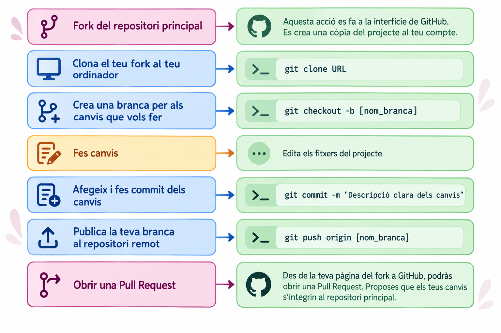
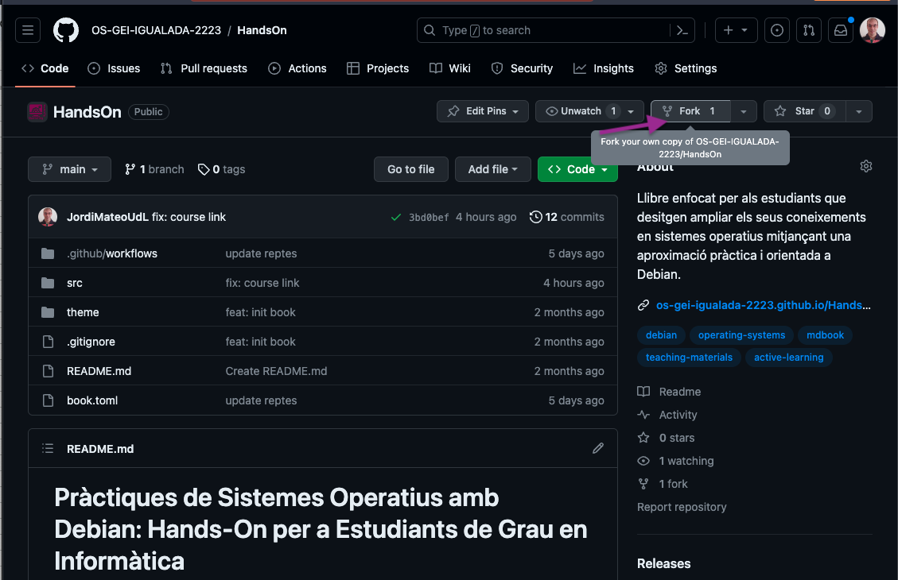
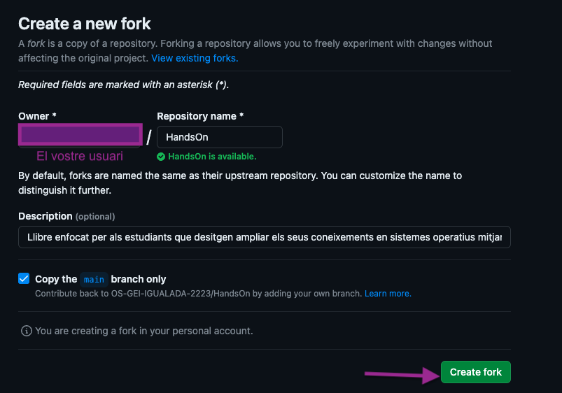
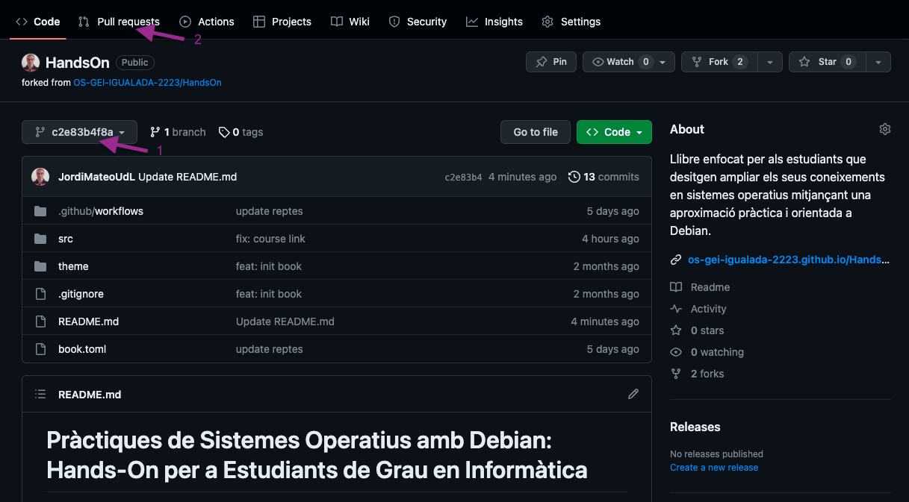
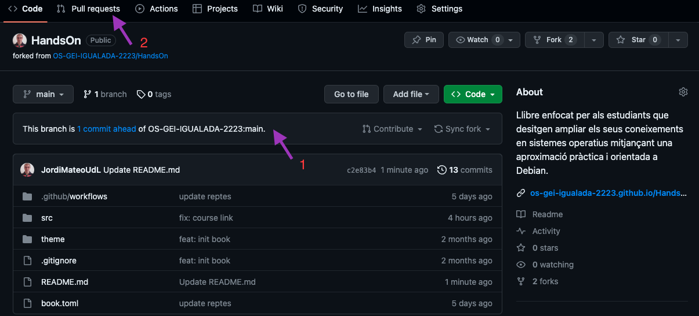
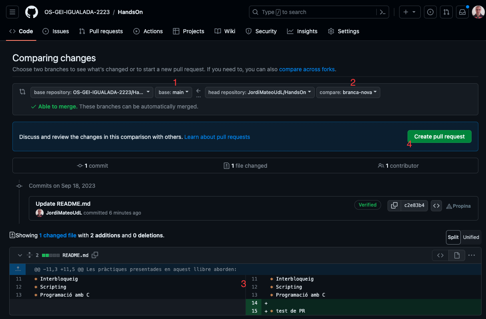

Els materials d'aquesta assignatura es desenvolupen seguint una filosofia de **codi obert (*open source*)**: els materials poden ser revisats, millorats, ampliats i corregits amb la participació de la comunitat.

Com a estudiant, pots formar part d'aquest procés i contribuir directament a la millora dels materials que utilitzaran altres estudiants en el futur.

Aquesta activitat també et permet obtenir **fins a 0,5 punts addicionals** sobre la qualificació final de l'assignatura.

::: {.repte title="Què significa contribuir?"}
Contribuir no significa simplement modificar un fitxer o enviar un *pull request*.

Una contribució és una **millora concreta, justificada i útil** per al projecte. Pot consistir, per exemple, en:

- crear un exercici o exemple nou;
- ampliar o aclarir una explicació;
- corregir una errata o un error tècnic;
- actualitzar informació que hagi quedat obsoleta;
- corregir un enllaç trencat;
- millorar la documentació;
- detectar i solucionar un problema que pugui afectar altres estudiants.

La contribució ha d'aportar **valor real al material docent**.
:::

## Una filosofia basada en l'Open Source

El desenvolupament *open source* es basa en una idea senzilla: **els projectes poden millorar gràcies a la participació de diferents persones**.

En lloc que una única persona sigui responsable de detectar tots els errors, escriure tot el contingut i mantenir-lo actualitzat, altres persones poden proposar millores.

En aquesta activitat aplicaràs el mateix model que s'utilitza en molts projectes de programari:

1. Parteixes d'una còpia del projecte (*fork*).
2. Treballes en una branca independent.
3. Fas i documentes els teus canvis.
4. Puges els canvis al teu repositori.
5. Proposes incorporar-los al projecte original mitjançant un *Pull Request*.
6. El responsable del projecte revisa la proposta.
7. Si la contribució és adequada, es pot incorporar al projecte principal.

Això permet experimentar i proposar canvis **sense modificar directament el repositori original**.

{ width=95% }

::: {.callout-note}
## Una contribució és una proposta, no una imposició

Quan obres un *Pull Request*, no estàs modificant directament els materials de l'assignatura.

Estàs fent una **proposta de canvi** perquè el responsable del projecte la pugui revisar.

Aquesta és una de les idees fonamentals del desenvolupament *open source*: els canvis es poden proposar, discutir, revisar i, finalment, acceptar o rebutjar.
:::

# El procés de contribució

## 1. Fes un *fork* del repositori

El primer pas és crear una còpia del repositori de l'assignatura al teu compte de GitHub.

Aquesta còpia s'anomena **fork**.

El *fork* et permet treballar sobre el projecte sense tenir permisos d'escriptura sobre el repositori original.

A la pàgina principal del repositori trobaràs el botó **Fork**.

{ width=85% }

Selecciona el teu compte de GitHub com a propietari del nou repositori.

{ width=85% }

Un cop creat, disposaràs d'una còpia del projecte dins del teu compte.

::: {.callout-tip}
### Per què fem un *fork*?

El *fork* separa el teu espai de treball del projecte original.

Pots experimentar, modificar fitxers i provar idees sense afectar els materials que utilitzen la resta d'estudiants.
:::

---

## 2. Clona el teu *fork*

Ara has de descarregar el teu *fork* al teu ordinador.

Des de GitHub, copia l'URL del teu repositori i executa:

```bash
git clone URL
```

Per exemple:

```bash
git clone https://github.com/el-teu-usuari/amsa.git
```

A continuació, entra al directori del projecte:

```bash
cd amsa
```

A partir d'aquest moment treballaràs sobre una còpia local del repositori.

::: {.callout-note}
També és possible fer alguns canvis directament des de la interfície web de GitHub. Tanmateix, si vols treballar de manera habitual amb els materials Quarto, és recomanable tenir el repositori clonat localment.
:::

::: {.callout-warning}
### Mantén el teu *fork* actualitzat

Els materials d'aquesta assignatura canvien sovint. Si treballes durant dies o setmanes sobre el mateix *fork*, sincronitza'l periòdicament amb el repositori original abans de començar una contribució nova:

```bash
git remote add upstream URL-del-repositori-original
git fetch upstream
git merge upstream/main
```

Fer-ho evita conflictes innecessaris quan obris la *Pull Request* i redueix el risc que la teva contribució es basi en una versió ja desactualitzada dels materials.
:::

---

## 3. Crea una branca per al teu canvi

Abans de modificar els fitxers, crea una branca (*branch*) específica per a la teva contribució.

```bash
git checkout -b nom-de-la-branca
```

Per exemple:

```bash
git checkout -b millora-exercici-processos
```

La branca permet mantenir el teu canvi separat de la resta del projecte.

::: {.repte title="Una branca per a una contribució"}
Sempre que sigui possible, procura que una branca representi una contribució concreta.

Per exemple:

`correccio-enllac-unitat-2`

és preferible a:

`canvis`

Un nom descriptiu facilita la revisió i permet entendre ràpidament quin és l'objectiu de la branca.
:::

---

## 4. Fes els canvis

Ara pots modificar els materials.

Pots:

- crear nous continguts;
- modificar explicacions;
- afegir exemples;
- crear exercicis;
- corregir errates;
- actualitzar informació;
- millorar la documentació.

Si treballes amb els materials Quarto, pots previsualitzar el resultat localment amb:

```bash
quarto preview
```

La previsualització permet comprovar que els canvis es visualitzen correctament abans d'enviar-los.

També pots editar els fitxers `.qmd` directament des de GitHub mitjançant l'editor web. Aquesta opció permet crear una branca amb els canvis i iniciar posteriorment el procés de *Pull Request*.

::: {.callout-warning}
### Revisa els canvis abans de proposar-los

Abans d'enviar la contribució, comprova que:

- el contingut és correcte;
- els exemples funcionen;
- no has introduït errates;
- els enllaços funcionen;
- el format es visualitza correctament (fes `quarto preview`, no només una lectura del `.qmd`);
- si has afegit un bloc de tipus `::: {.classe}`, la classe existeix realment a la llista de components admesos — una classe inventada es renderitza sense estil, sense avisar-te de l'error;
- no has pujat fitxers generats en renderitzar (`.aux`, `.log`, carpetes `_files/`, PDFs o HTML exportats) que no formen part del codi font;
- el canvi no modifica accidentalment altres parts dels materials.
:::

---

## 5. Fes *commit* dels canvis

Quan els canvis estiguin preparats, registra'ls amb un *commit*.

```bash
git add .
```

I després:

```bash
git commit -m "Descripció clara dels canvis"
```

Per exemple:

```bash
git commit -m "Millora l'exemple de processos"
```

Un bon missatge de *commit* ha de permetre entendre què s'ha modificat.

Evita missatges poc informatius com:

`canvis`

o:

`coses`

---

## 6. Puja la branca al teu GitHub

Ara has de publicar la branca al teu *fork*:

```bash
git push origin nom-de-la-branca
```

Per exemple:

```bash
git push origin millora-exercici-processos
```

La branca i els seus *commits* quedaran disponibles al teu repositori de GitHub.

---

## 7. Obre un *Pull Request*

Aquest és el pas més important del procés.

Un *Pull Request* (PR) és una proposta perquè els canvis que has fet al teu *fork* siguin incorporats al repositori original.

Des del teu repositori, selecciona la branca on has fet els canvis i inicia un nou *Pull Request*.

{ width=90% }

També pots seleccionar directament la branca amb els teus canvis i iniciar el *Pull Request* des de la interfície de GitHub.

{ width=90% }

---

## 8. Revisa l'origen i el destí dels canvis

GitHub mostrarà una comparació entre:

- el repositori principal, on vols incorporar els canvis;
- el teu *fork*, on has desenvolupat la modificació;
- la branca que conté els teus canvis.

Comprova especialment que la direcció sigui correcta.

En aquest cas:

```bash
Repositori principal
    ↓
Branca amb la teva contribució
```

GitHub també et mostrarà si els canvis es poden integrar automàticament.

{ width=95% }

Si tot és correcte, fes clic a **Create pull request**.

---

## 9. Explica bé la teva contribució

Un *Pull Request* no hauria de limitar-se a dir:

> "He fet alguns canvis."

La descripció ha d'ajudar el professorat a entendre què has fet, per què ho has fet i quin valor aporta.

Una bona descripció pot seguir aquesta estructura:

**Què he canviat?**
Explica breument quins fitxers o materials has modificat.

**Per què ho he canviat?**
Explica quin problema has detectat o quina necessitat resol el canvi.

**Quin valor aporta?**
Explica com millora el material per als estudiants.

**Com ho he comprovat?**
Si és aplicable, explica quines proves has fet o com has verificat que el canvi funciona.

::: {.repte title="Exemple de bona descripció"}
**Millora de l'exemple de processos de la Unitat 2**

He actualitzat l'exemple perquè utilitzava una comanda que ja no correspon amb la versió actual de Debian.

He substituït l'exemple per una alternativa compatible i he actualitzat l'explicació associada.

He comprovat el procediment en una màquina virtual amb Debian i he verificat que les comandes funcionen correctament.
:::

---

## Què passa després del Pull Request?

Quan envies una PR, el professorat revisarà la proposta.

La revisió pot incloure:

- correcció tècnica;
- qualitat del contingut;
- claredat de l'explicació;
- utilitat pedagògica;
- coherència amb la resta dels materials;
- qualitat de la documentació;
- possibles efectes sobre altres parts del projecte.

El professorat pot:

- acceptar la contribució;
- demanar modificacions abans d'acceptar-la;
- comentar o discutir alguns aspectes;
- rebutjar-la si no és adequada o no aporta prou valor.

Això forma part del funcionament normal d'un projecte *open source*.

::: {.callout-note}
### Una PR oberta no significa que el canvi s'hagi acceptat

El Pull Request és el mecanisme de revisió i proposta.

La incorporació definitiva del canvi depèn de la revisió del projecte.
:::

## Com s'avalua la contribució?

Pots obtenir fins a 0,5 punts addicionals sobre la nota final.

La puntuació no depèn simplement del nombre de Pull Requests que enviïs. Es valorarà principalment la qualitat i l'impacte de la contribució.

Entre altres aspectes, es tindrà en compte:

| Aspecte | Què es valora |
|---|---|
| Rellevància | El canvi resol un problema o necessitat real? |
| Qualitat | El contingut és correcte, clar i ben elaborat? |
| Impacte | La millora pot ser útil per a altres estudiants? |
| Rigor | La informació i els exemples són tècnicament correctes? |
| Documentació | El canvi està prou explicat i justificat? |
| Integració | És coherent amb l'estructura i l'estil dels materials? |

::: {.errorcomu title="No totes les contribucions puntuen"}
Enviar un Pull Request no garanteix l'obtenció del bonus.

Només es valoraran les contribucions que siguin acceptades pel professorat i que aportin un valor suficient als materials.

Una modificació purament cosmètica, arbitrària o innecessària pot no ser considerada una contribució avaluable.
:::

---

### Contribueix com si el projecte fos teu

Abans d'obrir una PR, pregunta't:

> Si un altre estudiant hagués de fer servir aquest material demà, aquesta modificació realment li seria útil?

Si la resposta és sí, probablement tens una bona contribució.


